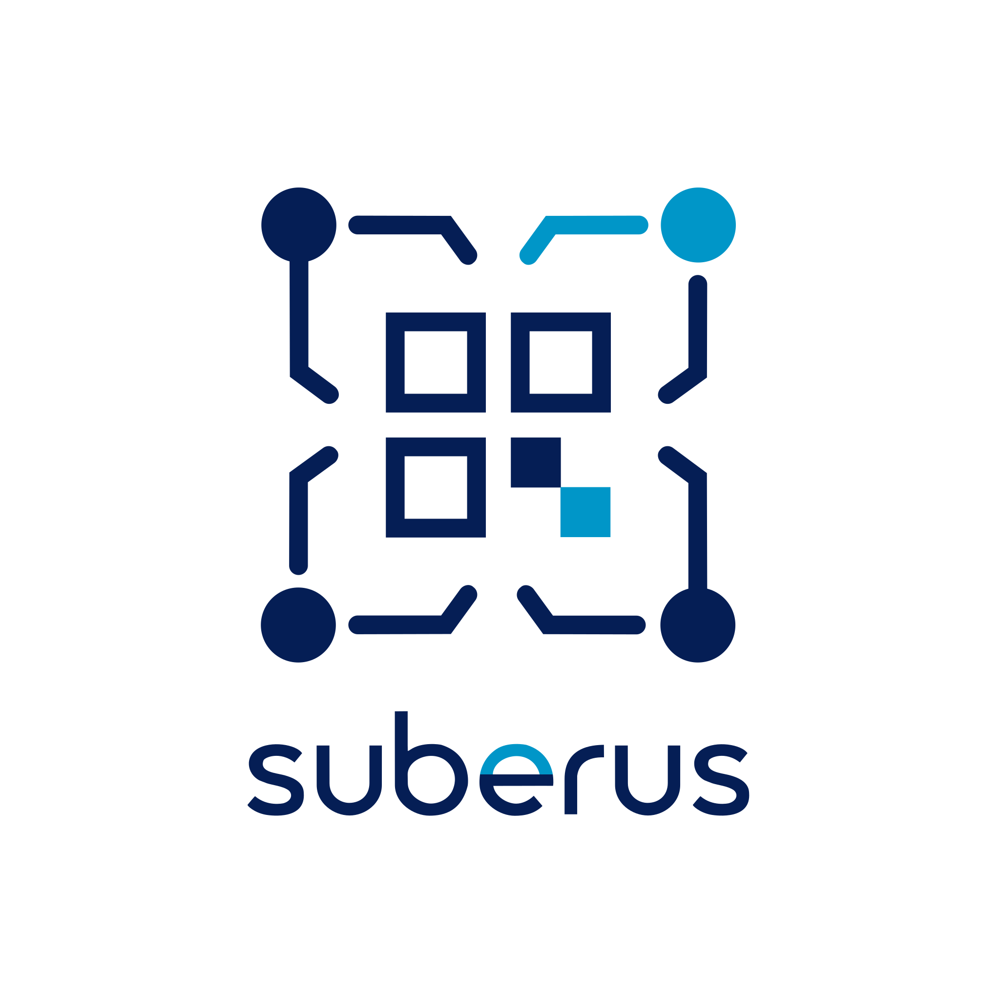
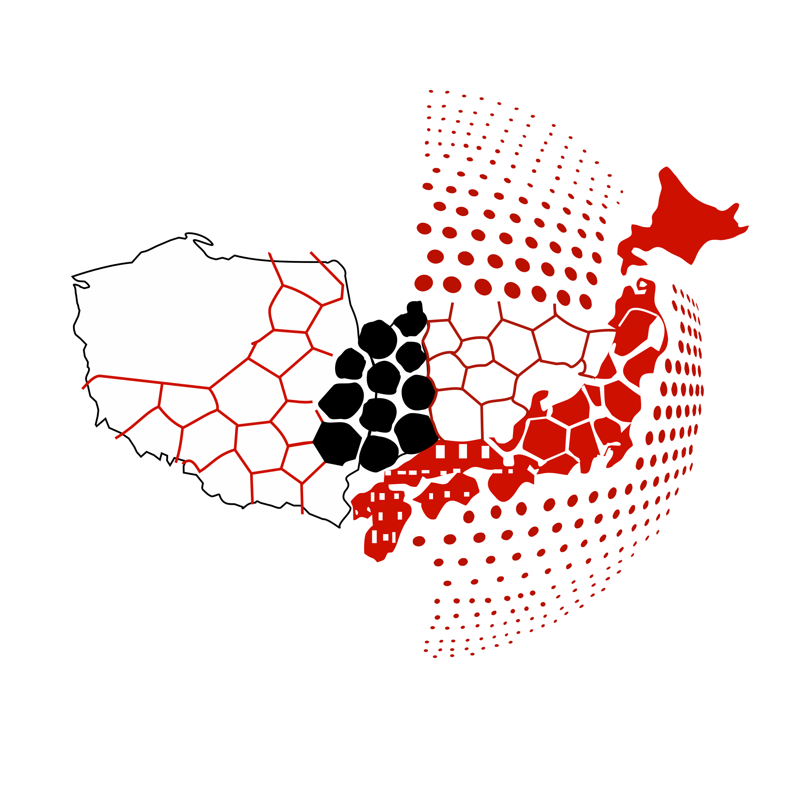

<div align="center">

<!-- Light logo for light themes, dark-theme variant for dark themes (GitHub picks by prefers-color-scheme) -->
<picture>
  <source media="(prefers-color-scheme: dark)" srcset="public/logo_dark.svg" />
  
</picture>


### **Abstract & peer-review management for scientific conferences**

[](https://tanstack.com/start)
[](https://nodejs.org)
[](https://www.typescriptlang.org)
[](https://www.postgresql.org)
[](https://www.prisma.io)
[](LICENSE)

</div>

---

## What it does

Suberus runs the full lifecycle of a conference call for submissions: authors submit, editors assign reviewers, reviewers score, decisions are made, and accepted work lands on the program. Everything that drives behaviour — reviewer counts, blinding, scoring criteria, deadlines — is configuration, not code.

- **Multiple submission types** — abstracts, full papers, posters, and exhibitor presentations, each with independent configuration. Enable any combination per conference.
- **Configurable review workflow** — single- or multi-reviewer flows, reviewer-decides vs. editor-decides, multi-round revise-and-resubmit, with full version history. State transitions are validated through an [XState](https://stately.ai/docs) machine.
- **Blind review** — OPEN / SINGLE BLIND / DOUBLE BLIND per submission type.
- **Editorial control** — desk accept/reject, decision overrides with reasoning, bulk decisions, custom scoring criteria.
- **Program planner** — schedule accepted submissions into sessions, with drag-and-drop and an autoplan helper.
- **Exhibitor flow** — company applications and presentations on a separate, non-reviewed track.
- **Email templates** — database-stored, placeholder-driven notifications for every workflow event.
- **Immutable audit trail** — every user, submission, review, and decision event is logged.

## Quick start

**Prerequisites:** Node.js 22+, pnpm, and Docker (managed via [proto](https://moonrepo.dev/proto) — run `proto install` to get the pinned toolchain).

> **Note:** PostgreSQL must have the [`pgvector`](https://github.com/pgvector/pgvector) extension available — it backs submission embeddings (semantic search / similarity). The Docker image ships with it; a self-managed PostgreSQL needs `pgvector` installed and `CREATE EXTENSION vector` enabled, or migrations will fail.

```bash
# 1. Install dependencies
pnpm install
# 2. Start infrastructure (PostgreSQL, Garage storage, Mailpit)
docker compose up -d
# 3. Configure environment
cp .env.example .env   # then fill in DB, storage, and SMTP values
# 4. Set up the database
pnpm db:update
# 5. Run the dev server
pnpm dev
```

The app is served at **http://localhost:3001**.


## Trusted by

Conferences and institutions running on Suberus:

<div align="center">

| |                                                                                                      |
|:---:|:----------------------------------------------------------------------------------------------------:|
|  |  |
| <a href="https://pjmicro.agh.edu.pl/">**15th Polish–Japanese Joint Seminar on Micro and Nano Analysis**</a> |            <a href="https://www.autometform.pwr.edu.pl/">**AutoMetForm & ConFair 2026**</a>             |

</div>

> _Using Suberus for your conference? Open a PR adding your logo to `.github/assets/institutions/`._

## Documentation
- **Admin manual** — Starlight site available at [docs.suberus.app](https://docs.suberus.app) or in `docs/`

## License

Released under the [MIT License](LICENSE).
