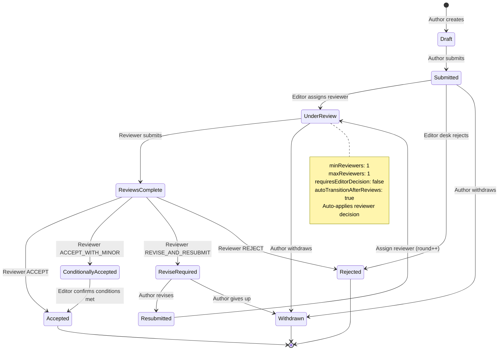
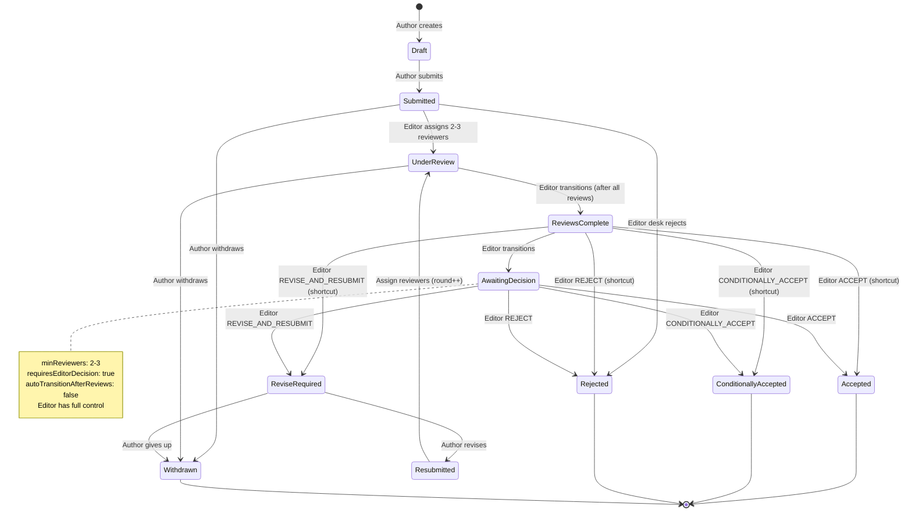
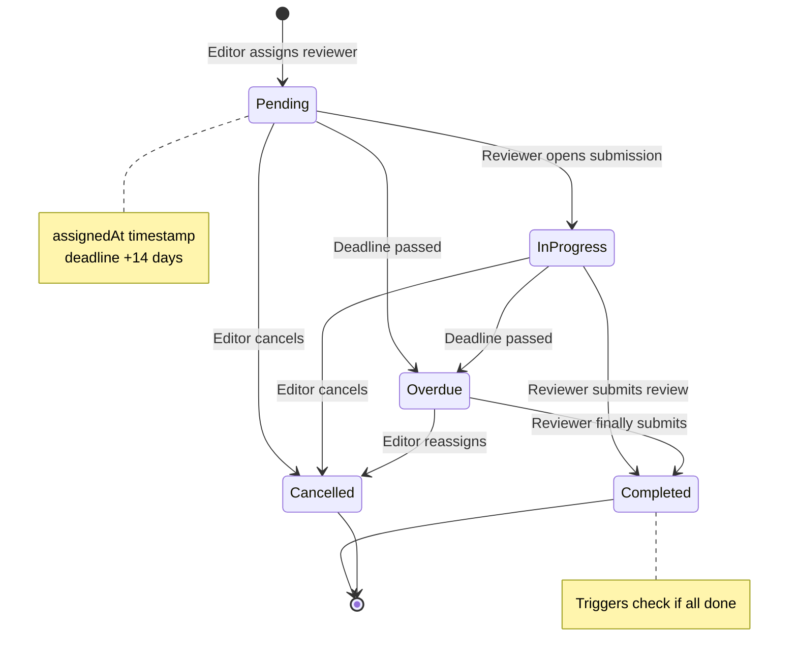
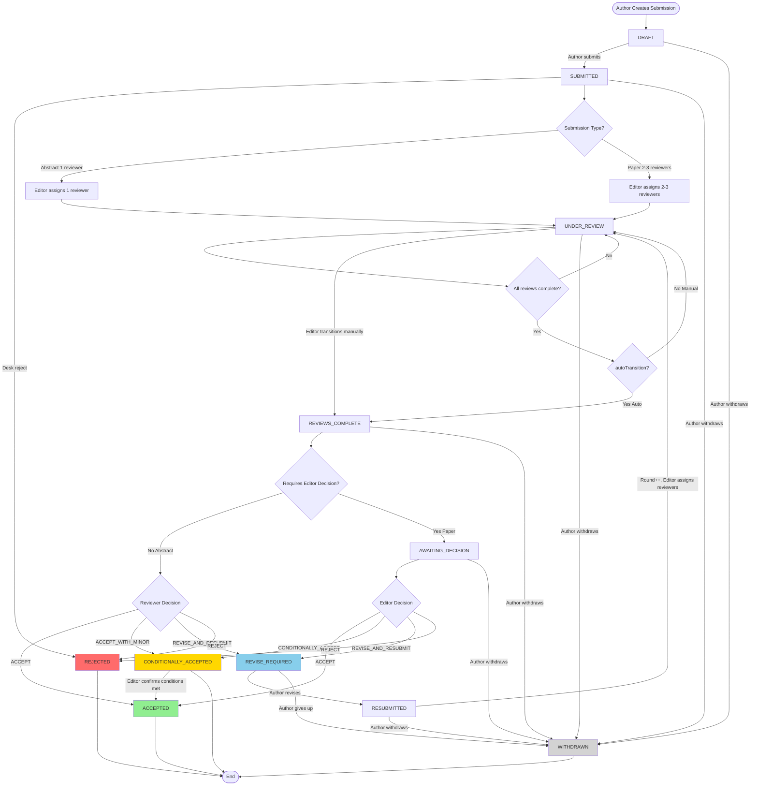
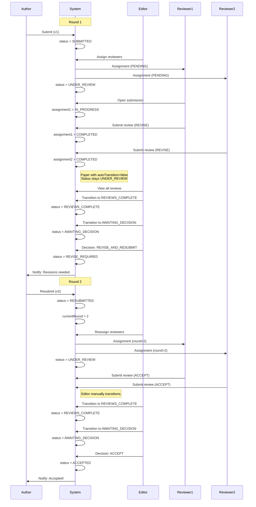

# Review Workflow System

## Overview

Universal, configurable review workflow supporting multiple submission types (abstracts, papers, posters) with flexible reviewer assignments and decision-making processes.

**Modular Design:**
- System can handle **abstracts only**, **papers only**, or **both simultaneously**
- Each type has independent configuration (reviewers, deadlines, review mode, workflow)
- Separate UI routes and forms per type ("/abstracts", "/papers")
- Shared backend model (`Submission`) for code reuse
- Enable/disable types via `isActive` flag in `SubmissionTypeConfig`

**Use Cases:**
- Traditional conference: Abstract-only submission for talk selection
- Journal-style: Paper-only submission with rigorous peer review
- Hybrid conference: Abstracts for presentations + Papers for proceedings

---

## Workflow Diagrams

### 1. Abstract Workflow (1 Reviewer, Reviewer Decides)



### 2. Paper Workflow (2-3 Reviewers, Editor Decides)



### 3. Review Assignment Lifecycle



### 4. Complete Workflow with All Paths



### 5. Multi-Round Review Process



---

## Core Principles

### 1. Submission Types Are Distinct
Each submission type (ABSTRACT, FULL_PAPER, POSTER) has independent configuration. No shared behavior assumed between types.

### 2. Modular Activation - Flexible Deployment
Conference can enable submission types independently via `isActive` flag:
- **Abstract only** - Traditional conference abstracts
- **Paper only** - Journal-style full papers
- **Both Abstract + Paper** - Hybrid conference (e.g., abstract for talk selection, paper for proceedings)

Each type has separate UI:
- Separate navigation links ("/abstracts", "/papers")
- Separate submission forms
- Separate listing pages
- Independent workflows

Shared backend (`Submission` model) enables code reuse while maintaining UI/UX separation.

### 3. Configuration Drives Behavior
All workflow logic reads from `SubmissionTypeConfig` (defined in `src/lib/settings/types.ts`, stored as JSON in the `app_settings` table via `AppSetting` model). Code doesn't hardcode rules like "abstracts need 1 reviewer" - config determines this.

### 4. Editor as Universal Reviewer
Editors (role=EDITOR) can:
- View all submissions regardless of assignment
- See all reviews including private notes
- Make decisions on any submission
- Override workflow if needed
- Assign/reassign reviewers at any time

---

## Submission Status Definitions

### Active States

| Status | Description | Who Can Transition |
|--------|-------------|-------------------|
| `DRAFT` | Author preparing submission | Author |
| `SUBMITTED` | Waiting for reviewer assignment | Editor |
| `UNDER_REVIEW` | Reviewers assigned, reviewing | System (when all reviews done) |
| `REVIEWS_COMPLETE` | All reviews submitted | System (auto) |
| `AWAITING_DECISION` | Editor needs to decide (papers) | Editor |
| `REVISE_REQUIRED` | Author must revise | Author |
| `RESUBMITTED` | Author resubmitted revision | Editor |

### Terminal States

| Status | Description | Editor Override? |
|--------|-------------|-----------------|
| `ACCEPTED` | Final acceptance ✅ | ✅ Can reopen |
| `CONDITIONALLY_ACCEPTED` | Accepted with minor conditions — editor can promote to ACCEPTED | ✅ Can reopen or promote |
| `REJECTED` | Final rejection ❌ | ✅ Can reopen |
| `WITHDRAWN` | Author withdrew | ❌ Truly final |

---

## State Transition Rules

### From DRAFT
- → `SUBMITTED` (author submits)
- Author can edit content freely while in DRAFT
- No versioning in DRAFT state

### From SUBMITTED
- → `UNDER_REVIEW` (when reviewer assigned)
- → `REJECTED` (desk rejection by Editor/Admin - no review needed)
- → `WITHDRAWN` (author withdraws)

### From UNDER_REVIEW
- → `REVIEWS_COMPLETE` (all reviews done)
- → `WITHDRAWN` (author withdraws)
- → `UNDER_REVIEW` (reassign reviewer - stays same state)

### From REVIEWS_COMPLETE
**If requiresEditorDecision=false** (Abstracts):
- Auto-applies reviewer decision immediately
- Reviewer decides ACCEPT → `ACCEPTED`
- Reviewer decides REJECT → `REJECTED`
- Reviewer decides REVISE_AND_RESUBMIT → `REVISE_REQUIRED`
- Reviewer decides ACCEPT_WITH_MINOR_REVISIONS → `CONDITIONALLY_ACCEPTED`

**If requiresEditorDecision=true** (Papers):
- → `AWAITING_DECISION` (editor transitions manually)
- Editor can also decide directly from REVIEWS_COMPLETE (shortcut, skips AWAITING_DECISION):
  - EDITOR_ACCEPT → `ACCEPTED`
  - EDITOR_CONDITIONAL → `CONDITIONALLY_ACCEPTED`
  - EDITOR_REVISE → `REVISE_REQUIRED`
  - EDITOR_REJECT → `REJECTED`

### From AWAITING_DECISION
Editor makes final decision:
- ACCEPT → `ACCEPTED`
- REJECT → `REJECTED`
- REVISE_AND_RESUBMIT → `REVISE_REQUIRED`
- CONDITIONALLY_ACCEPT → `CONDITIONALLY_ACCEPTED`

### From REVISE_REQUIRED
- → `RESUBMITTED` (author resubmits)
- → `WITHDRAWN` (author gives up)

### From RESUBMITTED
- → `UNDER_REVIEW` (assign reviewers for new round)
- Increment `currentRound`

### From CONDITIONALLY_ACCEPTED
- → `ACCEPTED` (editor confirms minor conditions met)
- → `AWAITING_DECISION` (editor override — reopens decision)
- Only EDITOR/ADMIN can trigger
- Transition to ACCEPTED requires reasoning (audit trail)

### From ACCEPTED / REJECTED
- → `AWAITING_DECISION` (editor override — reopens decision)
- Only EDITOR/ADMIN can trigger
- Requires reasoning (audit trail)

### Withdrawal
Author can withdraw from **any non-terminal state**: DRAFT, SUBMITTED, UNDER_REVIEW, REVIEWS_COMPLETE, AWAITING_DECISION, REVISE_REQUIRED, RESUBMITTED.
- → `WITHDRAWN` (author withdraws)
- No permission from editor needed

### Terminal States
`WITHDRAWN` - No transitions out (truly final)

`ACCEPTED`, `CONDITIONALLY_ACCEPTED`, `REJECTED` - Editor can override back to `AWAITING_DECISION`

---

## Review Assignment

### Single Reviewer (Abstracts)

```typescript
Config: minReviewers=1, maxReviewers=1

Flow:
1. Editor assigns 1 reviewer
2. Creates ReviewAssignment (status=PENDING)
3. Submission status → UNDER_REVIEW
4. Reviewer opens submission
5. Assignment status → IN_PROGRESS
6. Reviewer submits review
7. Assignment status → COMPLETED
8. Submission status → REVIEWS_COMPLETE
9. Auto-apply decision (no editor needed)
```

### Multiple Reviewers (Papers)

```typescript
Config: minReviewers=2, maxReviewers=3, requireAllReviews=true

Flow:
1. Editor assigns 2-3 reviewers
2. Creates multiple ReviewAssignment records
3. Submission status → UNDER_REVIEW
4. Reviewers work independently
5. Each submits review → their assignment COMPLETED
6. When all assignments COMPLETED → REVIEWS_COMPLETE
7. Submission status → AWAITING_DECISION
8. Editor reviews all recommendations
9. Editor makes final decision → terminal state (ACCEPTED/REJECTED/etc.)
```

### Assignment Status Progression

```
PENDING → IN_PROGRESS → COMPLETED
   ↓            ↓
CANCELLED   OVERDUE
   ↓            ↓
  [End]     CANCELLED
```

### Reviewer Reassignment

```
Scenario: Reviewer doesn't respond within deadline

1. Assignment status → OVERDUE (auto-calculated)
2. Editor cancels assignment
3. Assignment status → CANCELLED, cancelledAt set
4. Editor assigns new reviewer
5. New ReviewAssignment created (same round)
6. Old review (if exists) archived
7. Submission continues in UNDER_REVIEW
```

### Round Tracking

```
Round 1: Initial submission
- All reviews have round=1
- All assignments have round=1

Author revises → RESUBMITTED
- currentRound increments to 2

Round 2: Re-review
- New assignments created with round=2
- New reviews have round=2
- Old reviews (round=1) remain for history
```

---

## Review Scoring

### When Enabled (enableScoring=true)

```typescript
Config: {
  enableScoring: true,
  scoringCriteria: [
    { name: "Originality", description: "Contribution to the field" },
    { name: "Clarity", description: "Writing quality and structure" },
    { name: "Significance", description: "Importance and impact" },
    { name: "Methodology", description: "Research design and execution" },
  ]
}

Review form shows (dynamic from scoringCriteria):
- Each criterion: 1-5 score (compact row with label + description)
- Scale legend shown once: 1=Poor ... 5=Excellent
- Confidence Level: 1-5
- Comments: text
- Private Notes: text (editor only)
- Decision: ACCEPT/REJECT/REVISE/ACCEPT_WITH_MINOR

Database storage:
- Review.scores: Json? — stores Record<string, number>, e.g. {"Originality": 4, "Clarity": 5}
- Admin can add/remove criteria with name + description per submission type

Average score calculation:
allScores = Object.values(review.scores)
averageScore = sum(allScores) / allScores.length
```

### When Disabled (enableScoring=false)

```typescript
Review form shows:
- Comments: text
- Private Notes: text (editor only)
- Decision: ACCEPT/REJECT/REVISE/ACCEPT_WITH_MINOR

No scoring fields shown
Review.scores remains NULL
```

---

## Decision Logic

### Abstract (Reviewer Decides)

```typescript
Config: requiresEditorDecision = false

When review submitted:
  if (reviewDecision === 'ACCEPT') {
    submissionStatus = 'ACCEPTED'
  } else if (reviewDecision === 'ACCEPT_WITH_MINOR_REVISIONS') {
    submissionStatus = 'CONDITIONALLY_ACCEPTED'
  } else if (reviewDecision === 'REVISE_AND_RESUBMIT') {
    submissionStatus = 'REVISE_REQUIRED'
  } else if (reviewDecision === 'REJECT') {
    submissionStatus = 'REJECTED'
  }
```

### Paper (Editor Decides)

```typescript
Config: requiresEditorDecision = true

When all reviews submitted:
  if (config.autoTransitionAfterReviews || !config.requiresEditorDecision) {
    submissionStatus = 'REVIEWS_COMPLETE'

    if (!config.requiresEditorDecision) {
      // Auto-apply reviewer decision (abstracts/posters)
      // → ACCEPTED / REJECTED / REVISE_REQUIRED / CONDITIONALLY_ACCEPTED
      applyReviewerDecision(review.decision)
    } else if (config.requiresEditorDecision) {
      submissionStatus = 'AWAITING_DECISION'
    }
  } else {
    // Status stays UNDER_REVIEW - editor must manually transition
  }

  // Editor can also decide directly from REVIEWS_COMPLETE (shortcut)

  // Editor reviews:
  // Review 1: ACCEPT (score: 4.5/5)
  // Review 2: REVISE (score: 3.0/5)
  // Review 3: ACCEPT (score: 4.0/5)

  // Editor decides: ACCEPT (majority recommends)

When editor submits decision:
  createEditorDecision({
    decision: 'ACCEPT',
    reasoning: '2/3 recommend acceptance',
    letterToAuthor: 'We are pleased to accept...',
    basedOnReviews: [review1.id, review2.id, review3.id]
  })

  // Direct transition to terminal state
  if (editorDecision === 'ACCEPT') {
    submissionStatus = 'ACCEPTED'
  } else if (editorDecision === 'CONDITIONALLY_ACCEPT') {
    submissionStatus = 'CONDITIONALLY_ACCEPTED'
  } else if (editorDecision === 'REVISE_AND_RESUBMIT') {
    submissionStatus = 'REVISE_REQUIRED'
  } else if (editorDecision === 'REJECT') {
    submissionStatus = 'REJECTED'
  }
```

### Editor Override

```typescript
Scenario: Config says requiresEditorDecision=false but editor wants to override

Example: Abstract with bad reviewer decision
- Reviewer recommends REJECT
- Auto-transition to REJECTED would happen
- Editor sees review is poor quality
- Editor manually creates EditorDecision
- Editor decision: ACCEPT (override)
- Reasoning: "Reviewer misunderstood methodology"

System allows this for EDITOR and ADMIN roles
```

---

## Round Management

### Round Increment

```typescript
When author resubmits after REVISE_REQUIRED:
  1. Create new SubmissionVersion
     - version = currentVersion + 1
     - content = revised content
     - comment = "Addressed reviewer feedback"

  2. Increment round
     - submission.currentRound++

  3. Update status
     - status = 'RESUBMITTED'

  4. Editor assigns reviewers (same or different)
     - New ReviewAssignment records with round = currentRound

  5. Continue workflow
     - status = 'UNDER_REVIEW'
```

---

## Deadlines

### Review Deadlines

```typescript
Config: reviewDeadline = 14 (days) // Default

When reviewer assigned:
- Editor can specify custom deadline (optional)
- If not specified: ReviewAssignment.deadline = assignedAt + config.reviewDeadline days
- If specified: ReviewAssignment.deadline = customDeadline
- System can send reminder emails at deadline - 2 days
- System auto-marks OVERDUE at deadline + 1 day
- Editor sees overdue assignments highlighted

Example assignment with custom deadline:
createReviewAssignment({
  submissionId,
  reviewerId,
  deadline: new Date('2024-02-15') // Custom deadline
})

Example assignment with default deadline:
createReviewAssignment({
  submissionId,
  reviewerId,
  deadline: null // Uses config.reviewDeadline (14 days)
})
```

### No Auto-Actions

```typescript
Assumption: System never auto-cancels or auto-completes reviews

When overdue:
- Status → OVERDUE (visual indicator only)
- Editor must manually intervene
- Editor can: cancel assignment, contact reviewer
```

---

## Review Anonymity

Review mode is configurable per submission type: **OPEN**, **SINGLE_BLIND**, **DOUBLE_BLIND**

### OPEN Review

```typescript
Author visibility:
- ✅ See reviewer identities
- ✅ See all review comments and scores
- ✅ Know who wrote which review

Reviewer visibility:
- ✅ See author names and affiliations
- ✅ See submission metadata
- ✅ (Optional) See other reviews on same submission

Use case: Workshop submissions, collaborative reviews
```

### SINGLE_BLIND Review

```typescript
Author visibility:
- ❌ CANNOT see reviewer identities (hidden)
- ✅ See review comments and scores (anonymized)
- ❌ Cannot identify who wrote which review

Reviewer visibility:
- ✅ See author names and affiliations
- ✅ See full submission details
- ✅ (Optional) See other reviews on same submission

Use case: Conference abstracts, most academic reviews
```

### DOUBLE_BLIND Review

```typescript
Author visibility:
- ❌ CANNOT see reviewer identities (hidden)
- ✅ See review comments and scores (anonymized)
- ❌ Cannot identify who wrote which review

Reviewer visibility:
- ❌ CANNOT see author names (removed/anonymized)
- ❌ CANNOT see author affiliations
- ✅ See submission title and content only
- ⚠️  Authors must remove identifying info from content

Use case: High-stakes papers, bias-sensitive reviews
```

### Editor and Admin View

```typescript
Editor/Admin ALWAYS see:
- ✅ All submissions (regardless of review mode)
- ✅ All reviews with full details
- ✅ All reviewer identities
- ✅ All author identities and affiliations
- ✅ Private notes and reasoning
- ✅ Complete audit trail

Role: Full transparency for workflow management and conflict resolution
```

---

## Version Tracking

### New Version on Resubmission

```typescript
When author resubmits after REVISE_REQUIRED:

1. Create new SubmissionVersion
   - version = maxVersion + 1
   - title = updated title
   - content = updated content
   - comment = "Addressed reviewer feedback on methodology"

2. Update Submission.currentVersionId

3. New reviews reference new version
   - Review.versionId = newVersion.id

4. Old reviews reference old version
   - Review.versionId = oldVersion.id

History preserved:
- Round 1 reviews → version 1
- Round 2 reviews → version 2
```

### Version Not Required

```typescript
Assumption: Minor edits don't create new version

- Author can edit DRAFT without versioning
- Only RESUBMITTED creates new version
- Initial submission = version 1
```

---

## Audit Trail

All system events are logged in `ActivityLog` with a granular `ActivityType` enum:
- **User events:** registration, email verification, profile updates, role changes, activation/deactivation, deletion
- **Submission events:** creation, draft submission, status transitions (from/to status, round, event, reason), withdrawal, resubmission, track changes
- **Review events:** assignment, start, submission, cancellation, overdue marking
- **Decision events:** editor decisions, desk rejections, decision overrides
- **Invitation events:** creation, usage, cancellation
- **Admin events:** fee paid/unpaid marking

Each entry includes: event type, target user/submission (optional), performer (or null for system actions), typed JSON detail, and timestamp.

**Immutable:** Activity records are never deleted or modified — required for compliance and dispute resolution.

---

## Permissions

### Role-Based Access

| Action | Author | Reviewer | Editor | Admin |
|--------|--------|----------|--------|-------|
| Create submission | ✅ | ✅ | ✅ | ✅ |
| View own submissions | ✅ | ✅ | ✅ | ✅ |
| Be assigned as reviewer | ❌ | ✅ | ✅ | ✅ |
| View assigned submissions | ❌ | ✅ | ✅ | ✅ |
| View all submissions | ❌ | ❌ | ✅ | ✅ |
| Assign reviewers | ❌ | ❌ | ✅ | ✅ |
| Submit review | ❌ | ✅ | ✅ | ✅ |
| View all reviews | ❌ | ❌ | ✅ | ✅ |
| View private notes | ❌ | ❌ | ✅ | ✅ |
| Make editor decision | ❌ | ❌ | ✅ | ✅ |
| View reviewer identity | 🔀 | ❌ | ✅ | ✅ |
| View author identity | 🔀 | 🔀 | ✅ | ✅ |
| Resubmit revision | ✅ (own) | ✅ (own) | ✅ (own) | ✅ (own) |

**Legend:**
- ✅ Always allowed
- ❌ Never allowed
- 🔀 Depends on review mode configuration

**Review Mode Impact:**

| View Permission | OPEN | SINGLE_BLIND | DOUBLE_BLIND |
|----------------|------|--------------|--------------|
| Author sees reviewer identity | ✅ | ❌ | ❌ |
| Reviewer sees author identity | ✅ | ✅ | ❌ |
| Editor/Admin see all identities | ✅ | ✅ | ✅ |

**Notes:**
- All users can create submissions and view their own regardless of role
- Editor/Admin can be assigned as reviewers like regular Reviewers
- Editor/Admin ALWAYS see all identities (authors + reviewers) regardless of review mode
- Review mode is configured per submission type in `SubmissionTypeConfig`

---

## Configuration Examples

### Abstract Configuration

```typescript
{
  type: 'ABSTRACT',
  minReviewers: 1,
  maxReviewers: 1,
  requiresEditorDecision: false,
  allowRevisions: true,

  reviewDeadline: 14, // days
  requireAllReviews: true,
  autoTransitionAfterReviews: true, // Auto-apply reviewer decision
  enableScoring: false,
  scoringCriteria: [],
  reviewMode: 'SINGLE_BLIND' // Authors don't see reviewers
}
```

### Paper Configuration

```typescript
{
  type: 'FULL_PAPER',
  minReviewers: 2,
  maxReviewers: 3,
  requiresEditorDecision: true,
  allowRevisions: true,

  reviewDeadline: 21, // days
  requireAllReviews: true,
  autoTransitionAfterReviews: false, // Editor manually reviews before transition
  enableScoring: true,
  scoringCriteria: [
    { name: "Originality", description: "Contribution to the field" },
    { name: "Clarity", description: "Writing quality and structure" },
    { name: "Significance", description: "Importance and impact" },
    { name: "Methodology", description: "Research design and execution" },
  ],
  reviewMode: 'DOUBLE_BLIND' // Neither authors nor reviewers see identities
}
```

### Poster Configuration

POSTER uses identical workflow to ABSTRACT (single reviewer, reviewer decides).

```typescript
{
  type: 'POSTER',
  minReviewers: 1,
  maxReviewers: 1,
  requiresEditorDecision: false,
  allowRevisions: true,

  reviewDeadline: 7, // days
  requireAllReviews: true,
  autoTransitionAfterReviews: true, // Auto-apply reviewer decision
  enableScoring: false,
  scoringCriteria: [],
  reviewMode: 'SINGLE_BLIND' // Authors don't see reviewers
}
```

---

## Deployment Scenarios

### Scenario 1: Abstract-Only Conference
### Scenario 2: Paper-Only Conference
### Scenario 3: Hybrid Conference (Abstract + Paper)

---

## Edge Cases

### Desk Rejection

```
Scenario: Editor/Admin rejects submission without review

Use cases:
- Out of scope for conference
- Incomplete submission
- Duplicate submission
- Ethical concerns
- Low quality (obvious issues)

Flow:
1. Author submits → status = SUBMITTED
2. Editor/Admin reviews submission
3. Editor decides: desk reject (no reviewers needed)
4. Editor creates EditorDecision with reasoning
5. Status → REJECTED (direct, skips review process)
6. Author notified with rejection reason

Permissions: Only EDITOR and ADMIN can desk reject
Note: EditorDecision.letterToAuthor should explain rejection reason
```

### Auto vs Manual Transition After Reviews

```
Config: autoTransitionAfterReviews (per submission type)

When TRUE (Automatic):
- Last review submitted → System auto-transitions to REVIEWS_COMPLETE
- For papers: Then auto-transitions to AWAITING_DECISION
- For abstracts: Applies reviewer decision immediately

When FALSE (Manual):
- All reviews submitted → Status stays UNDER_REVIEW
- Editor must manually transition to REVIEWS_COMPLETE
- Allows editor to review all submissions before proceeding
- Useful for papers requiring editorial oversight

Note: When requiresEditorDecision=false, auto-transition always happens regardless of autoTransitionAfterReviews setting (reviewer decision must be applied).

Example use cases:
- Abstracts: autoTransitionAfterReviews = true (fast, automated)
- Papers: autoTransitionAfterReviews = false (editor control)
```

### Reviewer Withdraws Mid-Review

```
Scenario: Reviewer cannot complete review (any reason)

1. Reviewer contacts editor
2. Editor cancels assignment (status=CANCELLED)
3. Editor assigns new reviewer
4. Original partial review archived/ignored
5. New reviewer starts fresh
```

### Editor Changes Mind

```
Scenario: Editor makes decision, then wants to change

Assumption: Allow change before author notification

1. Editor decides REJECT
2. Status → REJECTED
3. Editor clicks "Undo" before notification sent
4. Status → AWAITING_DECISION
5. Editor submits new decision
6. Only latest decision counts
7. History shows both decisions
```

---

## Notifications

Email system uses configurable templates stored in database with simple placeholder substitution (`{{variable}}`).

### Email Templates System

**Model: `EmailTemplate`**
```typescript
{
  eventType: EmailEventType,          // Unique trigger event
  subject: string,                    // "Your submission {{submissionTitle}} has been received"
  body: string,                       // Template with {{placeholders}}
  isHtml: boolean,                    // Plain text or HTML email
  ccEmails: string[],                 // Optional CC recipients
  bccEmails: string[],                // Optional BCC recipients
  isEnabled: boolean,                 // Can disable specific events
  availablePlaceholders: string[],    // For UI reference
  description: string                 // When/why this is sent
}
```

### Email Event Types

| Event | Recipient       | Trigger |
|-------|-----------------|---------|
| `SUBMISSION_RECEIVED` | Author          | After successful submission |
| `SUBMISSION_WITHDRAWN` | Author, Admin   | When author withdraws |
| `REVIEWER_ASSIGNED` | Reviewer        | When editor assigns review |
| `REVIEWER_REMINDER` | Reviewer        | Deadline approaching (configurable days) |
| `REVIEW_SUBMITTED` | Admin          | When reviewer submits review |
| `ALL_REVIEWS_COMPLETE` | Admin          | Last review submitted |
| `DECISION_ACCEPTED` | Author          | Final acceptance |
| `DECISION_CONDITIONALLY_ACCEPTED` | Author          | Conditional acceptance |
| `DECISION_REVISE_REQUIRED` | Author          | Revisions needed |
| `DECISION_REJECTED` | Author          | Rejection |
| `REVISION_REMINDER` | Author          | Revision deadline approaching |
| `REVISION_RECEIVED` | Admin          | Author resubmits |
| `DEADLINE_APPROACHING` | Reviewer/Author | Generic deadline warning |
| `ACCOUNT_CREATED` | User            | New account created |
| `PASSWORD_RESET` | User            | Password reset requested |

### Available Placeholders

**User placeholders:**
```
{{userName}}          - Full name
{{userEmail}}         - Email address
{{userRole}}          - Current role
```

**Submission placeholders:**
```
{{submissionId}}      - Unique ID
{{submissionTitle}}   - Title
{{submissionType}}    - ABSTRACT/FULL_PAPER/POSTER
{{submissionStatus}}  - Current status
{{submissionRound}}   - Review round number
{{submissionUrl}}     - Direct link to submission
```

**Review placeholders:**
```
{{reviewerName}}      - Reviewer name (if not blind)
{{reviewDeadline}}    - Deadline date
{{daysRemaining}}     - Days until deadline
{{reviewDecision}}    - Reviewer recommendation
```

**Conference placeholders:**
```
{{conferenceName}}    - Conference name
{{conferenceEmail}}   - Contact email
{{conferenceWebsite}} - Website URL
```

**Decision placeholders:**
```
{{editorName}}        - Editor who made decision
{{decisionReason}}    - Brief reasoning
{{decisionLetter}}    - Full letter to author
```

### Email Processing

Email sending is asynchronous:
1. Workflow triggers event (e.g., submission.status = ACCEPTED)
2. System looks up EmailTemplate for DECISION_ACCEPTED
3. If template.isEnabled === true:
   - Replace all {{placeholders}} with actual values
   - Queue email for sending (background job)
   - Log email attempt
4. Email service processes queue
5. Handle failures with retry logic


### Template Management UI

Admin interface should allow:
- List all email templates
- Edit subject/body with live placeholder preview
- Enable/disable specific events
- Test send with sample data (to yourself)
- View sent email history
- See available placeholders per template

---

## Planned Features (Not Implemented)

### Conflict of Interest (COI) Management

Planned for future versions:
- Reviewer self-declaration of conflicts with authors
- Automatic COI detection based on co-authorship history, affiliations
- COI-aware reviewer assignment suggestions
- Blocked assignments for declared conflicts

---

## Implementation Notes

### xstate Integration

Each submission type has its own state machine.

> **Note:** The machine starts at `SUBMITTED`, not `DRAFT`. The DRAFT state is managed outside the state machine (simple status flag) because drafts have no workflow transitions — only free-form editing until the author submits.

```typescript
export const abstractMachine = createMachine({
  id: 'abstract',
  initial: 'SUBMITTED',
  states: {
    SUBMITTED: {
      on: {
        ASSIGN_REVIEWER: 'UNDER_REVIEW',
        WITHDRAW: 'WITHDRAWN'
      }
    },
    UNDER_REVIEW: {
      on: {
        REVIEW_SUBMITTED: 'REVIEWS_COMPLETE',
        WITHDRAW: 'WITHDRAWN'
      }
    },
    REVIEWS_COMPLETE: {
      on: {
        AUTO_ACCEPT: 'ACCEPTED',
        AUTO_REJECT: 'REJECTED',
        AUTO_REVISE: 'REVISE_REQUIRED',
        AUTO_CONDITIONAL: 'CONDITIONALLY_ACCEPTED'
      }
    },
    REVISE_REQUIRED: {
      on: {
        RESUBMIT: 'RESUBMITTED',
        WITHDRAW: 'WITHDRAWN'
      }
    },
    RESUBMITTED: {
      on: {
        ASSIGN_REVIEWER: 'UNDER_REVIEW'
      }
    },
    ACCEPTED: { on: { EDITOR_OVERRIDE: 'AWAITING_DECISION' } },
    REJECTED: { on: { EDITOR_OVERRIDE: 'AWAITING_DECISION' } },
    CONDITIONALLY_ACCEPTED: { on: {
      CONFIRM_CONDITIONS_MET: 'ACCEPTED',
      EDITOR_OVERRIDE: 'AWAITING_DECISION'
    } },
    WITHDRAWN: { type: 'final' }
  }
})
```
