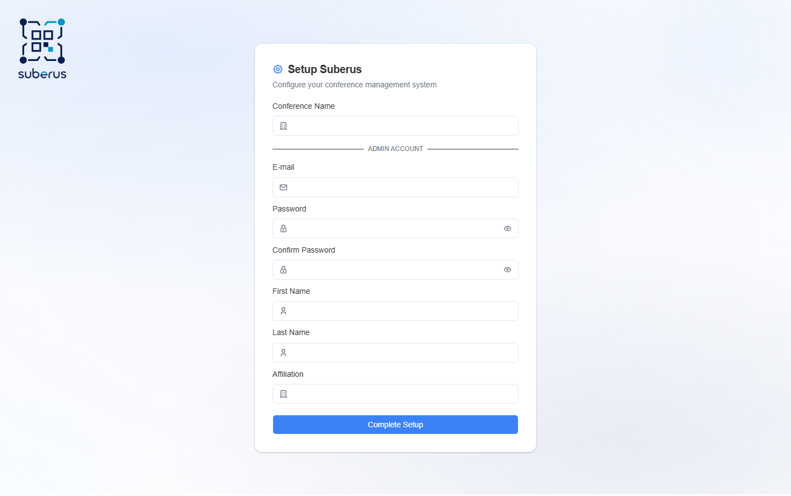

import { Aside, Steps, CardGrid, LinkCard } from '@astrojs/starlight/components';

The very first time Suberus runs, it shows a **one-time setup screen** at `/install`.
Here you name the conference and create the **first administrator account**. Once
setup is complete, `/install` is locked and anyone visiting it is sent to the login
page.

<Aside type="caution" title="One time only">
This screen is available **only until setup is completed**. After that it
redirects to login — there is no way back in through `/install`. Make sure you
record the admin email and password you choose.
</Aside>

## How to complete setup

<Steps>

1. Open the application — a fresh instance lands on the **Setup Suberus** screen
   automatically (`/install`).

2. Enter the **Conference Name**.

3. Fill in the **Admin Account** details: email, password (twice), first and last
   name, and affiliation.

4. Click **Complete Setup**. You are redirected to the login page.

5. Sign in with the admin account, then continue with the
   **[Quick start](/configuration/quick-start/)**.

</Steps>

## Fields reference

| Field | What it does | What to enter / Notes |
|---|---|---|
| **Conference Name** | The initial name of your conference. | You can refine it later on the **[Conference](/configuration/conference/)** tab. |
| **E-mail** | The login and contact address for the first admin. | Use a real, monitored mailbox. |
| **Password** | The admin password. | Choose a strong password — this account has full control. |
| **Confirm Password** | Re-type to avoid typos. | Must match **Password**. |
| **First Name** | Admin's given name. | Shown across the app. |
| **Last Name** | Admin's surname. | Shown across the app. |
| **Affiliation** | Admin's institution/organisation. | e.g. university or company. |

## Related

<CardGrid>
	<LinkCard title="Quick start" href="/configuration/quick-start/" description="The next step after signing in." />
	<LinkCard title="Roles & permissions" href="/configuration/roles-and-permissions/" description="What the admin role can do." />
</CardGrid>
