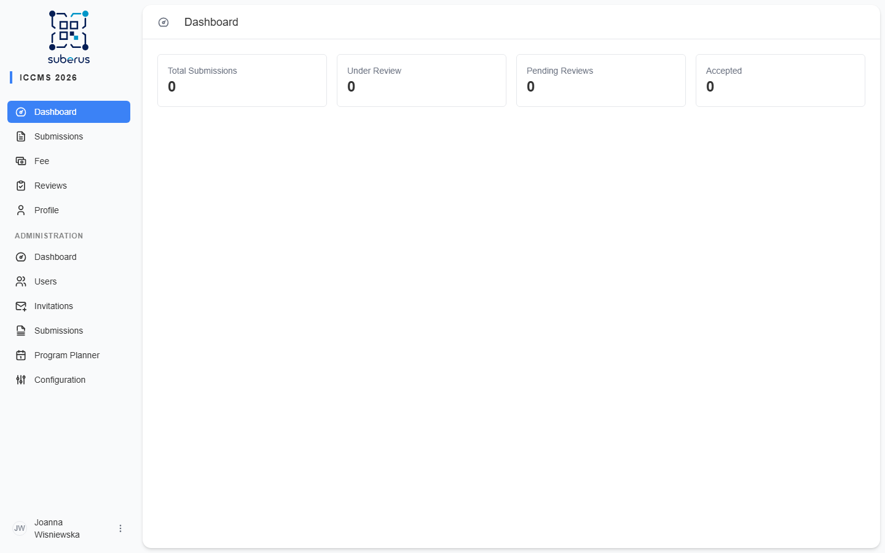
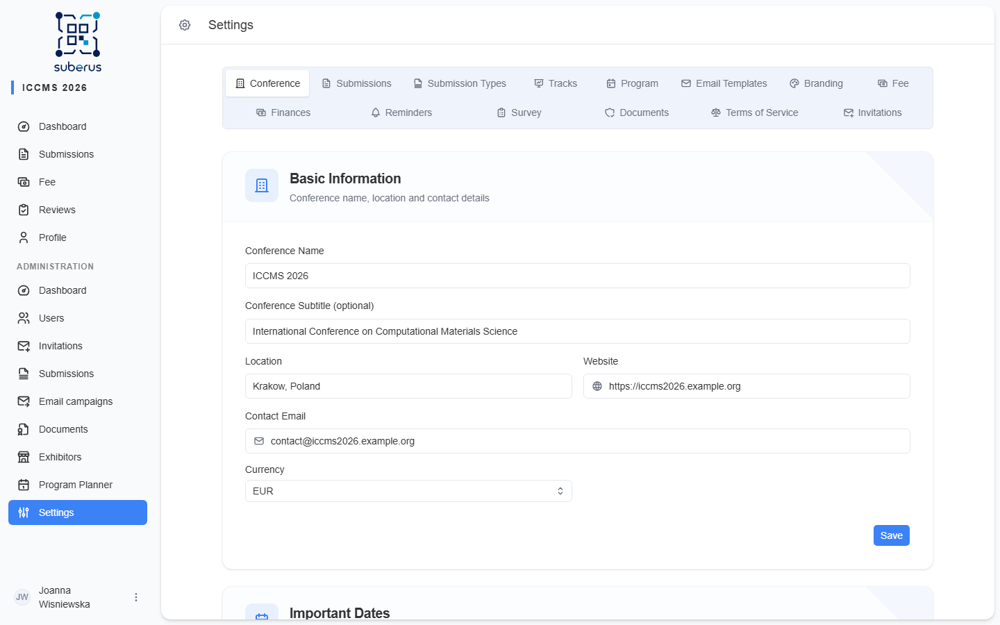

import { Steps, Aside, CardGrid, LinkCard } from '@astrojs/starlight/components';

This page is the **happy path**: the shortest route from a fresh install to an open
call for submissions. Follow it top to bottom once, and you'll have a working
conference. Each step links to the detailed reference page where you can fine-tune
later.

<Aside type="tip" title="You can change everything later">
Nothing here is permanent. Every setting below can be edited at any time from the
**Configuration** screen. The goal now is a working baseline, not perfection.
</Aside>

## Before you start

You need:

- An **administrator account** (created during installation — see *First-time install*).
- The basic facts of your event: name, contact email, website, and the key dates
  (submission deadline, review deadline, conference date).

## The 30-minute setup

<Steps>

1. **Sign in and open Configuration.**
   Log in with your admin account. In the left sidebar choose **Configuration**.
   Everything in this walkthrough lives behind the tabs at the top of that screen.

   

2. **Set the conference identity** *(Conference tab)*.
   Enter the conference **name**, **contact email**, **website**, and the main
   **dates**. These values appear in emails to authors and reviewers, so fill them
   in before any mail goes out.

3. **Choose what people can submit** *(Submission Types tab)*.
   Turn on the type(s) you need — **Oral Presentation**, **Poster**, or
   **Full Paper** — and turn off the rest. For each enabled type set how many
   reviewers it needs and who makes the decision.
   → Full details: **[Submission Types](/configuration/submission-types/)**.

4. **Write the submission guidelines** *(Submissions tab)*.
   Authors see this text on the submission form. Tell them what you expect
   (length, format, scope). You can also set validation rules (e.g. title length)
   here.

5. **Set the deadlines** *(Submissions / Submission Types)*.
   Define when the call closes and how many days reviewers get. Authors and
   reviewers are blocked from acting after their deadline, so get these right.

6. **Check the email templates** *(Email Templates tab)*.
   Suberus sends automatic emails (submission received, reviewer assigned,
   decision made…). The defaults work out of the box — skim them, adjust the
   wording and the footer to match your event, and use **test send** to mail one
   to yourself.

7. **Add your branding** *(Branding tab)*.
   Upload a logo and set the colours. This is what authors and reviewers see at
   the top of every page and in emails.

8. **Set the fee, if any** *(Fee tab)*.
   Add fee types (e.g. *Regular*, *Student*), choose the currency, and write the
   payment instructions authors will read. Skip this tab if your event is free.

9. **Invite your reviewers and co-organisers** *(Managing › Invitations)*.
   Send invitations so reviewers can create accounts — reviewers must exist before
   you can assign them to submissions. How long an invitation link stays valid is
   set on **[Configuration › Invitations](/configuration/invitations/)**.
   → Full details: **[Invitations](/managing/invitations/)**.

10. **Open the call.**
    With at least one submission type **Active** and the guidelines written,
    authors can now register and submit. Do a final dry run: register a test
    author account and walk through a submission yourself.

</Steps>

<Aside type="caution" title="Before you announce">
Send yourself a test email (step 6) and complete one test submission (step 10)
**before** you publish the call publicly. These two checks catch the most common
launch problems — wrong contact address and a misconfigured submission type.
</Aside>

## What's next

Once submissions start arriving you move from *configuration* to *managing the
conference* — assigning reviewers, tracking deadlines, and making decisions. That
part of the manual starts at the **[Managing quick start](/managing/quick-start/)**.

The remaining configuration tabs (Tracks, Reminders, Survey, Terms of Service) are
optional for launch and each get their own reference page. Once you have accepted
presentations, build and publish the schedule in the
**[Program Planner](/planner/overview/)** section.

## Related

<CardGrid>
	<LinkCard title="First-time install" href="/configuration/first-time-install/" description="Create the conference and the first admin account." />
	<LinkCard title="Submission Types" href="/configuration/submission-types/" description="Decide what people can submit and how it's reviewed." />
	<LinkCard title="Conference" href="/configuration/conference/" description="Identity, key dates, and date/time format." />
	<LinkCard title="Email Templates" href="/configuration/email-templates/" description="Review and test the automatic emails." />
</CardGrid>
