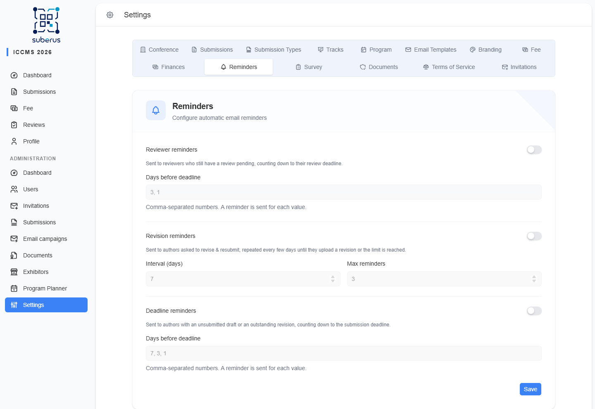

import { Aside, Steps, CardGrid, LinkCard } from '@astrojs/starlight/components';

The **Reminders** tab controls the **automatic emails** Suberus sends to nudge
people before a deadline: reviewers who haven't reviewed yet, authors who owe a
revision, and general deadline warnings. Each reminder type can be turned on or
off independently.

<Aside type="note" title="Where to find it">
**Configuration › Reminders.** Three groups: *Reviewer reminders*, *Revision
reminders*, *Deadline reminders*. One **Save** button at the bottom applies all
three.
</Aside>

<Aside type="tip" title="Email wording lives elsewhere">
This tab decides **when** reminders go out. The **text** of each reminder email is
edited on the **[Email Templates](/configuration/email-templates/)** tab.
</Aside>

## How to schedule reviewer reminders

<Steps>

1. Turn on **Reviewer reminders**.

2. In **Days before deadline**, enter a comma-separated list such as `7, 3, 1` —
   a separate reminder is sent at each value.

3. Optionally configure the *Revision* and *Deadline* groups the same way.

4. Click **Save**.

</Steps>

## Reviewer reminders

Reminds assigned reviewers their review is due.

| Field | What it does | What to enter / Notes |
|---|---|---|
| **Reviewer reminders** | Master switch for this reminder type. | On/Off. |
| **Days before deadline** | When to send, relative to the review deadline. | Comma-separated positive numbers, e.g. `7, 3, 1`. At least one is required when enabled. |

## Revision reminders

Reminds authors who have been asked to revise and resubmit.

| Field | What it does | What to enter / Notes |
|---|---|---|
| **Revision reminders** | Master switch for this reminder type. | On/Off. |
| **Interval (days)** | How many days between successive reminders. | A number ≥ 1. |
| **Max reminders** | How many reminders to send at most. | A number ≥ 1 — stops nagging after this count. |

## Deadline reminders

Sent to authors with an unsubmitted draft or an outstanding revision, as the
submission deadline approaches.

| Field | What it does | What to enter / Notes |
|---|---|---|
| **Deadline reminders** | Master switch for this reminder type. | On/Off. |
| **Days before deadline** | When to send, relative to the deadline. | Comma-separated positive numbers, e.g. `7, 3, 1`. At least one is required when enabled. |

## Related

<CardGrid>
	<LinkCard title="Email Templates" href="/configuration/email-templates/" description="The wording of every reminder email." />
	<LinkCard title="Conference" href="/configuration/conference/" description="The deadlines reminders count down to." />
</CardGrid>
