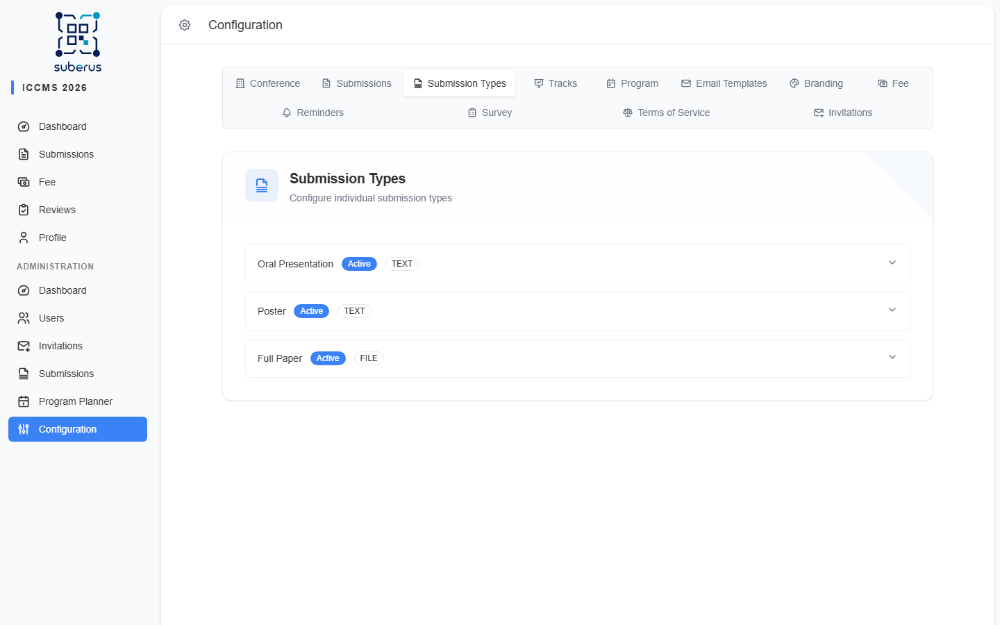

import { Steps, Aside, Tabs, TabItem, CardGrid, LinkCard } from '@astrojs/starlight/components';

**Submission Types** let you decide *what* people can submit and *how* each kind is
reviewed. Suberus supports three reviewable types, and you turn each one on or off
independently:

- **Oral Presentation** — a talk proposal (historically called an *abstract*).
- **Poster** — a poster proposal.
- **Full Paper** — a complete paper, usually with stricter, multi-reviewer review.

Company **exhibitor registration** is configured separately — exhibitors never
enter review, so their few switches live in the **Exhibitors** section of the
**[Conference](/configuration/conference/)** tab.

A traditional conference often enables **Oral Presentation** only. A journal-style
event uses **Full Paper**. A hybrid event enables several at once — each keeps its
own reviewers, deadlines, and rules.

<Aside type="note" title="Where to find it">
**Configuration › Submission Types.** Each type is a collapsible panel; click one
to expand its settings. A badge shows whether it is **Active** or **Inactive** and
its content format.
</Aside>

## Recommended setup by type

Sensible starting points for each type. Adjust to your event.

<Tabs>
	<TabItem label="Oral Presentation">
		- **Content Format:** Text
		- **Required reviewers:** 1
		- **Requires editor decision:** Off (reviewer's recommendation applied automatically)
		- **Review mode:** Single-blind
		- **Scoring:** Off (turn on later if you want numeric criteria)
	</TabItem>
	<TabItem label="Poster">
		- **Content Format:** File Upload (PDF)
		- **Required reviewers:** 1
		- **Requires editor decision:** Off
		- **Review mode:** Single-blind
		- **Scoring:** Off
	</TabItem>
	<TabItem label="Full Paper">
		- **Content Format:** File Upload (PDF)
		- **Required reviewers:** 2–3
		- **Requires editor decision:** On (you make the final call)
		- **Review mode:** Double-blind
		- **Scoring:** On — e.g. *Originality, Clarity, Significance, Methodology*
		- **Confidence level:** On
	</TabItem>
</Tabs>

## How to enable and configure a type

<Steps>

1. Open **Configuration › Submission Types** and click the type you want to set up.

2. Turn **Active** on so authors can choose it on the submission form.

3. Choose the **Content Format** — *Text* for typed abstracts, *File Upload* for
   documents. For file uploads, tick at least one allowed extension and set the
   **max file size**.

4. Set **Required reviewers** and decide **Requires editor decision** (see the
   table below — together these define the review workflow).

5. Pick the **Review mode** (who sees whose name) and the **Review deadline**.

6. Optionally enable **scoring**, **confidence level**, and **review attachments**.

7. Click **Save**. The badge updates to **Active**. Repeat for any other type;
   each is saved on its own.

</Steps>

<Aside type="caution">
Saving is **per type**. If you edit one panel, save it before expanding another —
unsaved changes in a panel are not carried over.
</Aside>

## Settings reference

Every field on a submission type, top to bottom.

| Field | What it does | What to enter / Notes |
|---|---|---|
| **Active** | Makes the type available for selection on the submission form. | Turn off types you don't use — authors won't see them. |
| **Include in program planner** | Accepted submissions of this type appear in the **[program planner](/planner/overview/)** pool and count towards session capacity. | On by default for Oral Presentation and Poster, off for Full Paper (papers are usually not scheduled as talks). |
| **Content Format** | How authors provide their content: **Text (Abstract)** types directly into a box, **File Upload** attaches a document. | Use *Text* for short abstracts, *File Upload* for papers/posters. For *File Upload* types a file is mandatory — authors cannot submit (or submit a revision) without one. |
| **Allowed file extensions** | *(File Upload only)* Which document types are accepted: **pdf**, **doc**, **docx**. | At least one is required, or the type won't save. PDF is the safest default. |
| **Max file size (MB)** | *(File Upload only)* Upload size limit for this type's submission file. | 1–100 MB. Default **10**. |
| **Required reviewers** | How many completed reviews are needed before the submission can reach a decision. | 1–10. Oral/Poster: usually **1**. Full Paper: **2–3**. |
| **Review mode** | Who can see whose identity during review. | **Open** (everyone sees names), **Single-blind** (authors don't see reviewers — most common), **Double-blind** (nobody sees the other side). |
| **Review deadline (days)** | Default number of days a reviewer gets, counted from assignment. | 1–90. You can still override the date per reviewer when assigning. |
| **Requires editor decision** | **On:** you (the editor) make the final accept/reject call after reviews. **Off:** the reviewer's recommendation is applied automatically. | Off is fast and suits abstracts/posters. On gives you control and suits papers. |
| **Enable scoring** | Adds numeric **1–5** criteria to the review form. | Optional. When on, define the criteria below. |
| **Scoring criteria** | *(Scoring only)* The named dimensions reviewers score, each with an optional description. | Add rows like *Originality*, *Clarity*, *Significance*. Description helps reviewers score consistently. |
| **Enable confidence level** | Asks reviewers to rate **how confident** they are in their review (1–5). | Useful for papers; helps you weigh conflicting reviews. |
| **Enable review attachment** | Lets reviewers upload a PDF/DOCX alongside their written review. | Handy when reviewers annotate the manuscript directly. |
| **Enable track selection** | *(Oral Presentation only)* Lets authors pick a preferred **track** when submitting. | Only useful if you've set up tracks. See the *Tracks* page. |
| **Save** | Persists this type's settings. | Per type — save before switching panels. |

## How the two key switches shape the workflow

**Required reviewers** and **Requires editor decision** together decide what happens
after reviews come in:

| Required reviewers | Requires editor decision | Result |
|---|---|---|
| 1 | Off | The single reviewer's recommendation is applied automatically. Fastest. Typical for **Oral / Poster**. |
| 2–3 | On | The submission waits for **your** decision after all reviews arrive. Typical for **Full Paper**. |
| 2–3 | Off | All reviews are collected, then the last reviewer's recommendation is applied automatically. Rarely what you want. |

<Aside type="tip" title="Start simple">
Enable one type, leave scoring off, set 1 reviewer with *editor decision* off. Get
the call live, then add scoring or extra reviewers once you see real submissions.
</Aside>

## Related

<CardGrid>
	<LinkCard
		title="Quick start"
		href="/configuration/quick-start/"
		description="Where submission types fit in the overall setup."
	/>
	<LinkCard
		title="Submissions"
		href="/configuration/submissions/"
		description="Shared rules: length limits, files, author & reviewer guidelines."
	/>
	<LinkCard
		title="Tracks"
		href="/configuration/tracks/"
		description="Needed if you enable author track selection."
	/>
	<LinkCard
		title="Roles & permissions"
		href="/configuration/roles-and-permissions/"
		description="How review mode controls who sees whose identity."
	/>
</CardGrid>
