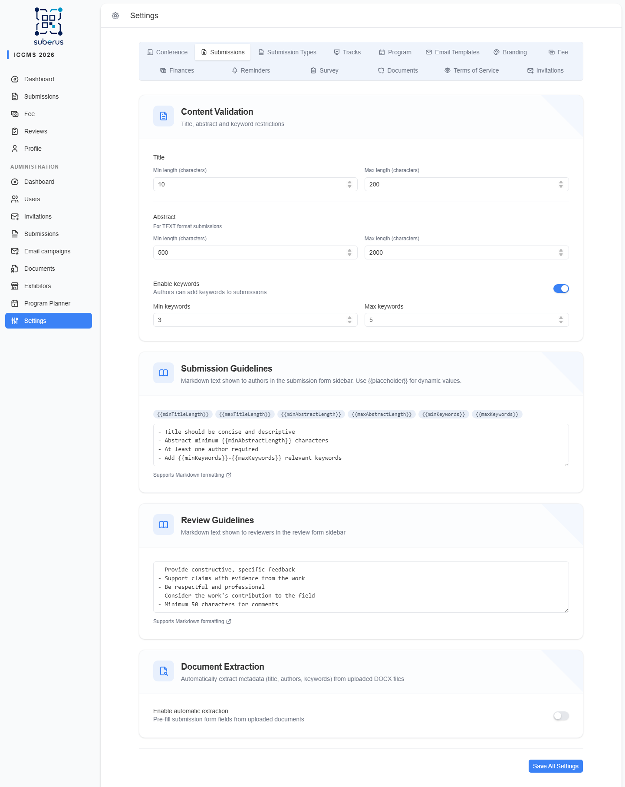

import { Aside, Steps, CardGrid, LinkCard } from '@astrojs/starlight/components';

The **Submissions** tab sets the **rules and guidance** that apply to every
submission, regardless of type: how long titles and abstracts may be, the
**guidelines** authors and reviewers read, and whether Suberus **automatically
extracts** metadata from uploaded documents.

<Aside type="note" title="Where to find it">
**Configuration › Submissions.** Several sections, but a single **Save All
Settings** button at the bottom saves the entire tab at once.
</Aside>

<Aside type="tip">
Per-type rules (how many reviewers, blind mode, file format) live on
**[Submission Types](/configuration/submission-types/)**. This tab is for rules
shared across all types.
</Aside>

## How to set validation rules

<Steps>

1. Under *Content Validation*, set the **Title** min/max lengths.

2. Set the **Abstract** min/max lengths (applies to text submissions).

3. Turn **Enable keywords** on or off; if on, set the min/max keyword counts.

4. Edit the **guidelines** and extraction options, then click **Save All Settings**.

</Steps>

## Content Validation

| Field | What it does | What to enter / Notes |
|---|---|---|
| **Title — Min length** | Shortest allowed title. | Characters, 1–500. Must be ≤ max. |
| **Title — Max length** | Longest allowed title. | Characters, 10–1000. |
| **Abstract — Min length** | Shortest allowed abstract (text submissions). | Characters, 0–10000. Must be ≤ max. |
| **Abstract — Max length** | Longest allowed abstract (text submissions). | Characters, 100–50000. |
| **Enable keywords** | Lets authors add keywords. | On/Off. Reveals the min/max below. |
| **Min keywords** | Fewest keywords required. | 0–20 (when keywords enabled). Must be ≤ max. |
| **Max keywords** | Most keywords allowed. | 1–20 (when keywords enabled). |

<Aside type="tip">
**File uploads** — the accepted file formats and the **max file size** are set
**per submission type** (File Upload format) on
**[Submission Types](/configuration/submission-types/)**.
</Aside>

## Submission Guidelines

Markdown text shown to authors in the submission form sidebar.

| Field | What it does | What to enter / Notes |
|---|---|---|
| **Submission Guidelines** | Guidance authors see while submitting. | Markdown. Click a **placeholder badge** (e.g. `{{maxTitleLength}}`) to insert a dynamic value that always reflects the current limits. |

Available placeholders: `minTitleLength`, `maxTitleLength`, `minAbstractLength`,
`maxAbstractLength`, `minKeywords`, `maxKeywords`.

## Review Guidelines

| Field | What it does | What to enter / Notes |
|---|---|---|
| **Review Guidelines** | Guidance reviewers see in the review form sidebar. | Markdown. e.g. how to give constructive feedback. |

## Document Extraction

Automatically pre-fills submission fields (title, authors, keywords) from uploaded
documents, so authors don't retype them.

<Aside type="caution">
Extraction works on **DOCX uploads only**. PDFs are not auto-extracted.
</Aside>

| Field | What it does | What to enter / Notes |
|---|---|---|
| **Enable automatic extraction** | Master switch for pre-filling from documents. | On/Off. Reveals the engine choices. |
| **Structure-based extraction** | Reads metadata from the document's structure/formatting. Instant, no extra infrastructure. | A status dot shows whether the *PDF API* service is healthy. |
| **AI-assisted extraction** | Uses an AI model for higher accuracy; acts as a fallback for low-confidence structure results. Slower. | Disabled if the LLM service is unavailable (requires `LLM_API_URL`). |

<Aside type="note">
When extraction is enabled, **at least one engine** must be on. The status dots
(green/red) tell you whether each engine's backing service is currently reachable.
</Aside>

## Related

<CardGrid>
	<LinkCard title="Submission Types" href="/configuration/submission-types/" description="Per-type reviewers, blind mode, file format." />
	<LinkCard title="Extraction (managing)" href="/managing/extraction/" description="How extraction behaves day-to-day and keeping it healthy." />
</CardGrid>
