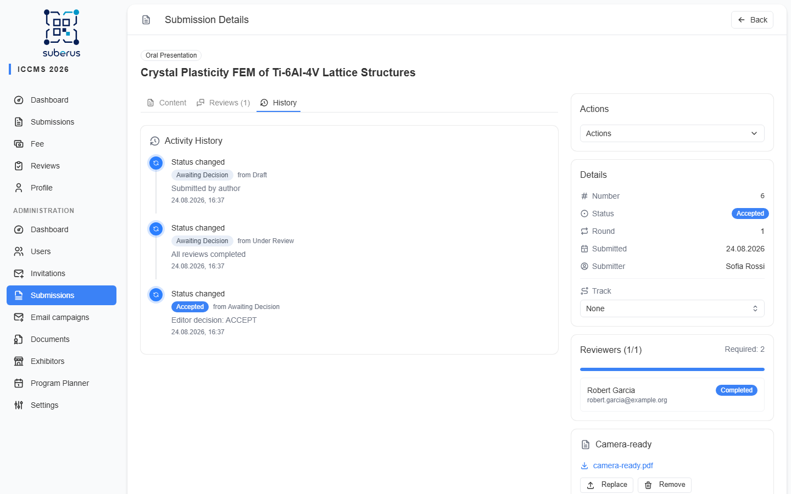

import { Aside, CardGrid, LinkCard } from '@astrojs/starlight/components';

Suberus records every significant action in an **activity log** — who did what, to
which submission or user, and when. It's your audit trail for compliance and for
resolving disputes.

<Aside type="note" title="Where to find it">
The latest entries appear in **Dashboard › Recent activity**. A submission's own
history is shown on its detail page.
</Aside>

## What gets recorded

| Category | Examples |
|---|---|
| **User events** | Registration, email verification, profile updates, role changes, activation/deactivation, deletion. |
| **Submission events** | Creation, submission, status transitions (with from/to, round, reason), withdrawal, resubmission, revised-version uploads (conditional acceptance), track changes, admin edits, deletion (keeps the title and number even after the submission is gone). |
| **Review events** | Reviewer assignment, review submitted, cancellation, overdue marking. |
| **Decision events** | Editor decisions, desk accept/reject, decision overrides. |
| **Invitation events** | Created, used, cancelled. |
| **Admin events** | Fee marked paid/unpaid. |

Each entry captures the **event type**, the **target** (submission/user), the
**performer** (or *system* for automatic actions), structured detail, and a
**timestamp**.

<Aside type="caution" title="Immutable by design">
Activity records are **never edited or deleted** — that's what makes them
trustworthy for disputes. Decisions, overrides, and desk actions all require a
reason precisely so the log explains *why*, not just *what*.
</Aside>

## Related

<CardGrid>
	<LinkCard title="Dashboard" href="/managing/dashboard/" description="Recent activity at a glance." />
	<LinkCard title="Submissions" href="/managing/submissions/" description="Per-submission history and decisions." />
</CardGrid>
