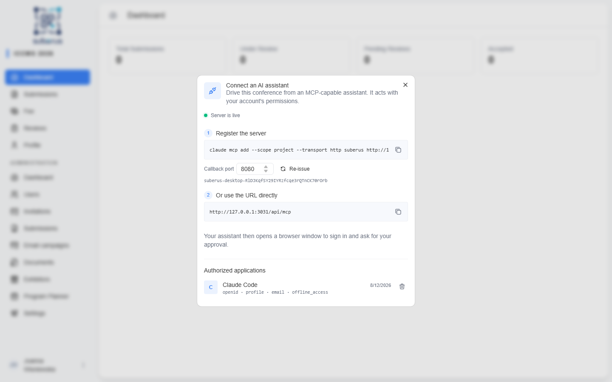
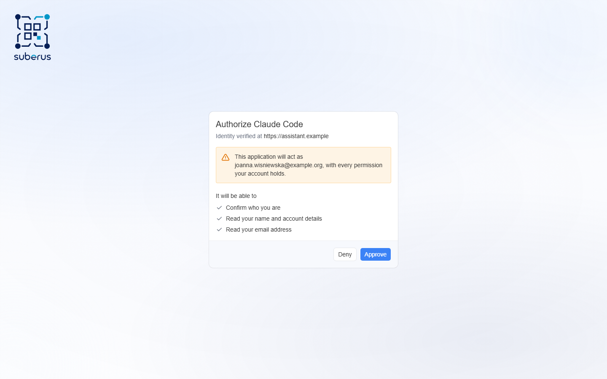

import { Aside, Steps } from '@astrojs/starlight/components';

Suberus can expose an **MCP server** — an interface that AI assistants such as
Claude Code understand. Once connected, you can ask the assistant to list
participants, look someone up, create an account, or change a role, and it
performs those actions in the system through your own account.

<Aside type="caution" title="It acts as you">
The assistant works with **your permissions**. Whatever you can do in the admin
panel, it can do on your behalf. Only connect assistants you trust, and only on
an account whose access matches what you actually want automated.
</Aside>

<Aside type="note" title="Where to find it">
**Connect AI assistant** in the user menu (bottom-left of the sidebar).
Available to **Admins** and **Editors**.
</Aside>



## Turning it on

The MCP server is **off by default**. Whoever runs your instance has to set the
environment variable `MCP_ENABLED=true` and restart it. Until then the
**Connect AI assistant** entry does not appear in the user menu at all.

This is deliberate: enabling it also exposes the OAuth authorization endpoints
that assistants use to sign in.

## Connecting an assistant

Suberus does not let an assistant register itself. Opening the dialog issues
**credentials** for you, and the assistant signs in with them.

<Steps>

1. Open **Connect AI assistant** from the user menu. Credentials are issued the
   moment it opens, so the command in step 1 is ready to use.

2. Copy that command and run it in Claude Code:

   ```bash
   claude mcp add --scope project --transport http suberus https://your-conference.example/api/mcp      --client-id suberus-desktop-... --callback-port 8080
   ```

   `--scope project` writes the server into the project's `.mcp.json`, so
   everyone working in that repository picks it up. Drop the flag to keep the
   server to yourself.

   For other clients, copy the **server URL** from step 2 and set the client id
   and the callback address `http://localhost:8080/callback` by hand.

3. The assistant opens a browser window. Sign in to Suberus as usual.

4. An **authorization screen** appears naming the application and what it is
   asking for. Review it and choose **Approve**.

</Steps>

Two small controls sit under the command: the **callback port** — the port the
assistant listens on while signing you in, `8080` for Claude Code — and
**Re-issue**, which mints a fresh client id or moves it to another port.

To take access away, use the bin icon next to an entry under **Authorized
applications**. That drops the approval and every token issued under it; for
credentials you issued here it deletes the client outright, so the command has
to be re-issued before the assistant can connect again.

<Aside type="caution" title="The port has to match">
The credentials are tied to the exact callback address
`http://localhost:<port>/callback`. If the assistant is started on a different
port, sign-in fails with *invalid redirect uri*. Set the port in the dialog and
choose **Re-issue**, then re-run the command with the new `--callback-port`.
</Aside>



The assistant stores the access it was granted and reconnects on its own next
time. Approved applications are listed at the bottom of the **Connect AI
assistant** dialog, with the access they hold and the date you approved them.

<Aside type="tip" title="Several conferences">
One assistant can be connected to several Suberus instances at once. Give each
one a different name when adding it (`suberus-2026`, `suberus-workshop`) and
issue credentials separately on each. Access granted on one instance never works
on another — each conference issues its own credentials and approves separately.
</Aside>

## The authorization screen

| What it shows | Why it matters |
|---|---|
| **Application name** | The name the application reports about itself. |
| **Identity verified at** | The address Suberus actually fetched the application's details from. This is the part the system checked itself, so trust it over the name. Shown only for applications that publish their identity at a URL — credentials you issued yourself have none. |
| **Acting as** | The account the assistant will use — yours. |
| **It will be able to** | The access being requested, in plain language. |

Choosing **Deny** returns the assistant to where it started with nothing
granted; nothing is stored.

## What the assistant can do

Today the assistant can work with **users**:

| Action | Access needed | Who can use it |
|---|---|---|
| List participants, with search and role/fee filters | Read | Admin, Editor |
| Open one participant's full record | Read | Admin, Editor |
| Create a participant account | Write | Admin, Editor |
| Change role, activation, late-submission, fee or e-mail verification | Write | Admin, Editor |
| Edit someone's personal and billing details | Write | Admin only |

Two independent things decide what an assistant may do: **your role** and **the
access you approved**. The assistant is offered an action only when both allow
it — an Editor's assistant is never offered the profile-editing action, and an
assistant you approved for reading only never sees any of the Write actions,
whatever your role is.

<Aside type="tip" title="Approving read-only access">
On the authorization screen you can see exactly which of the two the
application asked for. Approving an assistant that only requested reading is a
good way to let it answer questions about your participants without ever being
able to create accounts or change roles.
</Aside>

Creating an account sends the usual **set-password e-mail**, exactly as
[adding a user by hand](/managing/users/#add-a-user-yourself) does. You can ask
the assistant to skip that e-mail if you would rather deliver the details
another way.

<Aside type="note" title="Everything is logged">
Actions the assistant performs are recorded in the
**[Activity log](/managing/activity-log/)** under your name, the same as if you
had clicked through the interface.
</Aside>
