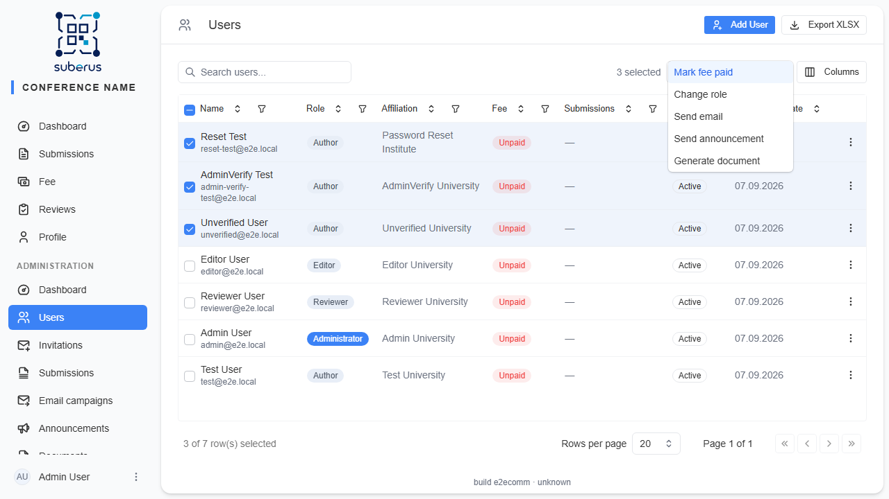
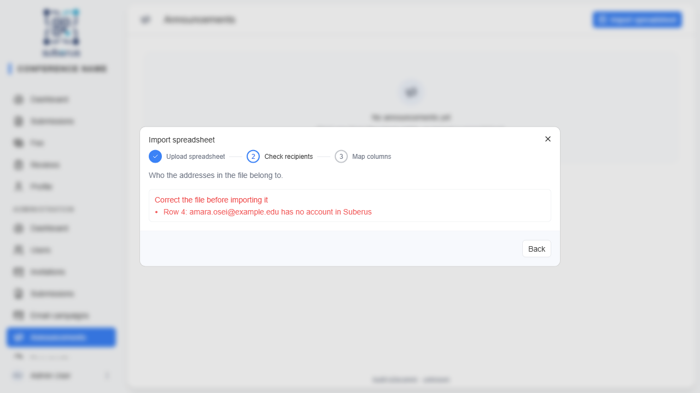
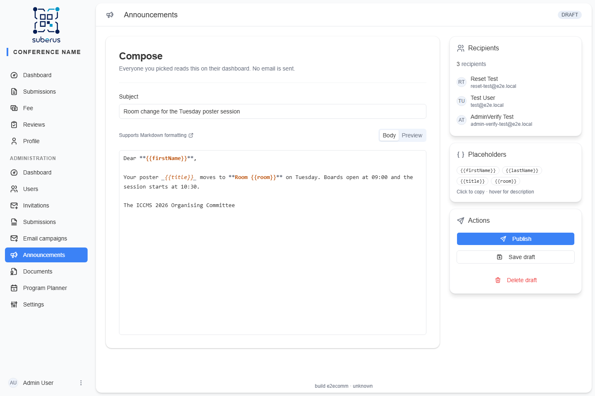
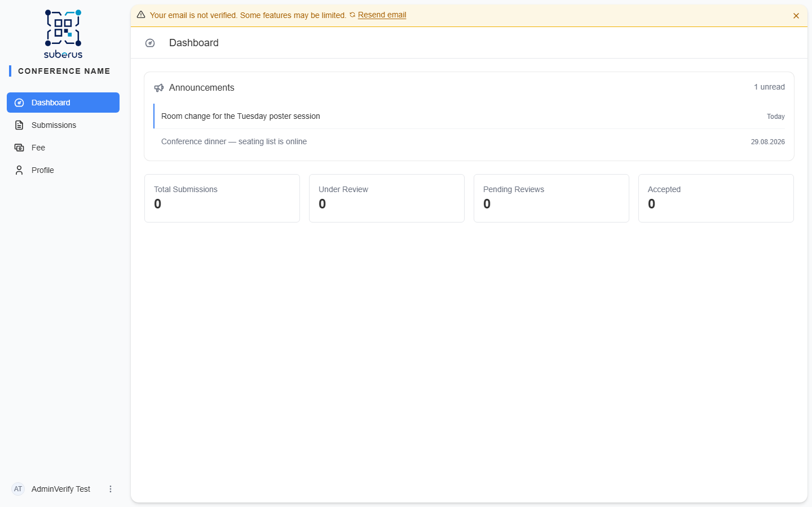
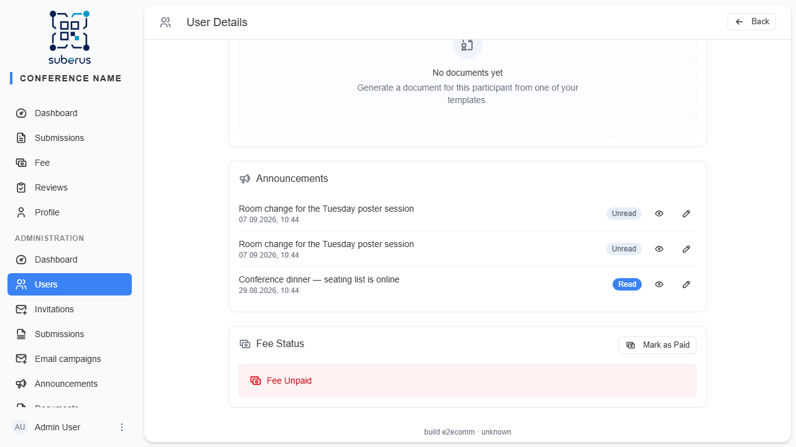

import { Aside } from '@astrojs/starlight/components';

**Announcements** puts a message inside Suberus instead of in someone's inbox. You pick
the recipients, write the text in Markdown, and publish; everyone you picked sees the
title on their dashboard the next time they open the app and can read it and mark it as
read. Nothing is emailed. Use it for the things people should find when they log in — a
change of room, a reminder that a document is waiting — and use
[email campaigns](/managing/bulk-email/) when the message has to reach them wherever they
are.

<Aside type="note" title="Where to find it">
**Announcements** in the admin sidebar lists what you have written and holds the
**Import spreadsheet** button. To start from the people already in Suberus, go to
**Users**, select recipients, and choose **Send announcement** from the bulk actions.
</Aside>

<Aside type="caution" title="Everyone needs an account">
An announcement is read inside Suberus, so every recipient must have a Suberus account.
An address that has none cannot be included — unlike an email campaign, which can be
sent to a stranger.
</Aside>

## Choosing the recipients

An announcement starts from the **Users** list. Search or filter for the people you
want, tick their checkboxes (or use the header checkbox to take everyone on the current
page), then open the **Bulk actions** menu and choose **Send announcement**. Suberus
creates the draft and opens the composer with exactly those users attached.

Each recipient's name and submission titles are captured at that moment, so editing a
profile afterwards won't change what an already-published announcement says.

## Importing recipients from a spreadsheet

When the message has to carry a different value for each person — a room number, a slot
time — start from a spreadsheet instead. On **Announcements**, click **Import
spreadsheet**. The wizard is the same three steps as the email one, with one difference:
an address with no Suberus account stops the import instead of offering to add the
person anyway. Remove those rows from the file and upload it again.

| Setting | What it does |
|---|---|
| **File** | One `.xlsx` or `.xls` file, up to **5 MB** and 5000 rows. Only the first sheet is read. The file is checked by its actual content, so a renamed file is rejected. |
| **Header row** | Found automatically: the first row with at least two filled cells. A title line and blank rows above the table are ignored. |
| **Email column** | Which column holds the addresses. Guessed from the content, changeable. Addresses are compared without regard to case or surrounding spaces. |
| **Use as** | Per column: **Skip** or **New placeholder** (becomes a token in the message). The first name and last name options do not appear here — every recipient already has an account, and the account's own name wins. |
| **Placeholder key** | The token name, filled in from the heading. Letters, digits and underscores, starting with a letter. It cannot be `firstName`, `lastName` or `title`, and two columns cannot claim the same key. |

Three things stop the import: a cell that is not an email address, the same address
twice, and an address with no Suberus account.

## Writing and publishing

1. Write a **Subject** and **Body**. The body is Markdown only — headings, bold, lists,
   links. The **Preview** tab shows exactly what the reader gets.
2. **Save draft** stores your edits. **Publish** stays disabled until both the subject
   and the body are filled in and every `{{token}}` you wrote is a real placeholder.
3. **Publish** asks for confirmation, then renders the message once per recipient with
   their own values and puts it on their dashboard straight away. There is no queue and
   no waiting.

Publishing cannot be undone, and a published announcement cannot be rewritten for
everyone at once. What you can still change is one person's copy — see below.

## What the recipient sees

The announcement appears in an **Announcements** card above the statistics on the
dashboard, newest first, with the unread ones marked. Clicking a title opens the full
text; **Mark as read** greys the row out. Announcements never expire and a reader cannot
delete one — a read announcement simply stops standing out.

## Editing one person's copy

Open the person in **Users**. The **Announcements** section on their profile lists every
announcement they have received, whether they have read it, and lets you preview or edit
it.

**Edit** opens the announcement as that person sees it, with their placeholders already
filled in, so you are editing the finished text rather than a template. Saving changes
that one recipient's copy — everybody else keeps the original wording — and does not
reset their read mark.

| Action | What it does |
|---|---|
| **Read / Unread** | Whether that person has marked the announcement as read. |
| **Preview** | Shows the announcement exactly as that person sees it. |
| **Edit** | Rewrites the subject and body for this recipient only. Markdown, with a live preview. |

## Placeholders

Drop these tokens into the subject or body; each is replaced per recipient when the
announcement is published:

| Placeholder | Replaced with |
|---|---|
| `{{firstName}}` | The recipient's first name. |
| `{{lastName}}` | The recipient's last name. |
| `{{title}}` | The recipient's submission titles, comma-separated. Empty for users with no submissions. |
| your own keys | Anything you mapped from a spreadsheet, for example `{{room}}`. The **Placeholders** panel lists the keys this announcement carries; hover one to see which column it came from, click to copy it. |

A token that matches no key is flagged in the **Placeholders** panel and blocks
publishing until you fix it.

## Saving an email in the profile too

An email campaign can leave the same message in the recipients' dashboards. Turn on
**Save in user profile** in the campaign composer before sending — see
[email campaigns](/managing/bulk-email/).
