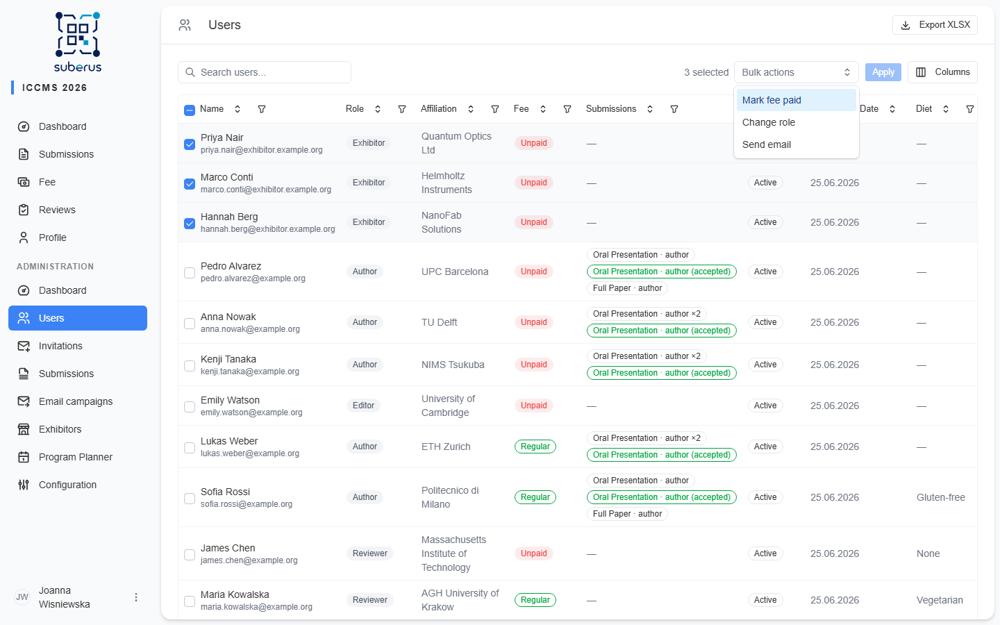
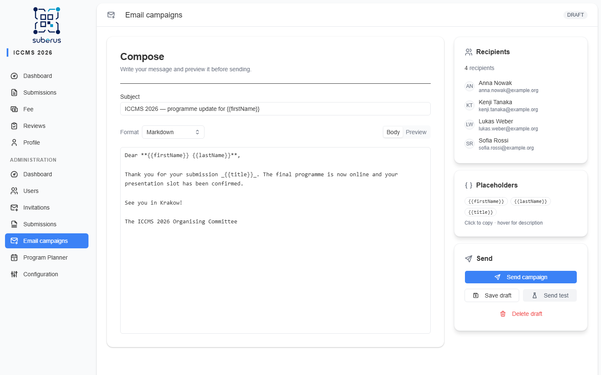
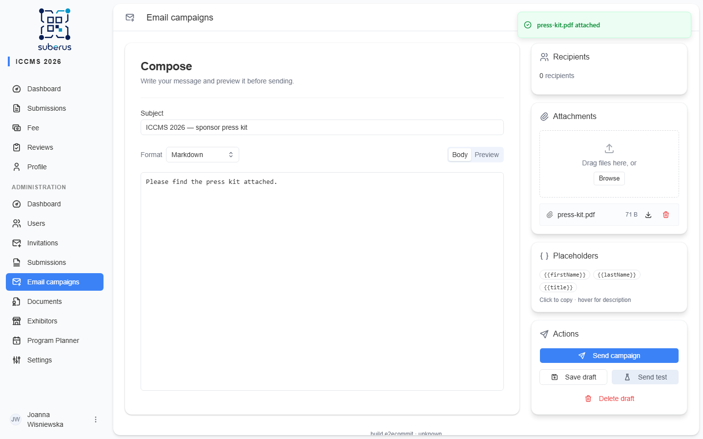

import { Aside, CardGrid, LinkCard } from '@astrojs/starlight/components';

**Email campaigns** lets you write a message once and send it to many users at the same
time — an announcement, a deadline nudge, anything ad-hoc that isn't covered by the
automatic [email templates](/settings/email-templates/). You choose the
recipients from the **Users** list, compose the body as plain text, Markdown, or
MJML, preview the rendered result, send a test to yourself, then queue the send.

<Aside type="note" title="Where to find it">
**Email campaigns** in the admin sidebar shows the send history. To start a new message,
go to **Users**, select recipients, and choose **Send email** from the bulk actions.
</Aside>

## Choosing the recipients

A campaign always starts from the **Users** list — there's no separate recipient
picker. Search or filter for the people you want, tick their checkboxes (or use the
header checkbox to take everyone on the current page), then open the **Bulk actions**
menu and choose **Send email**. Suberus creates the draft, opening the composer with
exactly those users attached.

Each recipient's name and submission titles are captured at that moment, so editing a
profile afterwards won't change what an already-queued campaign sends.

## Composing and sending

1. Write a **Subject** and **Body**, choosing a **Format** (see below). Optionally set
   a **Reply-To** address so replies reach you instead of the conference **Contact
   Email**, which is used when this is left blank. The preview updates as you type. **Send test** and
   **Send campaign** stay disabled until both the subject and body are filled in.
2. Click **Send test** to receive the message at your own address, placeholders filled
   from random sample data — a quick way to check the formatting.
3. Click **Send campaign**. It's queued and delivered one recipient at a time, with a
   progress bar showing how many have been processed.

## Attachments

While a campaign is still a **draft**, the **Attachments** panel lets you attach files
that ride along with every email. Drag files onto the drop area (or click **Browse**),
and they upload immediately. Each recipient — and the **Send test** copy — receives the
same set of files.

- **Limits:** up to **10 MB per file** and **25 MB total** per campaign. The total cap
  keeps the message within the size most mail servers accept.
- **Allowed types:** PDF, DOCX, XLSX, PPTX, PNG, JPG, GIF, WebP, ZIP. Files are validated
  by their actual content (not just the extension), so a renamed or unsupported file is
  rejected.
- **Editing:** add or remove attachments only while the campaign is a draft. Once sent,
  the list is read-only.
- **Copy to new draft** also copies the attachments into the new draft.

## Fields

| Field | What it does |
|---|---|
| **Recipients** | The users you selected in the Users list. Their name and submission titles are captured when the draft is created, so later profile edits don't change what gets sent. |
| **Subject** | The email subject line. Supports placeholders (plain text — never HTML). |
| **Reply-To** | Optional. A single email address. If set, replies go here instead of the platform's sending mailbox. Leave blank to fall back to the **Contact Email** from *Settings › Conference*. |
| **Format** | **Plain text** (sent as-is), **Markdown** (rendered to HTML), or **MJML** (responsive email markup, compiled to HTML). |
| **Body** | The message source, in the chosen format. Supports placeholders. |
| **Attachments** | Files sent with every email (draft only). Max 10 MB/file, 25 MB total; PDF, Office docs, images, or ZIP. Validated by content. |
| **Preview** | The rendered email. HTML formats render in a sandboxed frame; plain text shows verbatim. |
| **Save draft** | Stores your edits without sending. You can return to the draft later. |
| **Send test** | Sends one copy to your own address with sample placeholder values. |
| **Send campaign** | Renders the final body, queues the campaign, and starts delivery. |
| **Copy to new draft** | Shown once a campaign has been sent: clones the subject, body, format, Reply-To, attachments, and the exact recipient list into a fresh draft you can edit and resend. |

## Placeholders

Drop these tokens into the subject or body; each is replaced per recipient when the
email is sent:

| Placeholder | Replaced with |
|---|---|
| `{{firstName}}` | The recipient's first name. |
| `{{lastName}}` | The recipient's last name. |
| `{{title}}` | The recipient's submission titles, comma-separated. Empty for users with no submissions. |

## Delivery & throttling

Emails are sent through a background queue with a pause between each one (set by the
`BULK_EMAIL_DELAY_SECONDS` environment variable, default **5 seconds**) to avoid
overwhelming the mail server. The send is **resumable**: if the server restarts
mid-campaign, it continues with the recipients that haven't been sent yet rather
than starting over.

<Aside type="caution">
There is no "unsend". Always use **Send test** first, and double-check the
recipient count before clicking **Send campaign**.
</Aside>

## History

The **Email campaigns** page lists past campaigns with their status, sent/total counts,
and date. Open one to see its content and the per-recipient delivery result
(sent / failed). A sent campaign is read-only, but **Copy to new draft** clones it
(content + recipients) into an editable draft — handy for recurring announcements.

## Preparing a campaign with an AI assistant

A connected [AI assistant](/managing/ai-assistant/) can put a campaign together for
you — pick the recipients, write the subject and body, send itself a test copy —
and, if you approved it for **E-mail, send**, queue the campaign too. Drafts it
creates show up on this page like any other, so you can read and edit one before
it goes out. Attachments stay manual.

## Related

<CardGrid>
	<LinkCard title="Users" href="/managing/users/" description="Select the recipients for a bulk email." />
	<LinkCard title="AI assistant" href="/managing/ai-assistant/" description="Let an assistant draft and send a campaign." />
	<LinkCard title="Email Templates" href="/settings/email-templates/" description="Automatic transactional emails." />
	<LinkCard title="Reminders" href="/settings/reminders/" description="Scheduled reviewer and deadline nudges." />
</CardGrid>
