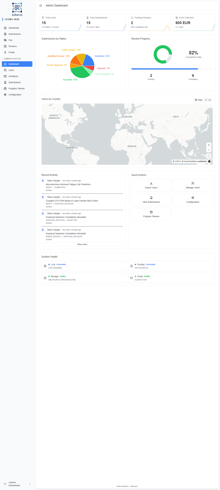

import { Aside, CardGrid, LinkCard } from '@astrojs/starlight/components';

The **Dashboard** is your home base. It summarises the state of the conference and
the health of the system, and refreshes automatically (about once a minute).

<Aside type="note" title="Where to find it">
The first screen after signing in as an Editor/Admin, or **Dashboard** in the
sidebar.
</Aside>

## What's on it

| Panel | What it shows |
|---|---|
| **Health alerts** | Prominent warnings when a core service (file storage, email) is failing. |
| **Metrics** | Headline counts — total users, submissions, pending reviews, and fees collected. The fees tile shows **paid / expected**, where *paid* counts everyone who has paid (including listeners with no submission) and *expected* is *paid* plus any users with at least one submission who still owe (the people who must pay). Each tile also shows a 14-day trend sparkline of daily changes (new signups, new submissions, completed reviews, and fees collected per day). |
| **Submissions chart** | Submissions over time / by status. |
| **Review progress** | How many reviews are done vs. outstanding. |
| **Users by country** | Where your users are based. Toggle the header switch between **Map** (bubbles sized by user count) and **List** (each country with its flag and number of registered users, highest first). |
| **Recent activity** | The latest events from the audit log (newest first). |
| **Quick actions** | Shortcuts to common admin tasks. |
| **System health** | Status of file storage (S3), email (SMTP), the LLM, the PDF API, and the DOCX API (DOCX structural redline) services. |

<Aside type="caution" title="Act on red health indicators">
If **System health** shows email (SMTP) or storage (S3) as failing, notifications
and file uploads may be broken. Fix the underlying service before the call gets
busy — check the relevant environment configuration.

A **yellow** LLM indicator means the service is reachable but the configured model
(`LLM_MODEL` / `LLM_EMBEDDING_MODEL`) is not one the API reports — AI features stay
disabled until you correct the model name. When green, the indicator shows the model
in use; when red or yellow, it shows the connection error or the available models.
</Aside>

## "A new version is available" banner

When the application is upgraded while you have a tab open, a bar appears at the
bottom of the screen reading **"A new version of the app is available. Refresh to
avoid errors."** with a **Refresh** button. The old tab still runs the previous
version, so some actions can fail until you reload — click **Refresh** when it is
convenient (it won't reload on its own, so you won't lose anything you're typing).

🖼️ [Screenshot placeholder: update banner at the bottom of the screen]

## Related

<CardGrid>
	<LinkCard title="Submissions" href="/managing/submissions/" description="Drill into the work behind the metrics." />
	<LinkCard title="Activity log" href="/managing/activity-log/" description="The full history behind 'Recent activity'." />
</CardGrid>
