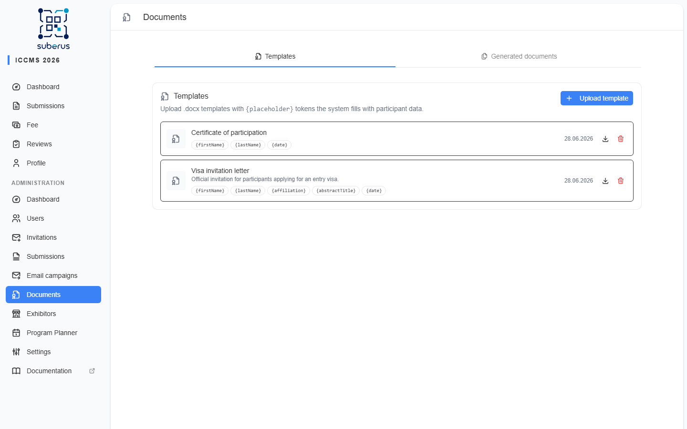
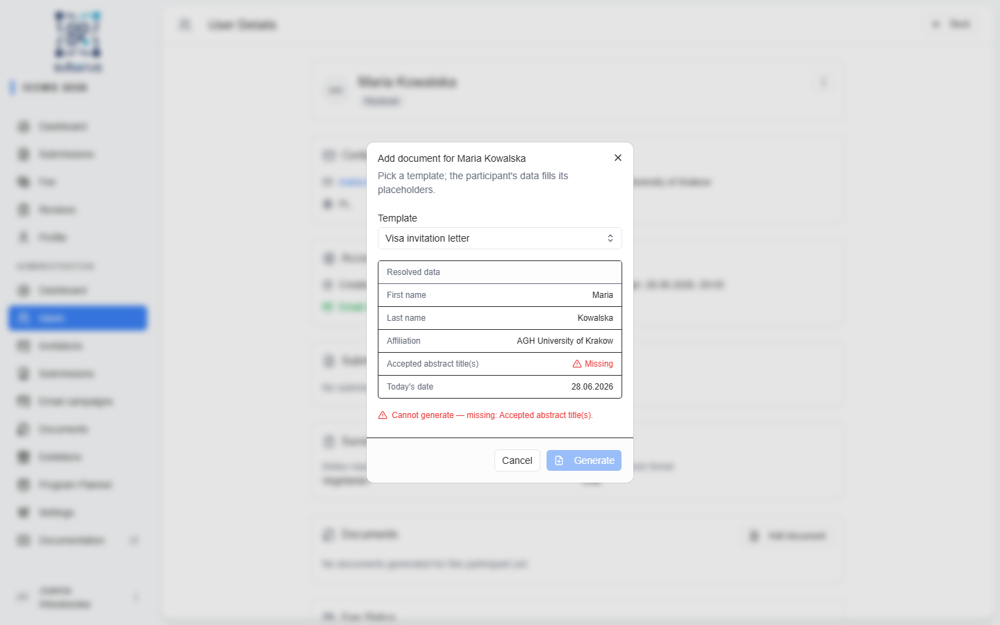
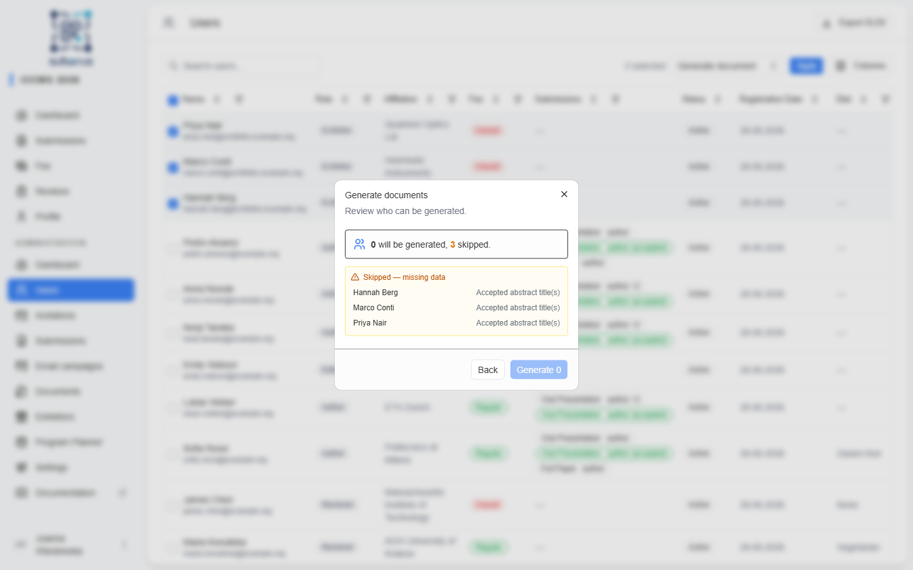
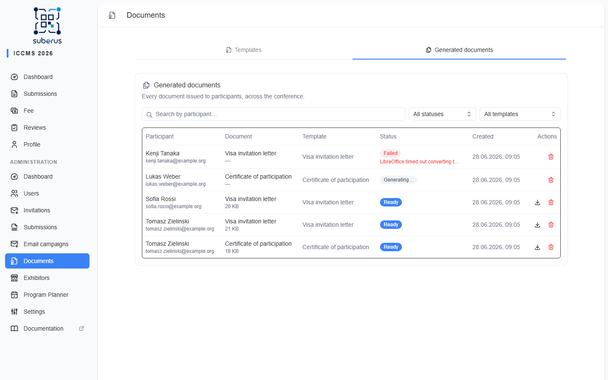
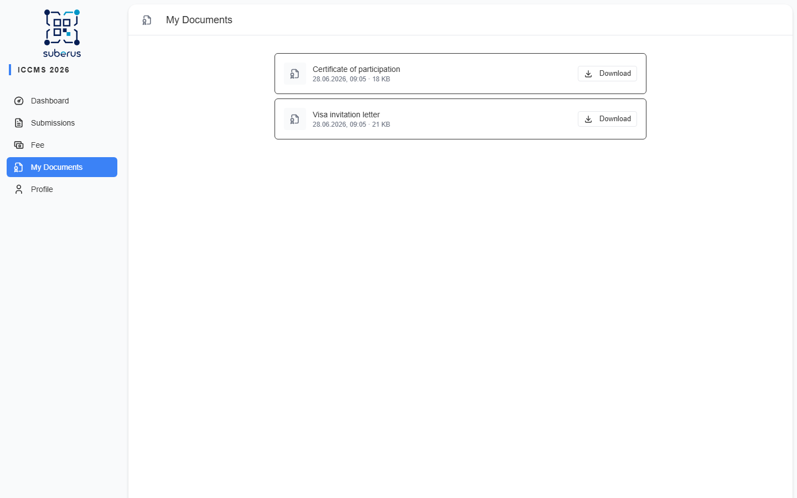

import { Aside, CardGrid, LinkCard, Steps } from '@astrojs/starlight/components';

The **Documents** generator turns a `.docx` template into a personalised **PDF** for a
participant — a visa invitation letter, a participation confirmation, or any document
that embeds the participant's own data. You upload a template once, mark where the data
goes with `{placeholder}` tokens, and Suberus fills it in and assigns the finished PDF to
the participant, who receives an email and can download it from their account.

<Aside type="note" title="Where to find it">
**Documents** in the admin sidebar (visible to **Admins** and **Editors**). It has two
tabs: **Templates** (upload and manage templates) and **Generated documents** (every
document issued to any participant).
</Aside>

## How it works

<Steps>

1. **Upload a template** — a `.docx` file containing `{placeholder}` tokens.
2. **Generate** for one participant (from their profile) or for **many** at once
   (from the template).
3. Suberus checks the participant has all the data each placeholder needs. If anything
   is missing, generation is **blocked** and you're told what's missing.
4. The PDF is rendered in the background, assigned to the participant, and they get an
   email notification.

</Steps>

## Templates

### Uploading a template

On the **Templates** tab, click **Upload template**, give it a name (and optional
description), and choose your `.docx` file.

Write placeholders in the document as `{key}` — for example `{firstName}` or
`{abstractTitle}`. On upload, Suberus reads the placeholders and **validates** them: only
the supported keys below are allowed, and only simple text tokens (no loops or
conditions). If the document contains an unknown token, the upload is rejected with a
message listing the offending tokens.

<Aside type="tip">
Type the tokens exactly, including the braces and capitalisation: `{firstName}`, not
`{first name}` or `{FirstName}`.
</Aside>

### Supported placeholders

| Placeholder | Replaced with |
|---|---|
| `{firstName}` | The participant's first name. |
| `{lastName}` | The participant's last name. |
| `{affiliation}` | The participant's affiliation (institution). |
| `{abstractTitle}` | The titles of the participant's **accepted** submissions, joined with commas. |
| `{email}` | The participant's email address. |
| `{date}` | Today's date, in the conference's configured date format. |

### Managing templates

Each template row shows its name, the placeholders it uses, and actions:

| Action | What it does |
|---|---|
| **Download** | Downloads the original `.docx` you uploaded. |
| **Delete** | Removes the template. Documents already generated from it are kept. |

## Generating for one participant

Open a participant from **Users**, then either click **Add document** in the
**Documents** section or pick **Generate document** from the header **Actions** menu.
Pick a template and Suberus shows a **resolution preview** — every
placeholder the template uses with the value that will be filled in, or a **Missing**
flag where the participant has no data for it.

If any value is missing (for example, the participant has no accepted abstract for
`{abstractTitle}`, or no affiliation set), the **Generate** button stays disabled until
you resolve the data. This prevents issuing a visa letter with a blank field.

When you click **Generate**, the document is queued — it appears as **Generating…** in
the participant's Documents section and flips to **Ready** when the PDF is finished.

## Generating for many

Bulk generation works like a **bulk email**: it starts from the **Users** list. Search or
filter for the participants, tick their checkboxes, open the **Bulk actions** menu and
choose **Generate document**, then **Apply**.

Pick a template and **Review**. Suberus shows how many will be generated and which are
**skipped** because they're missing data (and which data). Confirm with **Generate**, and
a live **progress** view shows ready / pending / failed counts as the batch runs.

<Aside type="note">
Each document renders independently in the background, so a single failure doesn't stop
the rest of the batch. Failed rows show the reason; you can regenerate them later.
</Aside>

## Generated documents

The **Generated documents** tab lists every document issued to any participant, with the
participant, template, status, and date. Search by participant, or filter by status or
template. You can **download** a ready document or **delete** any document (the
participant will no longer see it — no notification is sent).

## What the participant sees

When a document becomes **Ready**, the participant receives the **Document generated**
email and a **My Documents** link appears in their sidebar (only once they have at least
one document). There they can download their PDFs.

## Related

<CardGrid>
	<LinkCard title="Users" href="/managing/users/" description="Open a participant to add a document." />
	<LinkCard title="Email Templates" href="/settings/email-templates/" description="Edit the 'Document generated' notification email." />
	<LinkCard title="Submissions" href="/managing/submissions/" description="Accepted submissions supply {abstractTitle}." />
</CardGrid>
