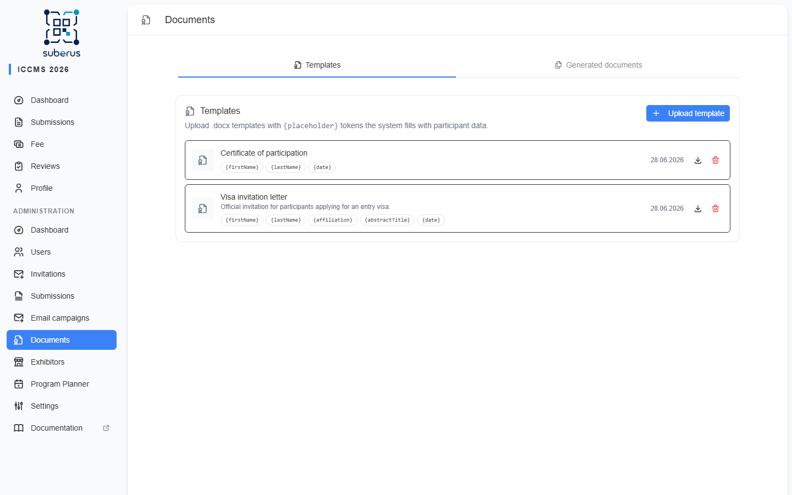
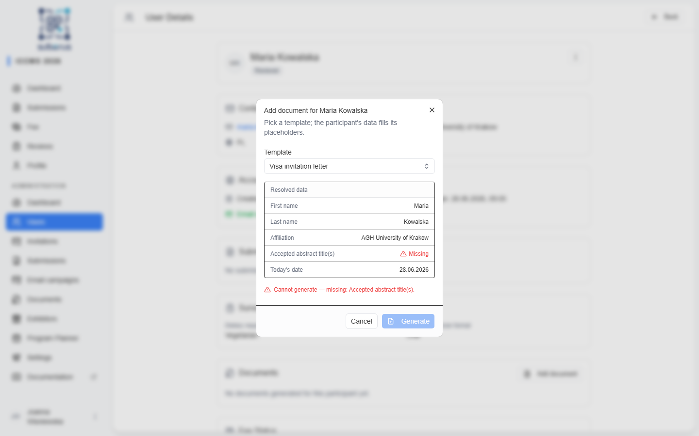
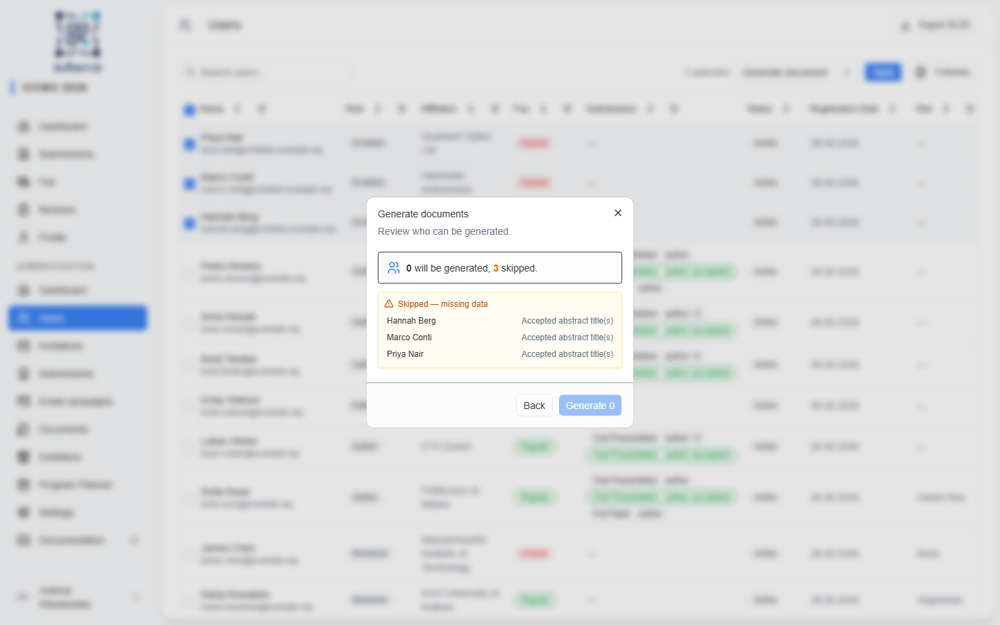
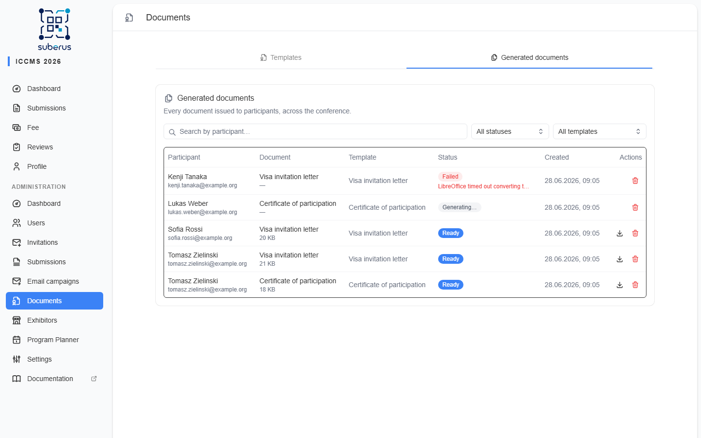
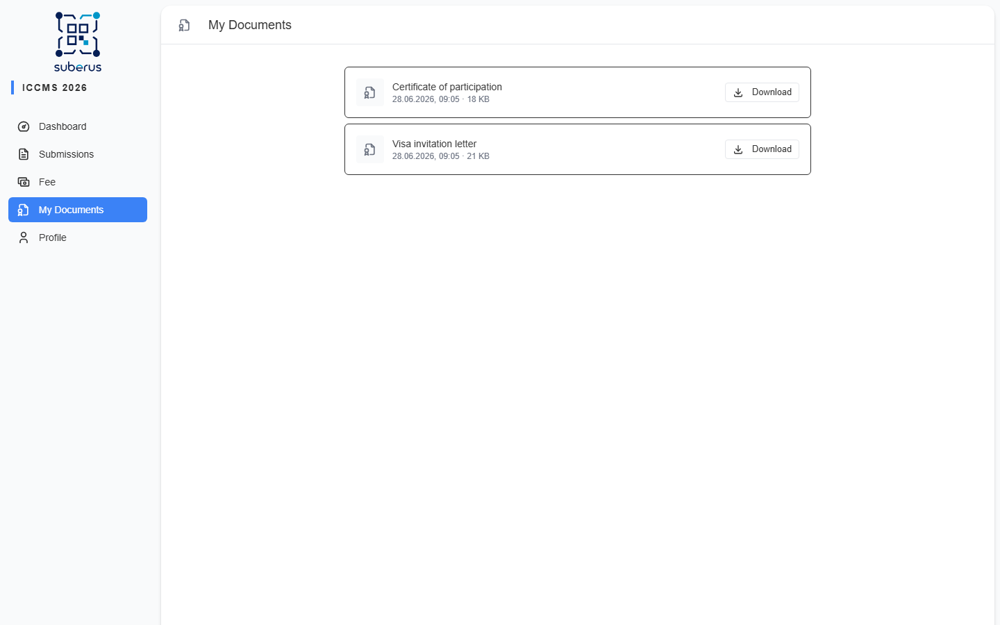

import { Aside, CardGrid, LinkCard, Steps } from '@astrojs/starlight/components';

**Documents** puts a **PDF** in a participant's account, and there are two ways to get one
there. Suberus can **generate** it from a `.docx` template — a visa invitation letter, a
participation confirmation, anything that embeds the participant's own data: you upload
the template once, mark where the data goes with `{placeholder}` tokens, and Suberus fills
it in. Or you **upload a finished PDF** somebody produced elsewhere — an invoice, a signed
certificate, a permit — and assign it to the participant yourself, one at a time or a
whole batch as a ZIP.

Either way the participant receives an email and can download the document from their
account.

<Aside type="note" title="Where to find it">
**Documents** in the admin sidebar (visible to **Admins** and **Editors**). It has two
tabs: **Templates** (upload and manage templates) and **Generated documents** (every
document issued to any participant).
</Aside>

## How it works

<Steps>

1. **Upload a template** — a `.docx` file containing `{placeholder}` tokens — or skip
   straight to uploading a finished PDF.
2. **Generate** for one participant (from their profile) or for **many** at once
   (from the template); or **upload** a PDF for one participant, or **import a ZIP** for
   many.
3. When generating, Suberus checks the participant has all the data each placeholder
   needs. If anything is missing, generation is **blocked** and you're told what's missing.
4. The PDF is prepared in the background, assigned to the participant, and they get an
   email notification.

</Steps>

## Templates

### Uploading a template

On the **Templates** tab, click **Upload template**, give it a name (and optional
description), and choose your `.docx` file.



Write placeholders in the document as `{key}` — for example `{firstName}` or
`{abstractTitle}`. On upload, Suberus reads the placeholders and **validates** them: only
the supported keys below are allowed, and only simple text tokens (no loops or
conditions). If the document contains an unknown token, the upload is rejected with a
message listing the offending tokens.

<Aside type="tip">
Type the tokens exactly, including the braces and capitalisation: `{firstName}`, not
`{first name}` or `{FirstName}`.
</Aside>

### Supported placeholders

| Placeholder | Replaced with |
|---|---|
| `{firstName}` | The participant's first name. |
| `{lastName}` | The participant's last name. |
| `{affiliation}` | The participant's affiliation (institution). |
| `{abstractTitle}` | The titles of the participant's **accepted** submissions, joined with commas. |
| `{email}` | The participant's email address. |
| `{date}` | Today's date, in the conference's configured date format. |

### Managing templates

Each template row shows its name, the placeholders it uses, and actions:

| Action | What it does |
|---|---|
| **Download** | Downloads the original `.docx` you uploaded. |
| **Delete** | Removes the template. Documents already generated from it are kept. |

## Generating for one participant

Open a participant from **Users**, then either click **Add document** in the
**Documents** section or pick **Generate document** from the header **Actions** menu.
Pick a template and Suberus shows a **resolution preview** — every
placeholder the template uses with the value that will be filled in, or a **Missing**
flag where the participant has no data for it.



If any value is missing (for example, the participant has no accepted abstract for
`{abstractTitle}`, or no affiliation set), the **Generate** button stays disabled until
you resolve the data. This prevents issuing a visa letter with a blank field.

When you click **Generate**, the document is queued — it appears as **Generating…** in
the participant's Documents section and flips to **Ready** when the PDF is finished.

## Generating for many

Bulk generation works like a **bulk email**: it starts from the **Users** list. Search or
filter for the participants, tick their checkboxes, open the **Bulk actions** menu and
choose **Generate document**.

Pick a template and **Review**. Suberus shows how many will be generated and which are
**skipped** because they're missing data (and which data). Confirm with **Generate**, and
a live **progress** view shows ready / pending / failed counts as the batch runs.



<Aside type="note">
Each document renders independently in the background, so a single failure doesn't stop
the rest of the batch. Failed rows show the reason; you can regenerate them later.
</Aside>

## Uploading a ready-made PDF

When the document was produced outside Suberus — an invoice from accounting, a certificate
signed by the organising committee — you attach the finished file instead of generating it.

Open a participant from **Users**, click **Add document** in the **Documents** section,
and switch to the **Upload a PDF** tab.

🖼️ [Screenshot placeholder: 72 — Add-document dialog on the "Upload a PDF" tab, with the file picker, title, and the sign / visible seal / notify checkboxes]

| Field | What it does |
|---|---|
| **PDF file** | The finished document. PDF only, up to **25 MB**. Suberus checks the real file contents, not the extension. |
| **Title** | The document's name everywhere it appears, including in the participant's account. Defaults to the file name. |
| **Sign with the conference certificate** | Adds the conference's digital signature, exactly as for a generated document. Shown only when [signing](/settings/documents/) is switched on. |
| **Visible seal** | Draws the signature seal on the first page. Turn it off to sign without a visible stamp — the signature is still embedded and verifiable. Shown only when **Sign** is checked; on by default. |
| **E-mail the participant when it is ready** | Sends the **Document generated** email. Turn it off to file a document quietly. |

The document appears as **Generating…** while it is signed and stored, then flips to
**Ready**.

## Importing many PDFs from a ZIP

When somebody hands you a folder of finished documents — one invoice per participant, one
certificate per attendee — import them in a single pass. Go to the **Generated documents**
tab and click **Import ZIP**.

Every PDF in the archive must be **named after the participant's ID**, the long identifier
from the address bar when you open them in **Users** (`/admin/users/3f2a1c4e-…`):

```
certificates.zip
├─ 3f2a1c4e-9b7d-4a02-8f11-c5d6e7a89c1d.pdf
├─ 8b71f0a2-33c5-41de-9d4a-2e40b6c7d812.pdf
└─ c9042f6e-71b8-4c93-a0e5-77aa1b2c3d4e.pdf
```

🖼️ [Screenshot placeholder: 73 — Import-ZIP dialog with the archive picker, the shared title, the sign / visible seal / notify checkboxes, and the imported / skipped summary]

| Field | What it does |
|---|---|
| **ZIP archive** | The archive of PDFs, up to **200 MB**. Files inside folders are fine; `__MACOSX` entries and dotfiles are ignored. |
| **Title for every document** | One title, applied to **all** documents in the archive — so import one kind at a time ("Certificate of attendance", "Invoice"). |
| **Sign with the conference certificate** | As above, applied to every document in the archive. |
| **Visible seal** | As above, applied to every document in the archive. |
| **E-mail the participant when it is ready** | As above, applied to every document in the archive. |

When the import finishes you get a count of what was imported and a list of what was
**skipped**, with the reason for each file: the name is not a participant ID, no such
participant, the file is not a valid PDF, it is over the 25 MB limit, or it could not be
stored. Everything else still imports — a bad file never stops the batch.

<Aside type="caution" title="One title per archive">
There is no way to give each file its own title in a ZIP. If you need different titles,
import one archive per kind, or upload those documents individually.
</Aside>

## Generated documents

The **Generated documents** tab lists every document issued to any participant —
generated and uploaded alike — with the participant, template, status, and date. An
uploaded document shows **—** in the template column. Search by participant, or filter by
status or template. You can **download** a ready document or **delete** any document (the
participant will no longer see it — no notification is sent).



## What the participant sees

When a document becomes **Ready**, the participant receives the **Document generated**
email — unless you turned the notification off while uploading — and a **My Documents**
link appears in their sidebar (only once they have at least one document). There they can
download their PDFs. Generated and uploaded documents look the same to them.



## Related

<CardGrid>
	<LinkCard title="Users" href="/managing/users/" description="Open a participant to add a document." />
	<LinkCard title="Email Templates" href="/settings/email-templates/" description="Edit the 'Document generated' notification email." />
	<LinkCard title="Submissions" href="/managing/submissions/" description="Accepted submissions supply {abstractTitle}." />
	<LinkCard title="Document signing" href="/settings/documents/" description="Sign issued PDFs with the conference certificate." />
</CardGrid>
