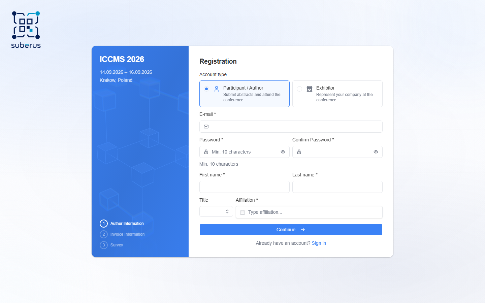
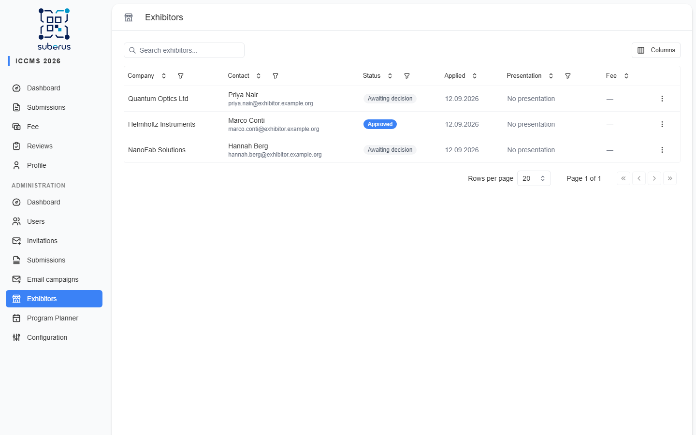
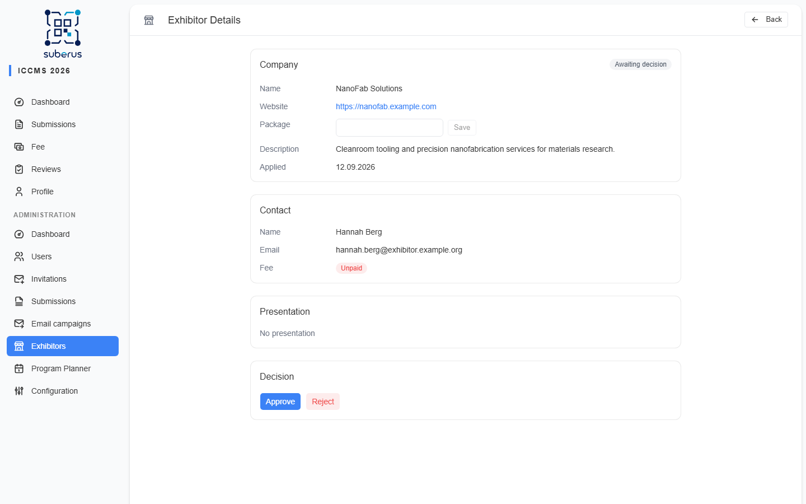
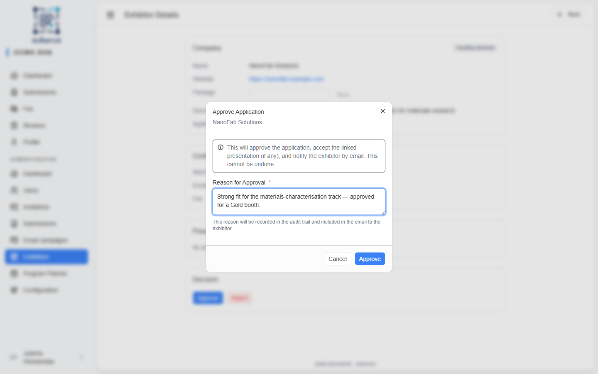

import { Aside, CardGrid, LinkCard, Steps } from '@astrojs/starlight/components';

Exhibitors are the companies and sponsors who join your conference to represent
themselves — a stand, a sponsor slot — rather than to submit research. Suberus handles
them as a **separate kind of account** with their own application and a single
approve/reject decision. They never enter peer review: an exhibitor, and the company
presentation they may bring, live entirely on the Exhibitors screen rather than in the
normal submission workflow.

It's an opt-in feature with a few moving parts, so here's the whole flow before the
screen-by-screen reference.

## Turning it on

Exhibitors stay hidden until you enable them. Flip **Enable exhibitors** in the
**Exhibitors** section of **[Configuration › Conference](/configuration/conference/)** —
two further options there let exhibitors attach a presentation and push approved
presentations into the program planner.

With the feature on, the public **registration** form grows an **account-type** choice:
every new visitor picks whether they're joining as a **Participant / Author** or as an
**Exhibitor**.

<Aside type="note">
The choice shows only while exhibitors are enabled, and never for people arriving through
an [invitation](/managing/invitations/) — their role is already decided.
</Aside>

## What happens next

<Steps>

1. **The company registers** as an Exhibitor and signs in to its own panel.

2. **It submits an application** — company name, website, and description — and, where you
   allow it, attaches an optional **company presentation**.

3. **You declare the package** — what was agreed with the company (see
   [Declaring the package](#declaring-the-package)).

4. **You approve or reject** the completed application with a reason. Approval also
   accepts the attached presentation; rejection rejects it. Either way the exhibitor is
   emailed.

</Steps>

Approved presentations can join the [program planner](/planner/overview/) when that option
is on, and an exhibitor's conference fee is marked on their
[user page](/managing/users/) just like anyone else's.

<Aside type="tip" title="Ask exhibitors their own questions">
Need to collect something from exhibitors that you don't ask participants — booth size,
power requirements, banner artwork? On the **[Survey](/configuration/survey/)** tab set a
question's **Audience** to **Exhibitors**, and it shows only to exhibitor accounts (during
registration and in their settings). The same control can keep a question **Participants**-only.
</Aside>

## The Exhibitors screen

<Aside type="note" title="Where to find it">
**Exhibitors** in the admin sidebar (it appears once the feature is on). Click a row to
open an exhibitor's detail.
</Aside>

Every exhibitor account shows up here, one row each:

| Column | What it shows |
|---|---|
| **Company** | The company name from the application (searchable); "—" until provided. |
| **Contact** | The exhibitor's name and email (searchable). |
| **Status** | *Application not submitted*, *Awaiting decision*, *Approved*, *Not accepted*, or *Withdrawn* (filterable). |
| **Applied** | When the application was submitted, or *Not applied yet*. |
| **Presentation** | The title of the linked presentation, or *No presentation*. |
| **Fee** | The fee type when the conference fee is marked paid; "—" otherwise. |

Accounts that haven't submitted an application yet are shown muted — there's nothing to
decide for them. Your column choices are remembered in this browser and restored next
time you open the page.

## The exhibitor detail

Opening an exhibitor shows four sections:

| Section | What it shows |
|---|---|
| **Company** | Name, website (as a link), the package you declare (see below), description, and the application date, with the current status badge. |
| **Contact** | The exhibitor's name, email, and fee status. The conference fee itself is marked paid/unpaid on the **[user detail](/managing/users/)** page — follow the link in this section. |
| **Presentation** | When the exhibitor submitted one: title, submission status badge, authors (presenter marked), and the abstract. Otherwise *No presentation*. |
| **Decision** | Approve/reject buttons, the recorded decision, or a note that no decision is possible yet. |

## Declaring the package

The **Package** row in the Company section is filled in by you, the organizer —
exhibitors cannot enter it themselves. Type what was agreed with the company
(e.g. *Gold*) and click **Save**. You can set or change it at any time, including after
the application has been decided. Clearing the field and saving removes the package.

The exhibitor sees the declared package read-only in the status card of their panel;
nothing is shown there until you set it. The **Package** field and its **Save** button
sit in the Company section shown above.

## Deciding an application

Only **pending, completed** applications can be decided. While the application is not
submitted, the Decision section shows *Application not completed — no decision possible*.

| Action | What it does |
|---|---|
| **Approve** | Approves the application, automatically accepts the linked presentation (if any), and emails the exhibitor. Requires a reason (min. 3 characters). |
| **Reject** | Rejects the application, automatically rejects the linked presentation (if any), and emails the exhibitor. Requires a reason (min. 3 characters). |

After a decision the section shows the outcome badge together with who decided and when.
Decisions cannot be undone.

<Aside type="caution">
The reason you enter is recorded in the **[activity log](/managing/activity-log/)**
and included in the email sent to the exhibitor.
</Aside>

<Aside type="note" title="This is the only place to decide">
Exhibitor presentations cannot be desk accepted, desk rejected, or overridden on
the **[Submissions](/managing/submissions/)** detail page, and they never enter
peer review — the application is decided here, as one decision covering the
company and its presentation.
</Aside>

## Withdrawal

Exhibitors can withdraw their own **pending** application from their panel; the
linked presentation (if any) is withdrawn with it. The reverse also stays in sync:
if a pending exhibitor's presentation is withdrawn from the submission side, the
application is marked *Withdrawn* too. Withdrawn applications cannot be decided.

## Related

<CardGrid>
	<LinkCard title="Conference" href="/configuration/conference/" description="Enable exhibitors and the optional presentation (Exhibitors section)." />
	<LinkCard title="Users" href="/managing/users/" description="Mark the exhibitor's conference fee as paid." />
	<LinkCard title="Activity log" href="/managing/activity-log/" description="Audit trail of exhibitor decisions." />
</CardGrid>
