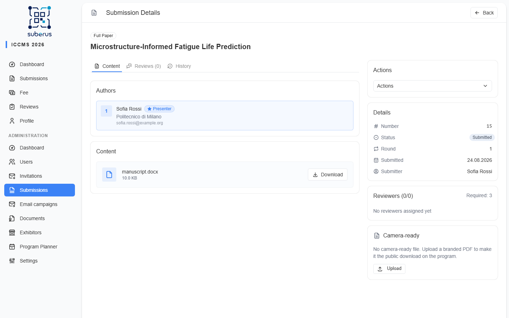

import { Aside, CardGrid, LinkCard } from '@astrojs/starlight/components';

When enabled, Suberus reads uploaded documents and **pre-fills submission fields**
(title, authors, keywords) so authors don't retype them. Extraction runs in the
**background** after an upload; you mostly just keep an eye on whether the backing
services are healthy.

<Aside type="note" title="Where it's set up">
Extraction is turned on and tuned on the **[Submissions configuration](/configuration/submissions/)**
tab (engines + health indicators). Service health is also summarised on the
**[Dashboard](/managing/dashboard/)**.
</Aside>

<Aside type="caution">
Extraction works on **DOCX uploads only** — PDFs are not auto-extracted.
</Aside>

## How it behaves

- An author uploads a document → an extraction job is **queued** and runs in the
  background.
- The result pre-fills the form; the author reviews and corrects before submitting.
- Two engines can be used (configured in Settings): **structure-based** (instant)
  and **AI-assisted** (slower, used as a fallback for low-confidence results).

## Keeping it healthy

| Check | Where | What to do |
|---|---|---|
| **PDF API** (structure engine) | Dashboard › System health / Submissions config | If red, ensure the PDF API service is running. |
| **LLM** (AI engine) — red | Dashboard › System health / Submissions config | Service unreachable. Configure `LLM_API_URL` and ensure the service is running; AI extraction stays disabled. |
| **LLM** (AI engine) — yellow | Dashboard › System health / Submissions config | Service is reachable but the configured model (`LLM_MODEL` / `LLM_EMBEDDING_MODEL`) is not reported by the API. Correct the model name to one shown in the indicator's available-models list; AI extraction stays disabled until then. |

## Related

<CardGrid>
	<LinkCard title="Submissions (configuration)" href="/configuration/submissions/" description="Enable extraction and choose engines." />
	<LinkCard title="Dashboard" href="/managing/dashboard/" description="See LLM / PDF API health at a glance." />
</CardGrid>
