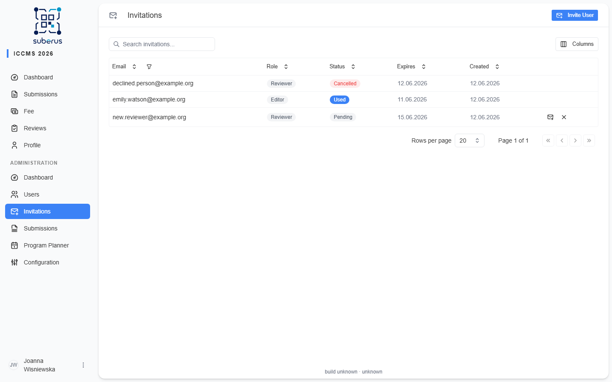

import { Aside, Steps, CardGrid, LinkCard } from '@astrojs/starlight/components';

**Invitations** let you bring people in by email — handy for reviewers and
co-organisers, and the way to onboard people **even when public registration is
closed**. Invited users receive an email with a registration link.

<Aside type="note" title="Where to find it">
**Invitations** in the admin sidebar. The validity window for invitation links is
set on the **[Invitations configuration](/configuration/invitations/)** tab.
</Aside>

## How to invite someone

<Steps>

1. Click **Invite User**.

2. Enter their **email** and choose a **role** — **Reviewer**, **Editor**, or
   **Administrator**.

3. **Send Invitation**. They receive an email with a registration link valid for the
   configured window.

</Steps>

## Managing pending invitations

The list shows each invitation and its status. For each you can:

| Action | What it does |
|---|---|
| **Resend** | Sends the invitation email again (e.g. if it expired or was missed). |
| **Cancel** | Invalidates the invitation so its link no longer works. |

<Aside type="tip">
Invited users can register through their link even after **registration is closed**
or the **registration deadline** has passed — see **[Conference](/configuration/conference/)**.
</Aside>

## Related

<CardGrid>
	<LinkCard title="Invitations (configuration)" href="/configuration/invitations/" description="How long invitation links stay valid." />
	<LinkCard title="Users" href="/managing/users/" description="Manage people once they've joined." />
	<LinkCard title="Email Templates" href="/configuration/email-templates/" description="The wording of the invitation email." />
</CardGrid>
