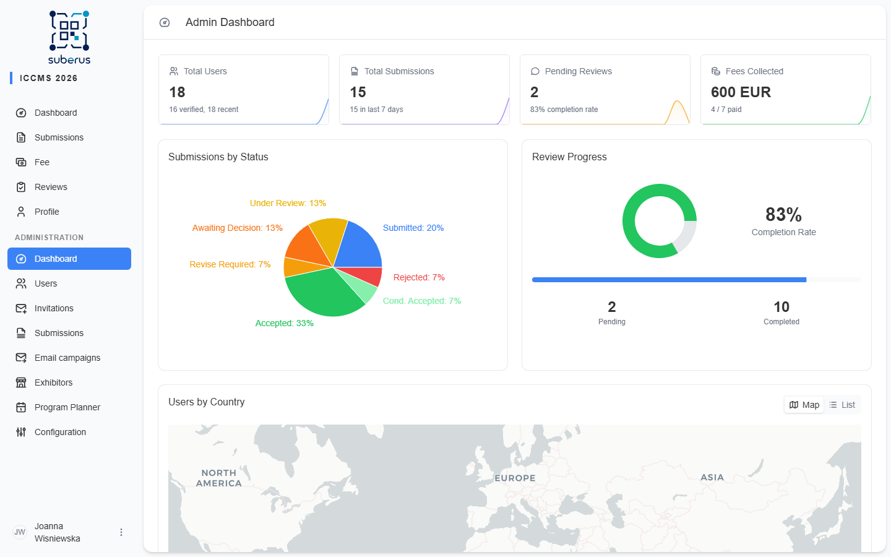

import { Steps, Aside, CardGrid, LinkCard } from '@astrojs/starlight/components';

Once configuration is done and the call is open, your job shifts to **running the
conference**: handling submissions as they arrive, assigning reviewers, and making
decisions. This page is the happy path through one full review round.

<Aside type="note" title="Roles">
The actions below are available to **Editors** and **Admins**. See
**[Roles & permissions](/configuration/roles-and-permissions/)**.
</Aside>

## One review round, end to end

<Steps>

1. **Watch the dashboard.** Open **Dashboard** to see incoming submissions, review
   progress, and system health at a glance.

2. **Open a submission.** Go to **Submissions**, filter by status `SUBMITTED`, and
   open one. You'll see its content, authors, history, and the action buttons.

3. **Triage.** Either send it straight to review (assign reviewers) or, for clearly
   in/out-of-scope work, **desk accept** or **desk reject** without review.

4. **Assign reviewers.** Use **Assign reviewer** (one for talks/posters, two or
   more for papers). The submission moves to `UNDER_REVIEW` and reviewers are
   emailed.

5. **Track progress.** Reviewers submit their reviews; the dashboard's review
   progress updates. Overdue assignments are highlighted.

6. **Decide.** When reviews are in, make the decision: **Accept**,
   **Conditionally accept**, **Revise & resubmit**, or **Reject**. For talks/posters
   the reviewer's recommendation can apply automatically; for papers you decide.

7. **Handle revisions.** If you asked for revisions, the author resubmits; reassign
   reviewers for the next round.

8. **Notify.** Decision emails are sent automatically (using your
   **[Email Templates](/configuration/email-templates/)**).

</Steps>

<Aside type="tip" title="Work in bulk when you can">
On the **Submissions** list you can select many rows and **change status**,
**assign a reviewer**, or **assign a track** for all of them at once.
</Aside>

## Where to go next

<CardGrid>
	<LinkCard title="Dashboard" href="/managing/dashboard/" description="Read the conference at a glance." />
	<LinkCard title="Submissions" href="/managing/submissions/" description="Triage, assign, and decide." />
	<LinkCard title="Reviews" href="/managing/reviews/" description="Assignment lifecycle and reassignment." />
	<LinkCard title="Users" href="/managing/users/" description="Roles, activation, fees, survey answers." />
	<LinkCard title="Program Planner" href="/planner/overview/" description="Schedule accepted presentations and publish the program." />
</CardGrid>
