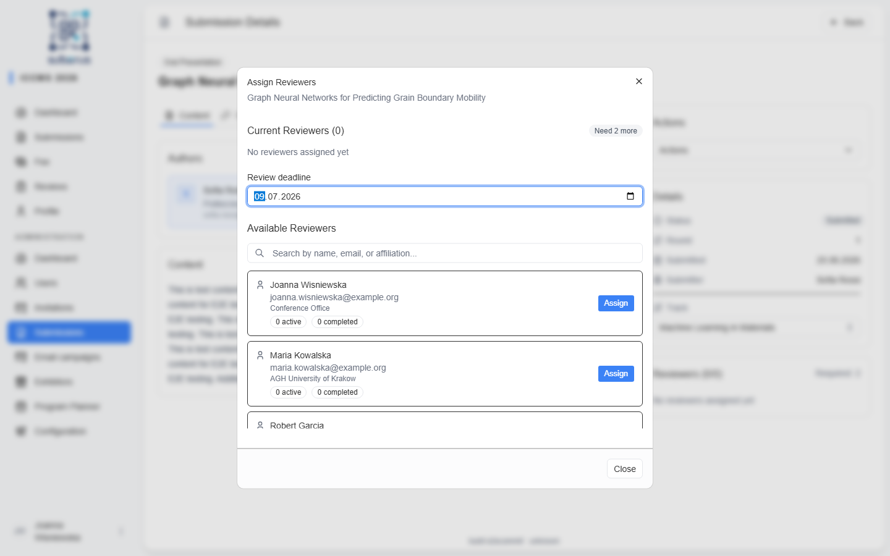
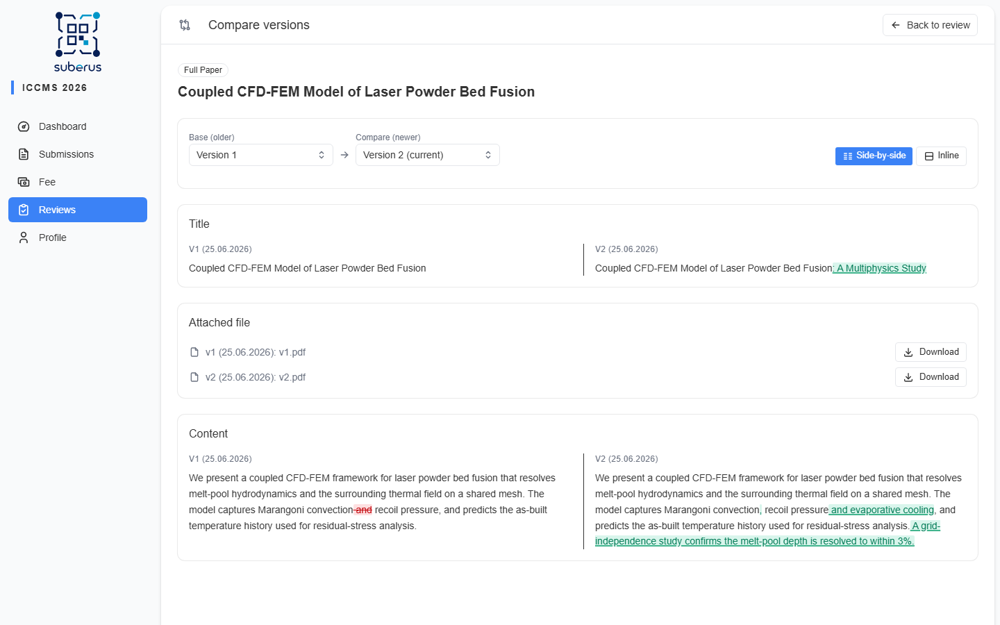

import { Aside, Steps, CardGrid, LinkCard } from '@astrojs/starlight/components';

Reviewing is driven from each **submission's detail** page, but it helps to
understand the **assignment lifecycle** so you can keep rounds moving and step in
when a reviewer goes quiet.

<Aside type="note" title="Where it happens">
You assign and manage reviewers from a **submission's detail** page
(**[Submissions](/managing/submissions/)**). Reviewers do their work from their own
*Reviews* area.
</Aside>

## The assignment lifecycle

Each reviewer you assign gets a **review assignment** that moves through these states:

| State | Meaning |
|---|---|
| **Pending** | Assigned, review not yet submitted. A deadline is set (default from the type's config, or a custom date you choose). |
| **Completed** | The reviewer submitted their review. |
| **Overdue** | The deadline passed without a review. Highlighted for you — the system never auto-cancels; you decide what to do. |
| **Cancelled** | You cancelled the assignment (e.g. to reassign someone else). |

When **all** required assignments are Completed, the submission advances
automatically to `REVIEWS_COMPLETE`.

## How to assign reviewers

<Steps>

1. Open the submission and click **Assign reviewer**.

2. Pick the reviewer. Optionally set a **custom deadline** (otherwise the type's
   default review window applies).

3. Repeat until you've met the required number for the type (1 for talks/posters,
   2+ for papers). The submission moves to `UNDER_REVIEW` and each reviewer is
   emailed.

</Steps>

## How to handle a late or unavailable reviewer

<Steps>

1. Spot the **Overdue** assignment (highlighted on the submission, and reflected in
   the dashboard's review progress).

2. Optionally send a nudge — automatic **reviewer reminders** can also do this (see
   **[Reminders](/settings/reminders/)**).

3. If they can't continue, **cancel** their assignment and **assign** a replacement.
   The new reviewer starts fresh in the same round.

</Steps>

<Aside type="tip" title="Multi-round reviews">
When an author resubmits after *Revise & resubmit*, the round number increases and
previous-round reviewers are offered for reassignment — old reviews are kept for
history.

A revised version uploaded after *Conditional acceptance* is different: it creates a
new version **without** incrementing the round or triggering another review — the
editor verifies it directly and confirms the conditions.
</Aside>

<Aside type="tip" title="Reviewers see what changed">
When a reviewer opens an assignment for a submission that has an earlier version,
the review screen shows a **Changes since previous version** panel, adapted to the
submission type. The panel always redlines the **title** and the **keywords**. For
**text** submissions it also redlines the abstract/content body; for **file**
submissions (where the content lives in an uploaded document, not text) it instead
shows a **File changed / unchanged** notice — the full file redline lives on the
Compare versions page. The Submission Content card is labelled **Text submission**
or **File submission** so it's always clear which elements apply. For a fuller view,
the **Compare versions** button opens a dedicated comparison page with side-by-side
panels and pickers to compare any pair of versions (toggle between side-by-side and
inline). Author names stay hidden under single/double-blind exactly as elsewhere.

</Aside>

## What each review decision means

When a reviewer submits, they pick one of four decisions. Each is phrased as a
**recommendation** — what it ultimately triggers depends on the submission type
(see the note below).

| Decision | What the reviewer is recommending | What it leads to |
|---|---|---|
| **Accept** | The work is ready as-is, no changes needed. | `ACCEPTED`. |
| **Accept with Minor Revisions** | Conditional acceptance — the author fixes small issues, **no new review round**. | `CONDITIONALLY_ACCEPTED`. The author can upload a revised (camera-ready) version; you then **Confirm conditions met** to finalise as `ACCEPTED`. |
| **Revise & Resubmit** | Substantial changes are needed before the work can be judged. | `REVISE_REQUIRED`. The author resubmits, the **round increments**, and reviewers are reassigned for another review. |
| **Reject** | The work cannot be accepted, even after revisions. | `REJECTED`. |

<Aside type="note" title="Recommendation vs. automatic decision">
**Talks & posters** (no editor decision): the reviewer's choice is **applied
automatically** once reviews are in. With more than one reviewer, they must
**agree** — if they disagree, the submission waits at `REVIEWS_COMPLETE` for you to
decide.

**Papers** (editor decision): the reviewer's choice is only a **recommendation**.
The submission goes to `AWAITING_DECISION` and **you** make the final call — you can
follow the recommendation or override it.

Whether a type decides automatically or needs an editor is set on
**[Submission Types](/settings/submission-types/)**.
</Aside>

## Anonymity

What reviewers and authors can see about each other depends on the **review mode**
(Open / Single-blind / Double-blind) set per submission type. Editors and Admins
always see all identities. See
**[Roles & permissions](/settings/roles-and-permissions/)**.

Under blind modes, uploaded files are shown to reviewers with a neutral name
(`v1.pdf`, `v2.docx`, …) rather than the author-derived file name, so the
author's identity cannot leak through the file label on the review or comparison
pages.

## Related

<CardGrid>
	<LinkCard title="Submissions" href="/managing/submissions/" description="Where you assign reviewers and make decisions." />
	<LinkCard title="Reminders" href="/settings/reminders/" description="Automatic nudges before review deadlines." />
	<LinkCard title="Submission Types" href="/settings/submission-types/" description="Reviewers required, deadlines, and blind mode per type." />
</CardGrid>
