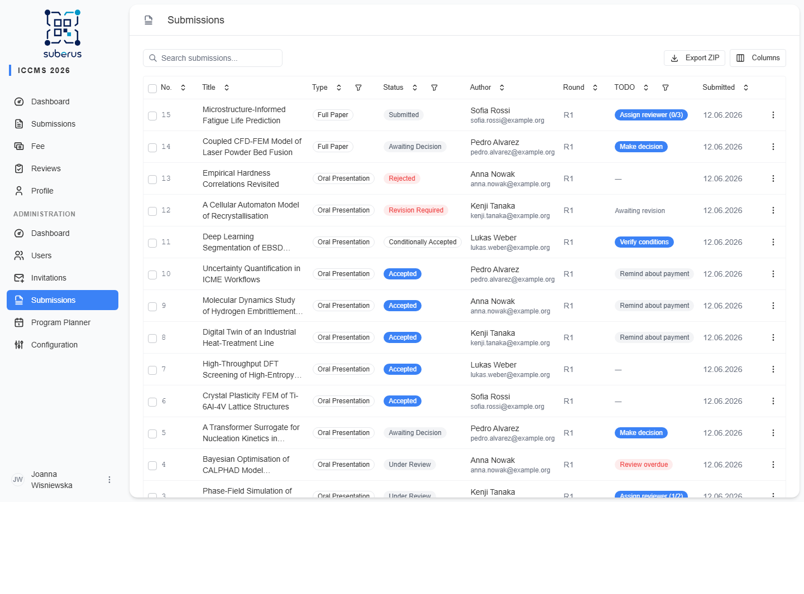
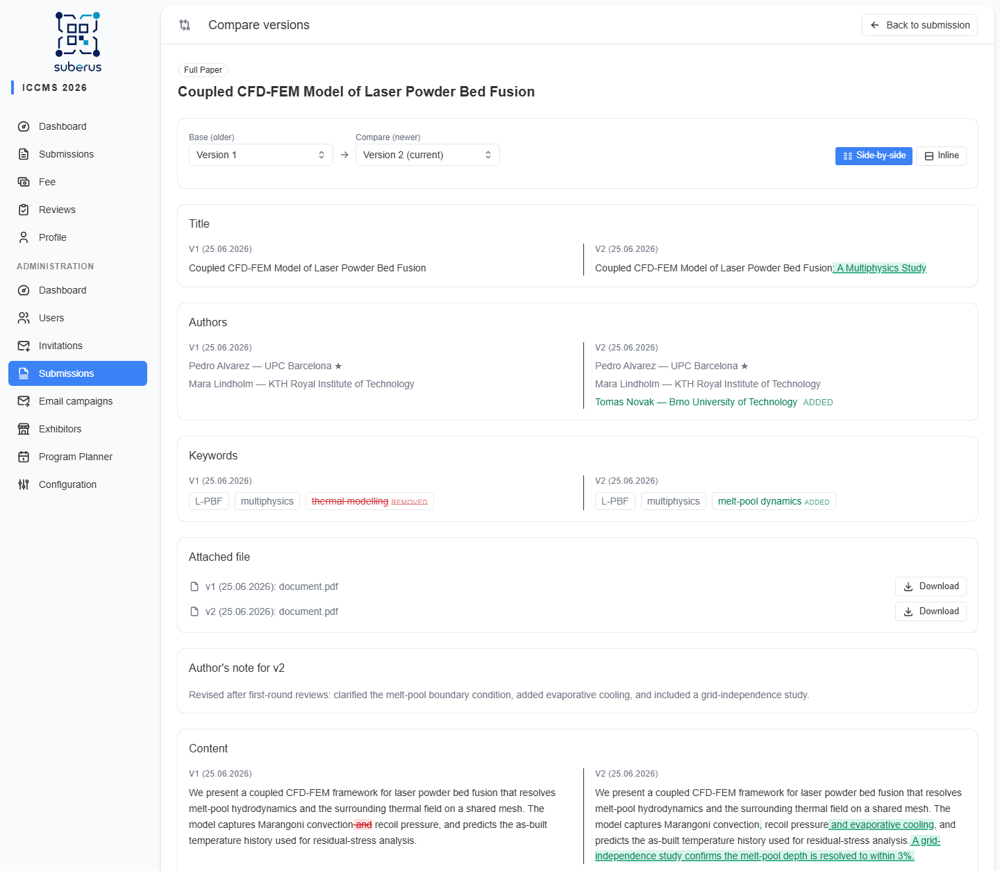
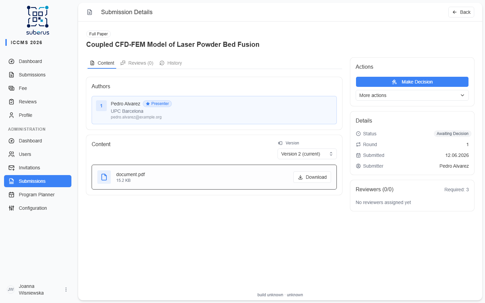
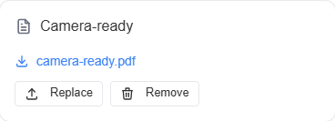
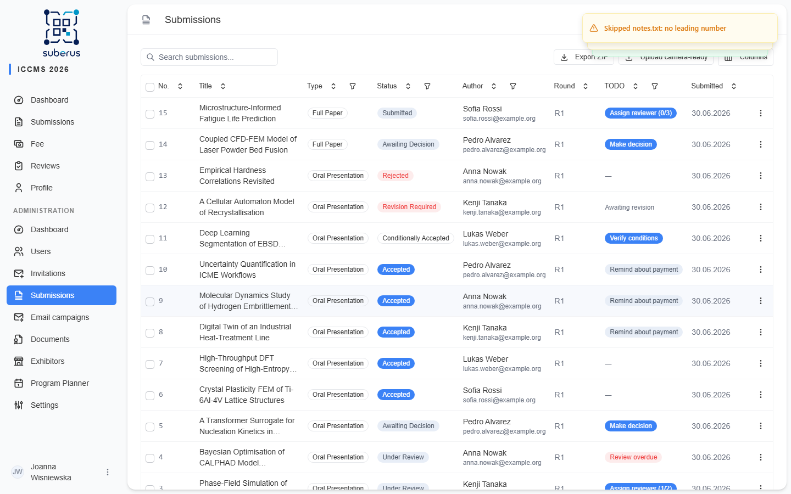

import { Aside, Steps, CardGrid, LinkCard } from '@astrojs/starlight/components';

**Submissions** is where most of the conference work happens. The list gives you a
filterable table of everything submitted; opening one shows its full content,
history, and every action available for its current state.

<Aside type="note" title="Where to find it">
**Submissions** in the admin sidebar. Click any row to open the submission detail.
</Aside>

## The list

| Column | What it shows |
|---|---|
| **Title** | The submission title (searchable). |
| **Type** | Oral Presentation, Poster, Full Paper, or Exhibitor. |
| **Status** | Current workflow state (e.g. `SUBMITTED`, `UNDER_REVIEW`, `ACCEPTED`). |
| **Author** | The submitting author (searchable by name or email). |
| **Round** | The current review round number. |
| **TODO** | Flags submissions that need your attention. |
| **Submitted** | The date the submission was created. Sortable. |
| **Last updated** | The date the submission last changed. Sortable, hidden by default — enable it in the **Columns** menu. |

Use the search box (matches title and author name/email), column filters, and the **Export** button to download
the list. Select rows with the checkboxes to reveal **bulk actions**. Use the
**Columns** menu to show or hide columns — your choice is remembered in this browser
and restored next time you open the page.

### Bulk actions

Select submissions, choose an action, and **Apply**:

| Action | What it does | Notes |
|---|---|---|
| **Change status** | Moves the selected submissions to a chosen status. | Some transitions are rejected if a submission isn't in a valid state for them. **Exhibitor** presentations are skipped — decide them via the **[Exhibitors](/managing/exhibitors/)** approve/reject flow. |
| **Assign reviewer** | Assigns one reviewer to all selected submissions. | **Exhibitor** presentations are skipped — they are never peer-reviewed. |
| **Assign to track** | Assigns the selected submissions to a conference track. | **Only Oral Presentation (abstract) submissions** can be assigned to tracks. |

## The submission detail

Opening a submission shows its content, version history, authors, reviews, and the
**audit history**. The **Details** panel also shows the **submitter** — the user who
created the submission — as a link to their profile. The action buttons available
depend on the current status.

| Action | When available | What it does |
|---|---|---|
| **Assign reviewer** | `SUBMITTED`, `RESUBMITTED`, or to add/replace reviewers during review (not for **Exhibitor** presentations — they are never peer-reviewed) | Creates a review assignment (with an optional custom deadline) and moves the submission to `UNDER_REVIEW`. The reviewer is emailed. |
| **Desk accept** | `SUBMITTED` or `RESUBMITTED` (not for **Exhibitor** presentations — approve via the **[Exhibitors](/managing/exhibitors/)** flow instead) | Accepts without review (e.g. invited speakers). Requires a reason; the author is notified. |
| **Desk reject** | `SUBMITTED` or `RESUBMITTED` (not for **Exhibitor** presentations — reject via the **[Exhibitors](/managing/exhibitors/)** flow instead) | Rejects without review (e.g. out of scope). Requires a reason; the author is notified. |
| **Editor decision** | After reviews (`REVIEWS_COMPLETE` / `AWAITING_DECISION`) | Records your decision — **Accept**, **Conditionally accept**, **Revise & resubmit**, or **Reject** — with reasoning and a letter to the author. |
| **Confirm conditions met** | `CONDITIONALLY_ACCEPTED` | Promotes a conditional acceptance to **Accepted** once the author meets the conditions. Requires reasoning (audit trail). The confirmation dialog tells you whether the author has **uploaded a revised version** since the decision; if not, it warns you so you don't confirm prematurely. Review any uploaded version with the **version selector** on the Content tab. |
| **Override / reopen** | `ACCEPTED`, `CONDITIONALLY_ACCEPTED`, `REJECTED` (not for **Exhibitor** presentations — exhibitor decisions are final) | Reopens a finalised decision back to `AWAITING_DECISION`. Requires reasoning. |
| **Edit submission** | Any — **Administrators only** (not **Exhibitor** presentations — edit those via the **[Exhibitors](/managing/exhibitors/)** flow) | Opens the submission form to fix title, abstract/content, authors, keywords, track, or the uploaded file. Saves **in place on the current version — no new version is created** and the status is unchanged. Logged in the activity history as *Edited by admin*. Editors do not see this action. |
| **Delete** | Any | Permanently removes the submission. Use with care. |

<Aside type="caution" title="Decisions are auditable, not silent">
Desk actions, decisions, condition confirmations, and overrides all require a
**reason** and are recorded immutably in the activity log. The author is notified
by email for decisions.
</Aside>

## Comparing versions

When a submission has **more than one version** (the author resubmitted, or
uploaded a revised version), a **Compare versions** button appears next to the
version selector on the **Content** tab. It opens a dedicated comparison page —
no downloading files into Word.

The comparison defaults to **two panels side by side** (the older version on the
left, the newer on the right) on desktop, and a single **inline** redline on
narrow screens; a **Side-by-side / Inline** toggle switches between them. The
chosen versions and layout live in the page URL, so a comparison can be shared.

Every field panel follows the same model: it **always shows the field's text**
(never a bare "unchanged" note) and **highlights any change** — insertions
underlined, deletions struck through (colour is never the only cue). The
**Side-by-side / Inline** toggle drives **every** field. For the text fields
(Title, Content, File contents), side-by-side reconstructs the old and new value
in two columns and inline shows one unified redline. **Authors** and **Keywords**
are compared *structurally* — each entry is tagged **added**, **removed**,
**moved**, or **changed** (see below) — and follow the same toggle: side-by-side
lists each version's authors/keywords in its own column, inline shows a single
combined list.

| Field | What it shows |
|---|---|
| **Base (older)** / **Compare (newer)** | The two versions being compared. Defaults to the previous version → the current one; change either picker to compare any pair. |
| **Identical versions** | If the two versions you pick turn out to be completely identical, a banner says so; otherwise the field panels below show the differences. |
| **Title** | The title text, with any change highlighted. |
| **Authors** | The author composition (name, affiliation, and who presents), compared **per author** (matched by e-mail): each line is tagged **added**, **removed**, **moved** (re-ordered), or **changed** (e.g. a new affiliation, with the previous value struck through). Shown to editors only. |
| **Keywords** | The keyword/tag set, compared **per keyword**: each tag is tagged **added**, **removed**, or **moved**. Shown to editors only. |
| **Attached file** | The file name on each side, each with a **Download** button to fetch that version's original file. |
| **Author's note for v_B** | The comment the author left when submitting that version, if any. |
| **Content** | The abstract/content text, with any change highlighted. Shown only when the submission has abstract/content text (hidden for file-only submissions). |
| **File contents** | Shown when the attached file changed, for **DOCX and PDF** uploads. **Side-by-side** reconstructs each version's document in its own panel (with **synced scrolling**, so both sides stay aligned); **Inline** shows a single unified redline of the document. The document is rendered close to its original Word formatting — the title, authors, affiliation and section headings keep their alignment, weight and font, and the body keeps its justification — read from the file's own styles. Changed **figures** are framed and labelled (removed / added); equations — both native Word equations and **MathType** equations — are rendered as proper math where possible (a MathType equation that can't be decoded falls back to its image), and oversized embedded images are scaled to fit the page. The document redline is prepared in the background once a revision is uploaded, so it may take a moment to appear the first time you open the comparison. If a revision **changes file format** (e.g. DOCX → PDF), the document redline can't be produced across formats — a short note explains this, and the **Content** text comparison above still reflects the changes. |

## How to take a submission through review

<Steps>

1. Open a `SUBMITTED` submission.

2. **Assign reviewer(s)** — one for talks/posters, two or more for papers. Set a
   custom deadline if needed. Status becomes `UNDER_REVIEW`.

3. Wait for reviews. When all are in, the status advances automatically
   (`REVIEWS_COMPLETE`).

4. Make the **Editor decision** (or let the reviewer's recommendation apply
   automatically for talks/posters, depending on the type's configuration).

5. If you chose **Revise & resubmit**, the author resubmits and you reassign
   reviewers for the next round.

6. If the decision is **Conditionally accept**, the author can upload a revised
   version to satisfy the minor conditions — this does **not** start a new review
   round. Review the new version with the **version selector** on the Content tab,
   then **Confirm conditions met** to finalise as **Accepted**.

</Steps>

<Aside type="note" title="Conditional acceptance vs. revise & resubmit">
**Conditionally accepted** is for *minor* fixes: the author uploads a revised
(camera-ready) version, no new reviewers are involved, the round number does not
change, and you confirm the conditions yourself. **Revise & resubmit** is for
substantive changes: it increments the round and goes back through review.
</Aside>

<Aside type="note" title="What a revision can change">
When an author uploads a revision (either path), they may also update the
**title**, **author composition**, and **keywords/tags** — not just the document.
For file-based types, uploading a new document **re-extracts** the title, authors,
and keywords from it, so a changed line-up is picked up automatically. Each version
keeps its own frozen snapshot of these, which is what the **Authors** and
**Keywords** rows of the [version comparison](#comparing-versions) diff against.
</Aside>

<Aside type="tip">
How many reviewers a type needs and whether **you** or the **reviewer** decides is
set on **[Submission Types](/settings/submission-types/)**.
</Aside>

## Camera-ready files

A **camera-ready file** is the final, print-ready PDF of an accepted talk — typically
the version you have branded with the conference template, sponsors, and page
numbering. Once uploaded, it becomes the public **Download camera-ready** button in the
[public program](/planner/publishing/#preview-camera-ready-download--favourites).

<Aside type="caution" title="Not the author's revision">
This is different from the *revised (camera-ready) version* an author uploads after a
**Conditional accept**. That one lives in the submission's version history and feeds the
review/diff. The file here is **editor-produced**, stored separately, and only surfaces
on the program. Re-uploading **overwrites** the previous one.
</Aside>

There are two ways to upload, both for **admins and editors**:

<Steps>

1. **One at a time** — on a submission's detail page, the **Camera-ready** card (right
   column) shows the current file with **Upload / Replace** and **Remove**. Use this for
   single corrections.

2. **In bulk** — on the **Submissions** list, **Upload camera-ready** (next to **Export
   ZIP**) takes a **ZIP** of PDFs. Each file is matched to a submission by its **leading
   number**, the same numbering as the export (`7.pdf`, `7-branded.pdf`, and `007 (final).pdf`
   all map to submission **#7**). The usual round trip is: **Export ZIP** → brand each PDF
   offline (keep the numbers) → re-zip → **Upload camera-ready**. After upload you get a
   report of how many were stored and which entries were skipped.

</Steps>

| Field / control | Where | Notes |
|---|---|---|
| **Upload / Replace** | Submission detail → Camera-ready card | Single PDF, replaces any existing file. |
| **Remove** | Submission detail → Camera-ready card | Deletes the camera-ready file. |
| **Upload camera-ready** | Submissions list toolbar | One **ZIP** of PDFs, matched by leading number. |
| Accepted formats | both | **PDF only** (validated by file content), max **25&nbsp;MB** per file. |
| Bulk skip reasons | bulk report | `no leading number`, `no matching submission`, `not a PDF`, `exceeds 25MB`. The `submissions.csv` manifest is ignored silently. |

## Related

<CardGrid>
	<LinkCard title="Reviews" href="/managing/reviews/" description="The reviewer assignment lifecycle and reassignment." />
	<LinkCard title="Submission Types" href="/settings/submission-types/" description="Reviewers required and who decides, per type." />
	<LinkCard title="Activity log" href="/managing/activity-log/" description="The immutable record of every decision." />
	<LinkCard title="Extraction" href="/managing/extraction/" description="Automatic metadata extraction from uploads." />
	<LinkCard title="Program Planner" href="/planner/overview/" description="Accepted presentations flow into the schedule." />
</CardGrid>
