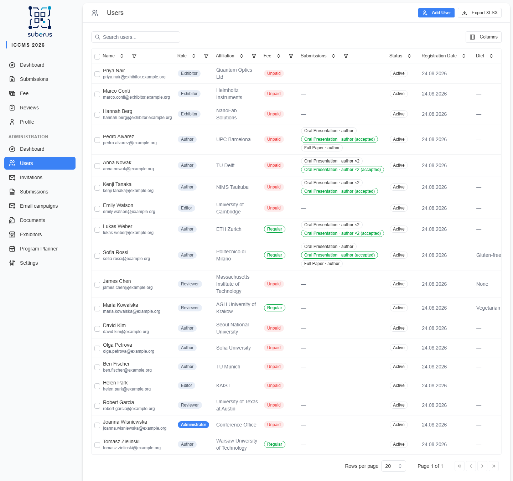
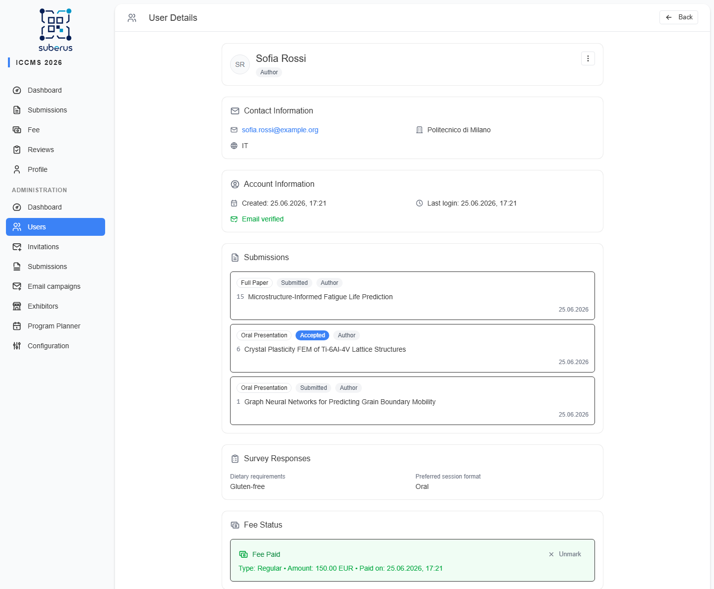
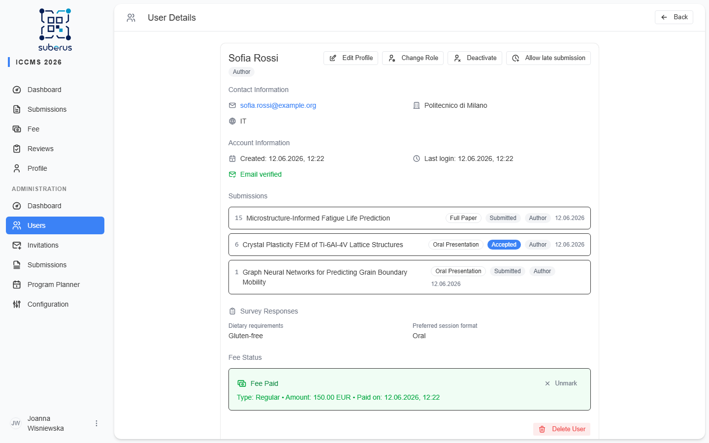

import { Aside, CardGrid, LinkCard } from '@astrojs/starlight/components';

Everyone who registers for your conference turns up on the **Users** screen. Open
a row to change someone's role, activate or deactivate their account, mark a fee
paid, or read how they answered your registration survey.

<Aside type="note" title="Where to find it">
**Users** in the admin sidebar. Click a row to open a user's detail.
</Aside>

## The list

| Column | What it shows |
|---|---|
| **Name** | The user's full name (searchable). |
| **Role** | Author, Reviewer, Editor, Admin, or Exhibitor. |
| **Affiliation** | Their institution/organisation. |
| **Fee** | Whether their conference fee is marked paid. |
| **Submissions** | How many submissions they have. |
| **Status** | Active or deactivated. |
| **Registration Date** | When the user registered (sortable). |
| *(Survey columns)* | Any survey answers you chose to **show in the users list** appear as extra columns. Each can be sorted and filtered like the built-in columns — choice and checkbox questions get a multi-select filter, free-text questions get a search box. |

Search by name, toggle columns, and use **Export XLSX** to download the full list
(including survey answers). Select rows for **bulk actions**. Your column choices
are remembered in this browser and restored next time you open the page.

<Aside type="tip" title="Surfacing survey answers">
Which survey answers appear as columns here is controlled per question on the
**[Survey](/settings/survey/)** tab via *Show in users list*.
</Aside>

### On mobile

On a phone the list becomes a stack of **cards** instead of a table. Each card
shows the name, **role**, email, affiliation, a **Paid / Unpaid** fee badge, and
the user's submission-role badges; tap a card to open the user. Search is
full-width and every match scrolls in one list (no paging). The **Columns**
picker is hidden — switch to a wider screen to choose columns.

## The user detail

Opening a user shows their profile in titled cards — **Contact Information**,
**Account Information**, **Submissions**, survey answers, and **Fee Status**.
Management actions live in the **⋯** menu at the top right of the header card.

### Header & actions

The header shows the user's avatar, name (with academic title), and a **role**
badge. An **Inactive** badge appears when the account is deactivated and a **Late
submission** badge when late submissions are allowed. The **⋯** menu holds:

| Action | What it does |
|---|---|
| **Edit Profile** | Edit the user's name, title, affiliation, and other profile fields. |
| **Change Role** | Promote/demote between Author, Reviewer, Editor, Admin. Reviewers (and above) can be assigned to review. Editors can change roles but cannot grant **Admin** or change an existing admin; no one can change their own role. **Exhibitor** accounts cannot be changed to or from manually — see **[Roles & permissions](/settings/roles-and-permissions/)**. |
| **Activate / Deactivate** | Block or restore account access without deleting the user. |
| **Allow / Disallow late submission** | Let this user create new submissions even after the submission deadline has passed and while submissions are locked. Off by default; affects only this user. |
| **Delete User** | Permanently removes the user. Destructive and irreversible — prefer **Deactivate**. Shown only if you may delete users. |

### Information cards

| Card | What it shows |
|---|---|
| **Contact Information** | Email (click to send mail), affiliation, ORCID, country, and address — each shown only when set. |
| **Account Information** | Registration and last-login dates, plus email-verification status. If the address isn't verified, a **Verify** button sends a fresh verification email. |
| **Fee Status** | A green **Fee Paid** callout (type, amount, currency, and paid-on date, with **Unmark**) or a red **Fee Unpaid** callout. When unpaid, **Mark as Paid** records payment (fee type / currency from **[Fee](/settings/fee/)**). |
| **Survey Responses** | The user's answers to your registration **[Survey](/settings/survey/)**. |

### Submissions panel

The detail page lists every submission the user is involved in — both those they
**own** (Author) and those where they are listed as a linked **co-author**. Drafts
are included.

| Column | What it shows |
|---|---|
| **No.** | The submission's sequential number. |
| **Title** | Links to the submission's detail page. |
| **Type** | Oral Presentation, Full Paper, or Poster. |
| **Status** | Current workflow status (incl. Draft). |
| **Role** | **Author** (owner) or **Co-author** (listed on someone else's submission). |
| **Last updated** | When the submission last changed. |

#### Add a submission on this user's behalf

Use **Add submission** (top-right of the Submissions card) when a registered
participant sent their submission another way (e.g. by email) and you want to
enter it for them. It opens the normal submission form, pre-filled with the
participant as the presenting author.

🖼️ [Screenshot placeholder: on-behalf submission form opened from a user's detail]

- The submission is **owned by the participant**, not you — it shows up on their
  own submissions list and they receive the usual confirmation email.
- You can submit it outright or **Save draft**; file and text submission types
  work exactly as on the participant-facing form.
- It works **even after the submission deadline** has passed or while submissions
  are locked, and it ignores the per-user submission limit.
- Available to **Editors and Admins**.

<Aside type="caution">
Role changes, activation/deactivation, late-submission permission changes, and fee marking are recorded in the
**[activity log](/managing/activity-log/)**. Deactivating is reversible; deleting a
user is not — prefer deactivation unless you're sure.
</Aside>

## Related

<CardGrid>
	<LinkCard title="Invitations" href="/managing/invitations/" description="Invite reviewers and co-organisers." />
	<LinkCard title="Survey" href="/settings/survey/" description="Define the questions and which answers show here." />
	<LinkCard title="Fee" href="/settings/fee/" description="Fee types and currency behind the Fee column." />
	<LinkCard title="Roles & permissions" href="/settings/roles-and-permissions/" description="What each role can do." />
</CardGrid>
