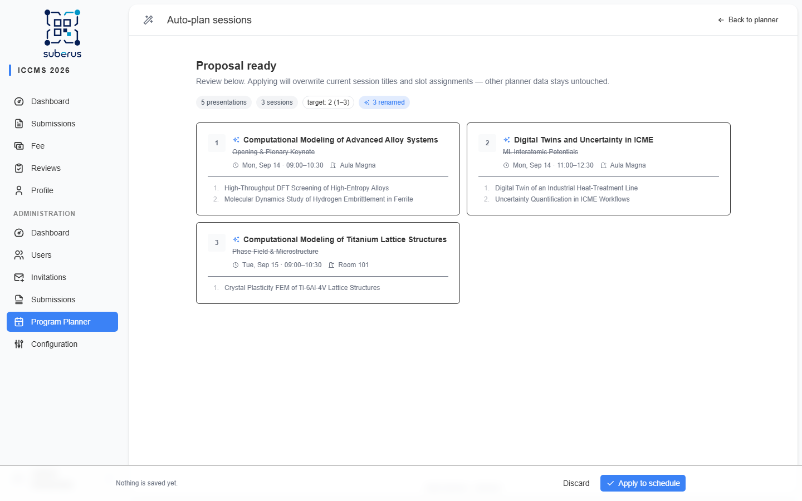

import { Aside, Steps, CardGrid, LinkCard } from '@astrojs/starlight/components';

The **autoplanner** drafts your program for you: it groups **accepted abstracts**
into the **sessions you've already created** and writes a title for each, giving you
a starting point to refine instead of placing every talk by hand. It keeps your
session **times and rooms** — it only fills them and names them. When it decides
which group lands in which session, it **avoids putting talks that share an author
into parallel (overlapping) sessions**, so authors aren't scheduled in two rooms at
once. Any residual clashes (e.g. back-to-back talks within the buffer) are still
flagged on the **[Publishing](/planner/publishing/)** issues panel.

<Aside type="caution" title="Requires the LLM service">
The autoplanner needs the **LLM and clustering services** configured at deployment
(`LLM_API_URL`, `LLM_API_KEY`, `LLM_MODEL`, `LLM_EMBEDDING_MODEL`, and
`PLANNER_API_URL`). If they aren't reachable:

- the **Enable autoplanner** toggle on **[Setup](/planner/setup/)** stays disabled
  with a red status dot, and
- the **Auto-plan** button in the planner header is disabled (tooltip: *"Enable
  autoplanner in Settings/Program/Planner"*).

These services **cannot** be configured from the admin UI — ask your **system
administrator** to set them up.
</Aside>

<Aside type="note" title="Where to find it">
The **Auto-plan** button in the planner header → `/admin/program-planner/auto-plan`.
</Aside>

## Prerequisites

Before the autoplanner can run you need:

- **At least one accepted Oral Presentation** (abstract) submission — these are the
  presentations it places.
- **At least one session** already created (the scaffold it fills). Create empty
  sessions first on the **[planner grid](/planner/manual-scheduling/)**.
- **No more sessions than submissions** — it can't fill more sessions than there are
  talks.

## How to run the autoplanner

The autoplanner fills sessions you've already drawn. For ICCMS, suppose you've
created a few **empty sessions** across 14–15 September in *Aula Magna* and *Room
101* but haven't placed any talks yet.

<Steps>

1. **Build the scaffold.** On the planner grid, draw the **empty sessions** you want
   filled — set each one's **time** and **room** (see
   **[Manual scheduling](/planner/manual-scheduling/)**). Don't add more sessions
   than you have accepted abstracts.

2. **Generate.** Click **Auto-plan** in the header, then **Generate proposal**.

3. **Wait.** Watch the four stages run (below) — progress streams live.

4. **Review.** Check the proposed grouping and the title written for each session.

5. **Apply or discard.** Click **Apply to schedule** to accept (it fills the talks
   and renames the sessions), or **Discard** to keep your current schedule unchanged.
   Then refine by hand on the grid.

</Steps>

## The four stages

| Stage | What happens |
|---|---|
| **Loading data** | Gathers your accepted abstracts and existing sessions. |
| **Analyzing abstracts** | The LLM computes a semantic embedding for each abstract. Results are **cached**, so re-runs are faster. |
| **Grouping** | A clustering service balances the abstracts into your sessions by similarity, then they're assigned to your session slots so author-sharing groups avoid parallel sessions. |
| **Writing titles** | The LLM writes a concise (4–8 word) title for each session. |

If a stage fails (e.g. a service is unreachable), the error is shown on that stage
and nothing is changed.

## Reviewing the proposal

The preview shows summary badges — presentation count, session count, the **target
per session** and size range — and one card per session with its proposed title and
talks. Sessions whose title changed are marked as **renamed**. **Nothing is saved
until you apply.**

<Aside type="caution" title="Apply replaces session titles and slot assignments">
**Apply to schedule** overwrites the **titles and presentation slots** of the
affected sessions and splits each session's minutes equally between its talks. Your
session **times, rooms, chairs, and breaks stay untouched**. **Discard** changes
nothing. There is no undo — review the proposal before applying, and refine it
afterwards on the **[planner grid](/planner/manual-scheduling/)**.
</Aside>

## Troubleshooting

| Symptom | Likely cause | What to do |
|---|---|---|
| **Auto-plan** button disabled | Autoplanner not enabled / LLM unreachable | Enable it on **[Setup](/planner/setup/)**; if the toggle is disabled, ask your system administrator to configure the LLM service. |
| Red status dot on the toggle | LLM service down | System administrator to check `LLM_API_URL` and the service. |
| A stage errors out | A backing service (LLM or clustering) failed mid-run | Re-run; if it persists, report the stage and message to your system administrator. |
| "More sessions than submissions" | Scaffold too large | Remove extra empty sessions, or accept more submissions. |

## Related

<CardGrid>
	<LinkCard title="Setup" href="/planner/setup/" description="Enable the autoplanner (LLM requirement)." />
	<LinkCard title="Manual scheduling" href="/planner/manual-scheduling/" description="Create the session scaffold and refine the result." />
	<LinkCard title="Publishing" href="/planner/publishing/" description="Check issues and publish." />
</CardGrid>
