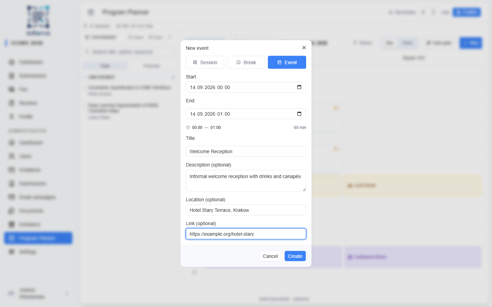
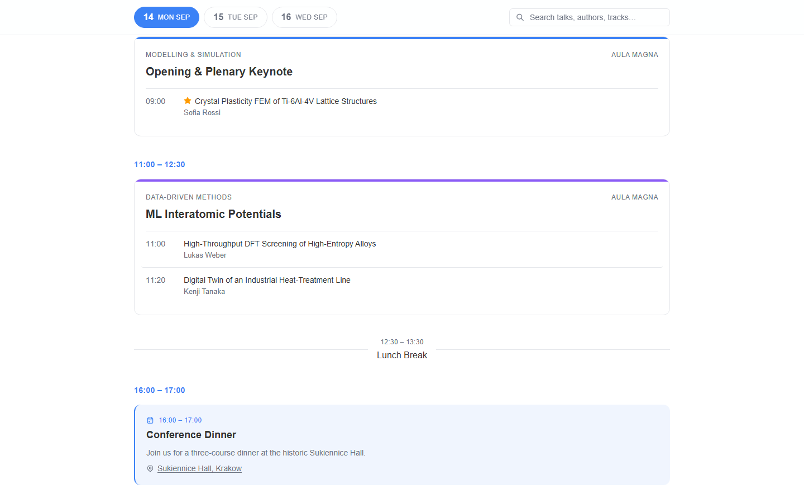

import { Aside, Steps, CardGrid, LinkCard } from '@astrojs/starlight/components';

Manual scheduling is where you place presentations onto the calendar yourself —
create **sessions**, **breaks**, and **events**, fill sessions from the **unscheduled sidebar**,
and fine-tune chairs, ordering, and durations in the **session editor**. It's also
how you correct anything the autoplanner produced.

The walkthrough below builds the first morning of **ICCMS 2026** — a session in
*Aula Magna*, a lunch break, and the conference dinner.

<Aside type="note" title="Where to find it">
**Program Planner** in the admin sidebar (`/admin/program-planner`).
</Aside>

<Aside type="caution" title="Set up rooms first">
The planner needs at least one **room**. With none, it shows a placeholder — add
rooms on the **[Setup](/planner/setup/)** page before scheduling.
</Aside>

## How to build the schedule

Working example: the morning of **14 September** in *Aula Magna*.

<Steps>

1. **Check the basics.** Confirm your **rooms**, **visible hours**, and **conference
   dates/timezone** are set (**[Setup](/planner/setup/)**). Use the **Conference
   start** button in the header to jump the grid to 14 September.

2. **Draw a session.** On the *Aula Magna* column, **drag** from `09:00` to `10:30`
   to draw a 90-minute session — or click **+ New**, keep the type on **Session**,
   and set its **Start**, **Presentations**, and **Room**. It appears as an empty
   session card.

3. **Fill it.** In the **Unscheduled sidebar**, find *Crystal Plasticity FEM of
   Ti-6Al-4V Lattice Structures* and **drag** it onto the session card. To build a
   session from several talks at once, press **S**, tick them, and click **+ Create
   session**.

4. **Refine it.** Click the session to open the **session editor**: set up to three
   **chairs**, reorder presentations, adjust each talk's **duration**, and give the
   session a title (e.g. *Opening & Plenary Keynote*). Press **Save** — nothing is
   written until you do.

5. **Add a break.** Click **+ New**, switch to **Break**, title it *Lunch Break*,
   set `12:30`–`13:30`, and leave **Room** empty so it spans every room.

6. **Add an event.** Click **+ New**, switch to **Event**, and add the *Conference
   Dinner* with a **Start**/**End**, a **Location**, and a map **Link** — it shows as
   a featured card on the public program.

7. **Clear issues.** Resolve anything the **Issues panel** flags (clashes, missing
   rooms), then move on to **[Publishing](/planner/publishing/)**.

</Steps>

## Creating sessions, breaks, and events

The **+ New** button opens a create dialog. Toggle between **Session**,
**Break**, and **Event** at the top.

| Field | Applies to | What to enter / Notes |
|---|---|---|
| **Start** | All | The start date and time (`datetime-local`). |
| **End** | Event | The end date and time (`datetime-local`). Events can run hours (a dinner, a full-day trip). |
| **Presentations** | Session | Number of slots (the session's capacity). |
| **Min / talk** | Session | Minutes per slot. Session length = *Presentations × Min / talk*. |
| **Duration** | Break | Length of the break in minutes. |
| **Title** | All | Optional for sessions (auto-named later), **required** for breaks and events. |
| **Description** | Event | Optional free text shown on the public program. |
| **Location** | Event | Optional venue name (e.g. a restaurant). |
| **Link** | Event | Optional URL (e.g. a map link) — the location becomes clickable on the public program. |
| **Room** | Session, Break | Which room column it lands in. A break with no room spans all rooms. Events are always room-less. |
| **Track** | Session | An optional program track (colour tag). |

<Aside type="tip">
You can also **drag on an empty area** of the calendar grid to draw a new session
directly at that time and room — it uses the **default presentation length** from
**[Setup](/planner/setup/)**.
</Aside>

## The unscheduled sidebar

The left sidebar lists work that still needs placing.

| Control | What it does |
|---|---|
| **Unscheduled / Scheduled** | Switch between work still to place and everything already on the grid. |
| **Search** | Filter by title, author, or keyword. |
| **Track / Presenter** | Group the list by program/intake track or by first author. |
| **Select** (shortcut `S`) | Show checkboxes to pick several submissions; shift-click selects a range. Then **+ Create session** builds one session from the selection. |
| **Read** | Open **Reading mode** — a full-screen reader to review submissions one by one. |

Drag any row onto the calendar to schedule it.

### Reading mode

Reading mode is a distraction-free reader for triaging submissions before placing
them: it shows the title, authors, keywords, and full abstract, with a **download**
for any attached file. Use the **← / →** arrows (or click the navigation buttons) to
move between submissions, and **Esc** to close.

## The session editor

Click a session to open the editor (a panel on the right). The header fields
(title, start, duration, room, track) are edited together and committed with the
**Save** button — nothing is written until you press it. Closing the panel with
unsaved changes asks you to confirm. Chairs, presentations, **Split**, and
**Continue series** apply immediately.

| Field / action | What it does | Notes |
|---|---|---|
| **Title** | The session name shown on the grid and public program. | Committed with **Save**. |
| **Start** | When the session begins. | `datetime-local`, in the conference timezone. Committed with **Save**. |
| **Slots** × **Min / slot** | Capacity and per-talk length. | Session duration = *Slots × Min / slot*. Committed with **Save**. |
| **Room** | Which room column the session sits in. | Or *No room* (flagged as an issue). |
| **Track** | The program track (colour tag). | Optional. |
| **Chairs** | Who chairs the session. | Up to **3**; search by name or email. A session with **no chair** shows a warning marker and dashed border. |
| **Presentations** | The talks in this session. | Reorder with up/down, edit each one's **duration**, or remove it. |
| **Continue series** | Create a follow-on session with the same track and duration. | For multi-part series. |
| **Split** | Split the session after a chosen presentation into a new session. | Choose the split point from *Split after presentation:*. |
| **Delete session** | Permanently removes the session. | Its presentations return to the unscheduled list. |

## Breaks

Breaks mark non-talk time. Open a break to edit its **title**, **start**,
**duration**, and **room**, then press **Save** (same as the session editor —
nothing is written until you do). Leave the room empty and the break spans **all
rooms** (a conference-wide coffee or lunch break); set a room and it applies to
that column only.

## Events

Events are non-talk items with a description and an explicit start–end time — a
conference **dinner**, a **trip**, **sightseeing**, and the like. They have no
room and span the full width of the grid. Open an event to edit its **title**,
**start**, **end**, **description**, **location**, and **link**, then press
**Save**.

On the public program an event stands out as a **featured card** showing its
description and a clickable location link, while plain breaks stay thin
dividers.

## Making corrections

Everything on the grid is editable in place:

- **Drag** a session or break to a new time or room; **resize** it to change its
  duration.
- **Drop** an unscheduled submission onto an existing session card to add it there.
- Each session card shows a **capacity bar** (talks vs. minutes used); the
  **Capacity strip** above the grid sums it up — *X / Y placed · Z free (W slots)*.
- The **Issues panel** lists problems — **room overlaps** and **sessions without a
  room**. Click an issue to jump straight to the offending session.

<Aside type="tip" title="Getting around the grid">
Use the **Day / Week** toggle, **Today**, and the **Conference start** jump to
navigate; use the **Rooms** filter to hide rooms you're not working on right now.
</Aside>

## Related

<CardGrid>
	<LinkCard title="Overview" href="/planner/overview/" description="How the planner fits together." />
	<LinkCard title="Setup" href="/planner/setup/" description="Rooms, visible hours, and tracks this page assumes." />
	<LinkCard title="Autoplanner" href="/planner/autoplanner/" description="Let the LLM draft the grouping, then refine it here." />
	<LinkCard title="Publishing" href="/planner/publishing/" description="Check issues and publish the program." />
</CardGrid>
