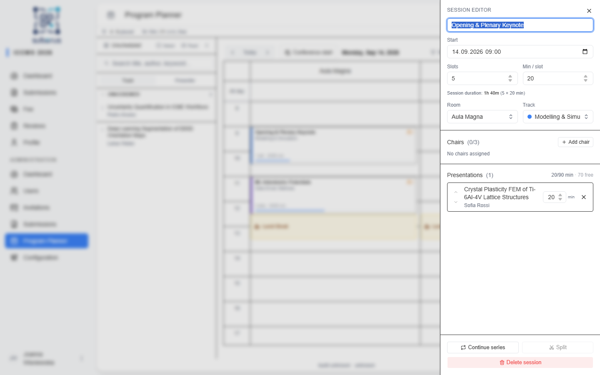
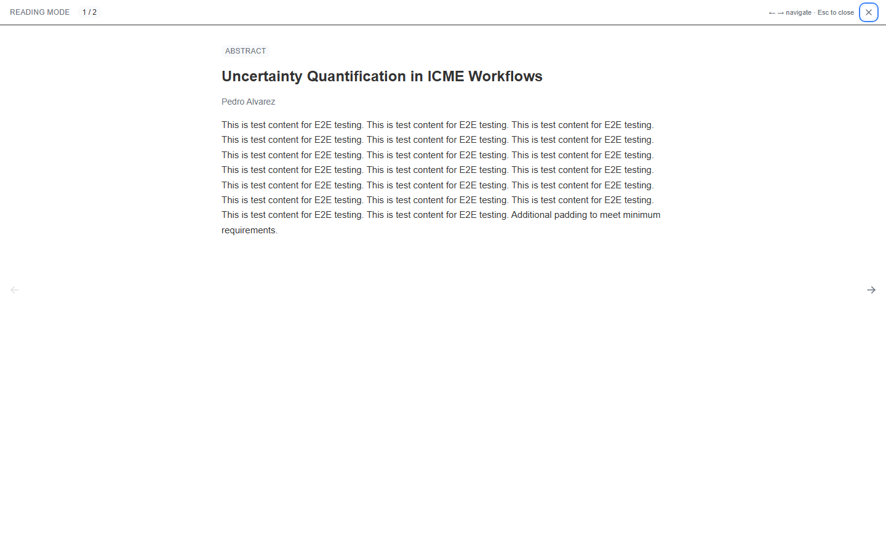

import { Aside, Steps, CardGrid, LinkCard } from '@astrojs/starlight/components';

Manual scheduling is where you place presentations onto the calendar yourself —
create **sessions** and **breaks**, fill sessions from the **unscheduled sidebar**,
and fine-tune chairs, ordering, and durations in the **session editor**. It's also
how you correct anything the autoplanner produced.

<Aside type="note" title="Where to find it">
**Program Planner** in the admin sidebar (`/admin/program-planner`).
</Aside>

<Aside type="caution" title="Set up rooms first">
The planner needs at least one **room**. With none, it shows a placeholder — add
rooms on the **[Setup](/planner/setup/)** page before scheduling.
</Aside>

## How to build the schedule

<Steps>

1. Confirm your **rooms**, **visible hours**, and **conference dates/timezone** are
   set (**[Setup](/planner/setup/)**).

2. **Create sessions.** Either click **+ New** and fill the dialog, or **drag on the
   grid** to draw a session at a time and room.

3. **Fill them.** Drag a row from the **Unscheduled sidebar** onto the grid (or onto
   an existing session card), or **select** several submissions and use **+ Create
   session**.

4. **Refine.** Open a session to set its **chairs**, reorder presentations, and
   adjust durations in the **session editor**.

5. **Add breaks** (coffee, lunch) where needed.

6. **Resolve issues** flagged in the **Issues panel**.

7. When the schedule looks right, move on to **[Publishing](/planner/publishing/)**.

</Steps>

## Creating sessions and breaks

The **+ New** button opens a create dialog. Toggle between **Session** and
**Break** at the top.

| Field | Applies to | What to enter / Notes |
|---|---|---|
| **Start** | Both | The start date and time (`datetime-local`). |
| **Presentations** | Session | Number of slots (the session's capacity). |
| **Min / talk** | Session | Minutes per slot. Session length = *Presentations × Min / talk*. |
| **Duration** | Break | Length of the break in minutes. |
| **Title** | Both | Optional for sessions (auto-named later), **required** for breaks. |
| **Room** | Both | Which room column it lands in. A break with no room spans all rooms. |
| **Track** | Session | An optional program track (colour tag). |

<Aside type="tip">
You can also **drag on an empty area** of the calendar grid to draw a new session
directly at that time and room — it uses the **default presentation length** from
**[Setup](/planner/setup/)**.
</Aside>

## The unscheduled sidebar

The left sidebar lists work that still needs placing.

| Control | What it does |
|---|---|
| **Unscheduled / Scheduled** | Switch between work still to place and everything already on the grid. |
| **Search** | Filter by title, author, or keyword. |
| **Track / Presenter** | Group the list by program/intake track or by first author. |
| **Select** (shortcut `S`) | Show checkboxes to pick several submissions; shift-click selects a range. Then **+ Create session** builds one session from the selection. |
| **Read** | Open **Reading mode** — a full-screen reader to review submissions one by one. |

Drag any row onto the calendar to schedule it.

### Reading mode

Reading mode is a distraction-free reader for triaging submissions before placing
them: it shows the title, authors, keywords, and full abstract, with a **download**
for any attached file. Use the **← / →** arrows (or click the navigation buttons) to
move between submissions, and **Esc** to close.

## The session editor

Click a session to open the editor (a panel on the right).

| Field / action | What it does | Notes |
|---|---|---|
| **Title** | The session name shown on the grid and public program. | Saves on blur or Enter. |
| **Start** | When the session begins. | `datetime-local`, in the conference timezone. |
| **Slots** × **Min / slot** | Capacity and per-talk length. | Session duration = *Slots × Min / slot*; recalculated when you change either. |
| **Room** | Which room column the session sits in. | Or *No room* (flagged as an issue). |
| **Track** | The program track (colour tag). | Optional. |
| **Chairs** | Who chairs the session. | Up to **3**; search by name or email. A session with **no chair** shows a warning marker and dashed border. |
| **Presentations** | The talks in this session. | Reorder with up/down, edit each one's **duration**, or remove it. |
| **Continue series** | Create a follow-on session with the same track and duration. | For multi-part series. |
| **Split** | Split the session after a chosen presentation into a new session. | Choose the split point from *Split after presentation:*. |
| **Delete session** | Permanently removes the session. | Its presentations return to the unscheduled list. |

## Breaks

Breaks mark non-talk time. Open a break to edit its **title** and **room**. Leave the
room empty and the break spans **all rooms** (a conference-wide coffee or lunch
break); set a room and it applies to that column only.

## Making corrections

Everything on the grid is editable in place:

- **Drag** a session or break to a new time or room; **resize** it to change its
  duration.
- **Drop** an unscheduled submission onto an existing session card to add it there.
- Each session card shows a **capacity bar** (talks vs. minutes used); the
  **Capacity strip** above the grid sums it up — *X / Y placed · Z free (W slots)*.
- The **Issues panel** lists problems — **room overlaps** and **sessions without a
  room**. Click an issue to jump straight to the offending session.

<Aside type="tip" title="Getting around the grid">
Use the **Day / Week** toggle, **Today**, and the **Conference start** jump to
navigate; use the **Rooms** filter to hide rooms you're not working on right now.
</Aside>

## Related

<CardGrid>
	<LinkCard title="Overview" href="/planner/overview/" description="How the planner fits together." />
	<LinkCard title="Setup" href="/planner/setup/" description="Rooms, visible hours, and tracks this page assumes." />
	<LinkCard title="Autoplanner" href="/planner/autoplanner/" description="Let the LLM draft the grouping, then refine it here." />
	<LinkCard title="Publishing" href="/planner/publishing/" description="Check issues and publish the program." />
</CardGrid>
