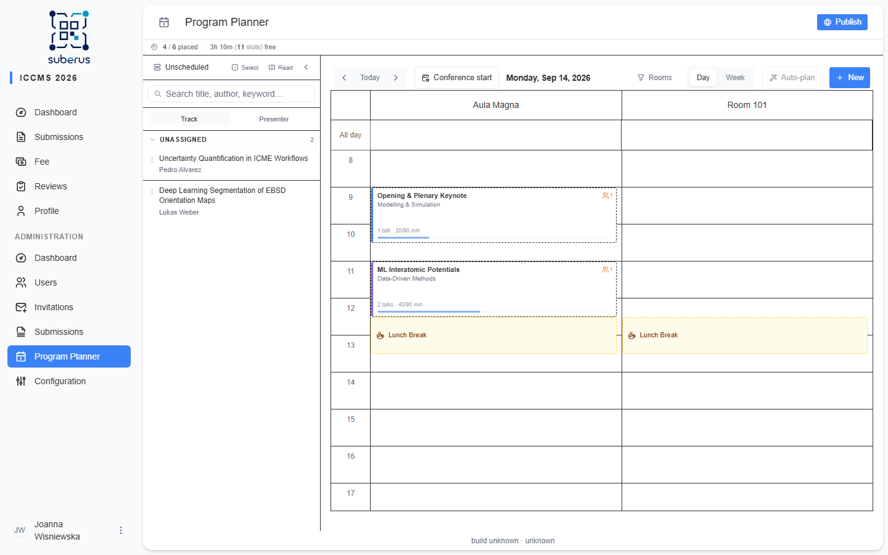

import { Aside, Steps, CardGrid, LinkCard } from '@astrojs/starlight/components';

The **Program Planner** turns your accepted presentations into a timetable —
**sessions** placed in **rooms** across the **days** of your conference — and
finally publishes it as a public schedule. You can build the schedule **by hand**,
let the **autoplanner** draft it for you (it needs the LLM service), or mix both.

This section walks you through it end to end, using **ICCMS 2026** (14–16
September, Kraków) as a running example: two rooms — *Aula Magna* and *Room 101* —
and a handful of accepted talks to place.

<Aside type="note" title="Where to find it">
**Program Planner** in the admin sidebar (`/admin/program-planner`). Its
prerequisites — visible hours, default presentation length, rooms, and program
tracks — are configured first on the **[Setup](/planner/setup/)** page.
</Aside>

## Build a program, start to finish

Each step below is a page in this section. Follow them in order the first time.

<Steps>

1. **[Set up](/planner/setup/)** the basics — set ICCMS's **dates & timezone**
   (14–16 September), the planner's **visible hours** (`08:00`–`18:00`), create the
   **rooms** (*Aula Magna*, *Room 101*), and optionally add **program tracks**.

2. **[Schedule by hand](/planner/manual-scheduling/)** — draw sessions on the grid
   and drag accepted talks from the sidebar into them, add breaks and events.

3. *(Optional)* **[Auto-plan](/planner/autoplanner/)** — create empty sessions, then
   let the LLM group the abstracts and title them, and refine the result by hand.

4. Clear anything the **Issues panel** flags (clashes, missing rooms, sessions
   outside the conference dates).

5. **[Publish](/planner/publishing/)** to put the program live at `/program`.

</Steps>

## The planner layout

| Area | What it is |
|---|---|
| **Calendar grid** | **Rooms are the columns**, conference days the timeline. Drag sessions and breaks here. Days outside your conference dates are hidden. |
| **Header controls** | Day/Week view toggle, previous/next/**Today**, a **Conference start** jump, the **Rooms** filter (show/hide room columns), **Auto-plan**, **+ New**, and **Publish**. |
| **Unscheduled sidebar** | Accepted presentations not yet placed. Drag a row onto the grid to schedule it; search, group, and read submissions here. |
| **Capacity strip** | A one-line read of progress — e.g. *X / Y placed · Z free (W slots)*. |
| **Issues panel** | Flags clashes (room double-booked) and sessions with no room. Click an issue to jump to the session. |
| **Outside-range banner** | Appears when you navigate to a day outside the conference dates. |

## Key concepts

- **Session** — a block of presentations in one room. Its length is **slots ×
  minutes-per-slot** (e.g. 4 × 20 min = 80 min).
- **Break** — a non-talk block (coffee, lunch). A break with **no room** spans
  **all rooms**.
- **Program track** — an optional colour tag for grouping related sessions. Add a
  number suffix to a track name (e.g. `ML 2`) to link sessions into a **series**.
  These are separate from the subject **[Tracks](/settings/tracks/)** authors
  pick at submission.
- **Chairs** — up to **3** people who chair a session. A session with no chair is
  flagged (you can still publish).
- **Publish states** — **Draft** (only you see it), **Draft published** (visible to
  admins only), **Published** (public at `/program`).

<Aside type="tip">
The planner has a **mobile** layout too: a per-day list of sessions and a **Queue**
overlay for the unscheduled list, so you can review and nudge the schedule from a
phone.
</Aside>

## Related

<CardGrid>
	<LinkCard title="Setup" href="/planner/setup/" description="Dates, visible hours, rooms, and program tracks." />
	<LinkCard title="Manual scheduling" href="/planner/manual-scheduling/" description="Build and correct the schedule by hand." />
	<LinkCard title="Autoplanner" href="/planner/autoplanner/" description="Let the LLM draft sessions from accepted abstracts." />
	<LinkCard title="Publishing" href="/planner/publishing/" description="Issue checks, publish states, and the public program." />
</CardGrid>
