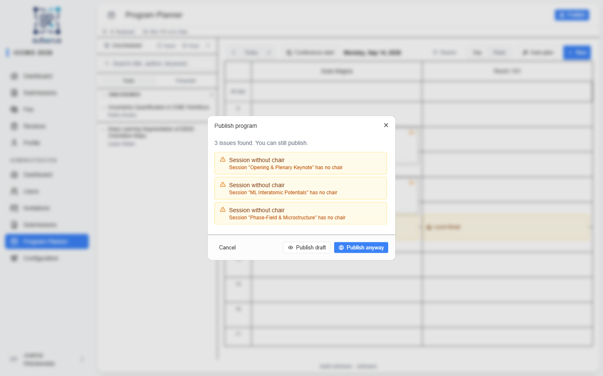
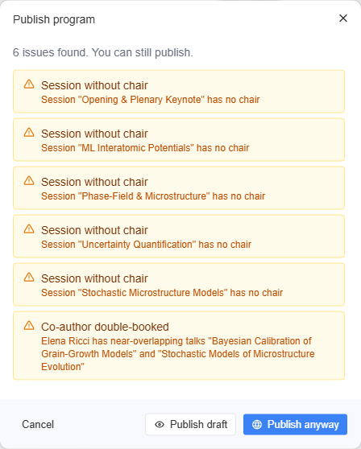
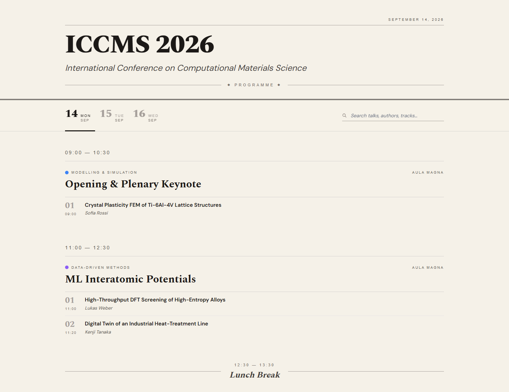
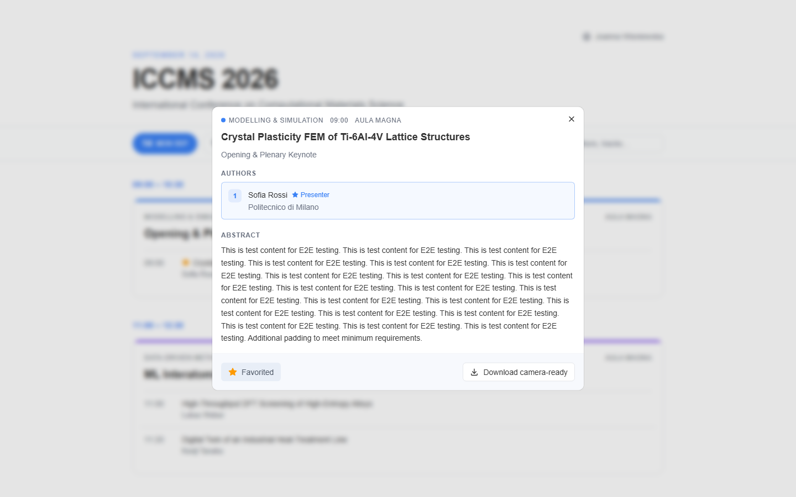
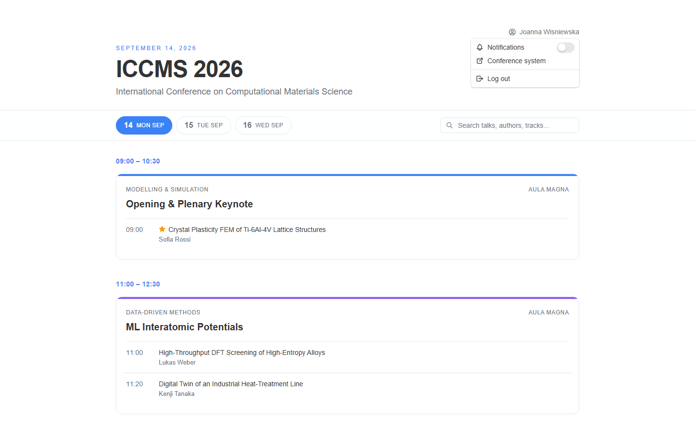

import { Aside, Steps, CardGrid, LinkCard } from '@astrojs/starlight/components';

When the schedule is ready, **publish** it to make the public program available. A
pre-publish check warns you about clashes and gaps first, and you can choose to share
the program with **admins only** before going fully public.

<Aside type="note" title="Where to find it">
The **Publish** button in the planner header. Once published, the program is public
at `/program`.
</Aside>



## How to publish

Once the ICCMS schedule looks right, take it live:

<Steps>

1. Click **Publish** in the planner header to open the dialog.

2. Review the **pre-publish issue checks** (below). Fix what you can on the
   **[planner grid](/planner/manual-scheduling/)** — e.g. add a chair to a flagged
   session — or proceed anyway.

3. *(Optional)* Click **Publish draft** first to show the program to **admins only**
   while you finish — it stays off the public page.

4. Type **UNDERSTOOD** in the confirmation box — going public is visible to
   everyone immediately, so the **Publish** button stays disabled until you do.

5. Click **Publish** (shown as **Publish anyway** when issues remain) to make the
   program public at `/program`.

6. To retract, open the dialog again and choose **Unpublish** — the program returns
   to *Draft* and disappears for everyone.

</Steps>

## Publication states

| State | Who sees the program | How to get there |
|---|---|---|
| **Draft** | Only you, in the planner. | The default before publishing. |
| **Draft published** | Admins only (visible in their menu, not public). | **Publish draft** in the dialog. |
| **Published** | Everyone, at `/program`. | Type **UNDERSTOOD**, then **Publish**. |

In *Draft published*, the public program page shows a **Draft preview** banner at the
top so staff can tell at a glance that attendees cannot see it yet.

Publishing is reversible: **Unpublish** returns the program to *Draft* and hides it
from everyone.

While the program is *Published*, **[Clear plan](/planner/manual-scheduling/)** is
disabled — you have to **Unpublish** first, so a live public program cannot be
wiped in one click.

## Pre-publish issue checks

The dialog runs these checks and lists anything it finds. They **warn but never
block** — *Publish anyway* is always available.

| Check | What it means | How to fix |
|---|---|---|
| **Session without chair** | A session has no assigned chair. | Add a chair in the session editor (up to 3). |
| **Presentations exceed session duration** | The talks total more than the session's length. | Trim durations, add slots, or move a talk out. |
| **Room double-booked** | Two sessions overlap in the same room. | Move one to another room or time. |
| **Chair in overlapping sessions** | A chair is booked for two sessions at once. | Reassign one session's chair or reschedule. |
| **Co-author double-booked** | Two talks that share an author are scheduled within the **[Author conflict buffer](/planner/setup/)** of each other (in different sessions). | Reschedule one talk so their times are further apart. |
| **Presenter in parallel sessions** | A presenter is presenting in two sessions that run at the same time, so they can't sit through either. | Move one talk to a non-overlapping session. |
| **Non-accepted submission in program** | A scheduled talk isn't an accepted submission. | Remove it, or finalise its decision. |
| **Session outside conference dates** | A session falls outside the conference start/end. | Move it within range, or adjust the dates on **[Conference](/settings/conference/)**. |



## The public program

Once **Published**, attendees see the program at `/program`:

- A **day selector** to switch between conference days, and a **search** box (titles,
  speakers, tracks). While searching, each session keeps its header but lists only the
  matching talks, and day buttons show how many matches wait on the other days — with a
  jump link when the current day has none.
- Sessions grouped by time slot — **parallel** sessions sit side by side — each
  showing its room, track colour, **chairs**, and a numbered list of presentations
  with times and authors.
- **Breaks** shown inline between sessions.
- A **sign-in link** in the top-right corner for anonymous visitors. Signed-in users
  instead see their name as a **menu** with: a **Notifications** toggle (favourite
  reminders, see below), a **Theme** submenu (**System** / **Light** / **Dark**, remembered
  across visits), **Conference system** (back to the dashboard), and **Log out**.



### Preview, camera-ready download & favourites

Every presentation is **clickable** — for anyone, signed in or not:

- Clicking a talk opens a **preview dialog** with its abstract, authors, and keywords.
- Each author gets a card with their **full affiliation** — long institution names wrap
  onto several lines instead of being cut off.
- If **Publish participant contact details** is enabled (**Settings › Program ›
  Appearance**, off by default), **author names are clickable for participants** —
  in the presentation rows and on the author cards inside the preview. A
  participant is a user whose fee is marked as paid; everyone else sees authors as
  plain text. Clicking one switches the preview to an **author view** with the
  author's name, **affiliation**, **email**, **ORCID** link, **website** and
  **LinkedIn**. **Back to talk**
  returns to the preview.
- **Email, ORCID, website and LinkedIn appear only for authors who consented** to publishing their
  contact details (at registration or later in **Profile › Contact & Invoice
  Information**). Everyone else — including co-authors without a user account —
  shows name and affiliation only.

  🖼️ [Screenshot placeholder: author view in the presentation preview dialog]
- The same setting adds a **Participants** link to the program header, visible only to
  signed-in participants. It opens `/program/participants` — the full list of
  participants with a paid fee, with a **search box** over names and affiliations.
  Participants who consented are **clickable** and open a dialog with their
  **affiliation**, **email**, **ORCID**, **website** and **LinkedIn**; everyone else is
  listed as plain text, name
  and affiliation only. Anonymous visitors are sent to the sign-in page, signed-in
  non-participants back to the program.

  🖼️ [Screenshot placeholder: participant list]
- If the editor has uploaded a **camera-ready PDF** for that talk (see
  [Camera-ready files](/managing/submissions/#camera-ready-files)), the dialog shows a
  **Download camera-ready** button. The download is public.
- **Signed-in** visitors additionally get an **Add to favourites** toggle. Favourited
  talks show a **star** next to their title on the program. Favourites are saved per
  user and persist across visits.

Anonymous visitors see the program and can preview and download — they just don't get
stars or favourites.



### Short links & QR codes

Every camera-ready PDF also has a **permanent short link** built from the
submission number shown in the submissions list:

```
https://<your-conference>.suberus.app/s/<number>
```

Leading zeros and a trailing `.pdf` are both accepted, so the number printed in
the abstract book (`042`), the plain number (`42`) and `042.pdf` all work. Point a QR code at this URL and it keeps
working even if the talk is later moved to another session or day — the link is
keyed to the submission, not to its slot in the program.

| Behaviour | Detail |
|---|---|
| **When it works** | Only once the program is **published** and the talk is **scheduled** and has a camera-ready PDF. |
| **Before that** | The link returns **404** — the same response as a number that does not exist, so nothing about unpublished submissions leaks. |
| **Who can use it** | Anyone. No sign-in, opens the PDF directly. |

### Generating QR codes

**Configuration › Program › QR Codes** turns those short links into printable QR
codes — one per scheduled talk, plus one for the public program page.

<Steps>

1. Choose the settings (see the table below).

2. Click **Generate ZIP**. The settings are saved and a ZIP downloads containing one
   QR file per scheduled talk, named after its submission number (`42.svg`).

3. Click **Program page QR** for a single QR pointing at the public program page.

</Steps>

🖼️ [Screenshot placeholder: Configuration › Program › QR Codes panel]

| Field | Detail |
|---|---|
| **File format** | **SVG** (default) scales losslessly for print; **PNG** for tools that need a bitmap. |
| **Error correction** | **L** (7%), **M** (15%, default), **Q** (25%), **H** (30%). Higher levels survive scuffs and overprinting but pack the pattern denser. |
| **Size** | Output width in pixels, 128–2048 (default 512). For SVG this only sets the `width`/`height` attributes — the graphic stays vector. |
| **Quiet zone** | Blank margin around the code, in modules, 0–16 (default 4). Below 4 some scanners struggle. |
| **Substitute domain** | Leave empty to encode this site's own address. Enter e.g. `https://example.com/conf` and talk QRs encode `https://example.com/conf/42`, while the program QR encodes `https://example.com/conf` itself. That domain must forward both — see [Forwarding a substitute domain](#forwarding-a-substitute-domain) — otherwise the printed codes lead nowhere. |
| **Include talks without a camera-ready PDF** | On by default, so you can print before every file is in. Those QRs return 404 until the PDF is uploaded — then they start working with no reprint. |

Only talks **scheduled into a session** are included; a submission with no slot has no
short link. **Invited talks** are skipped as well — they are placeholders with no
camera-ready file to point at. Note that `/s/<number>` also requires the program to be **published** —
codes printed ahead of publication stay 404 until you publish.

### Forwarding a substitute domain

A substitute domain is useful when the printed URL has to be short, memorable, or
independent of where Suberus is hosted. It is a plain HTTP redirect on **your**
server — Suberus never sees the substitute domain, so nothing needs configuring on
this side beyond the field above.

Two rules are needed, both redirecting to the address shown under the field:

| Printed URL | Redirects to |
|---|---|
| `https://example.com/conf` | `https://conference.suberus.app/program` |
| `https://example.com/conf/42` | `https://conference.suberus.app/s/42` |

Allow a leading-zero form (`/conf/042`) and an optional `.pdf` suffix if your abstract
book prints them — Suberus accepts both on `/s/<number>`, and the examples below
normalise them anyway.

**nginx**

```nginx
location ~ ^/(conf|c26)/0*([0-9]+)(?:\.pdf)?/?$ {
    return 301 https://conference.suberus.app/s/$2;
}
location ~ ^/(conf|c26)/?$ {
    return 301 https://conference.suberus.app/program;
}
```

**Caddy**

```caddy
@talk path_regexp talk ^/(conf|c26)/0*([0-9]+)(?:\.pdf)?/?$
redir @talk https://conference.suberus.app/s/{re.talk.2} 301

@program path_regexp ^/(conf|c26)/?$
redir @program https://conference.suberus.app/program 301
```

**Apache** (`mod_rewrite` enabled)

```apacheconf
RewriteEngine On
RewriteRule ^/?(conf|c26)/0*([0-9]+)(\.pdf)?/?$ https://conference.suberus.app/s/$2 [R=301,L]
RewriteRule ^/?(conf|c26)/?$ https://conference.suberus.app/program [R=301,L]
```

<Aside type="caution" title="Test before you print">
Open both printed URLs in a browser once the rules are live. A QR code cannot be
corrected after printing, and a typo in the prefix makes every code in the batch
useless.
</Aside>

### Favourite reminders (push notifications)

Signed-in attendees can get a **browser push notification** shortly before a
favourited talk starts — even with the program tab closed.

<Steps>

1. As an admin, set the **lead time** in **Configuration › Program › Planner**,
   field **Favourite reminder lead time** (default **5** minutes, 1–120), then click
   **Save**. This controls how long before a talk the push is sent.

2. The attendee opens the **user menu** on `/program` and turns on **Notifications**.
   Their browser asks for notification permission once; after that, every current and
   future favourite is covered by a single opt-in.

3. While the schedule is **Published**, a reminder fires once per favourite, about the
   lead-time before it starts. Turning **Notifications** off stops all reminders.

</Steps>

<Aside type="caution" title="Requires server setup">
Push reminders need VAPID keys configured on the server (`VITE_VAPID_PUBLIC_KEY`,
`VAPID_PRIVATE_KEY`, `VAPID_SUBJECT`). When unset, the **Notifications** toggle is
hidden and no reminders are sent.
</Aside>

| Behaviour | Detail |
|---|---|
| **Who** | Signed-in attendees who favourited a talk and enabled Notifications. |
| **When** | About *lead-time* minutes before the talk's computed start, while **Published**. |
| **Once** | One reminder per favourite; a talk moved to a *later* slot after its reminder won't re-alert. |
| **Lead time** | Admin-set in **Configuration › Program › Planner** (default 5 min). |



## Offline access and installing the program

The public program works **offline**. After an attendee has opened `/program` once on
a device, the page keeps working without a connection — useful on venue wifi.

| Behaviour | Detail |
|---|---|
| **What works offline** | The program itself: days, sessions, talks, search — plus the abstracts of talks the attendee favourited. The participant list too, once opened while online, whenever **Publish participant contact details** is on and the attendee is signed in with a paid fee. |
| **What needs a connection** | Talks that were never opened while online, signing in, and camera-ready downloads. |
| **Freshness** | The program refreshes whenever the device is online. An **Offline** badge appears in the header while it is not. |
| **Favourites** | A star toggled offline is applied straight away and sent to the server when the connection returns. Favourites still require a signed-in account. |
| **Installing** | On Android/Chrome an **Install** button appears in the header and adds the program to the home screen under the **conference name**. On iOS use Safari's *Share → Add to Home Screen*. |

<Aside type="note" title="Named after your conference">
The installed app takes its name and colour from **Conference name** and the primary
colour in **[Branding](/settings/branding/)** — change them and the next visit picks
the new values up.
</Aside>

## Related

<CardGrid>
	<LinkCard title="Overview" href="/planner/overview/" description="How the planner fits together." />
	<LinkCard title="Manual scheduling" href="/planner/manual-scheduling/" description="Fix the issues flagged here." />
	<LinkCard title="Branding" href="/settings/branding/" description="The look of the public site the program appears on." />
</CardGrid>
