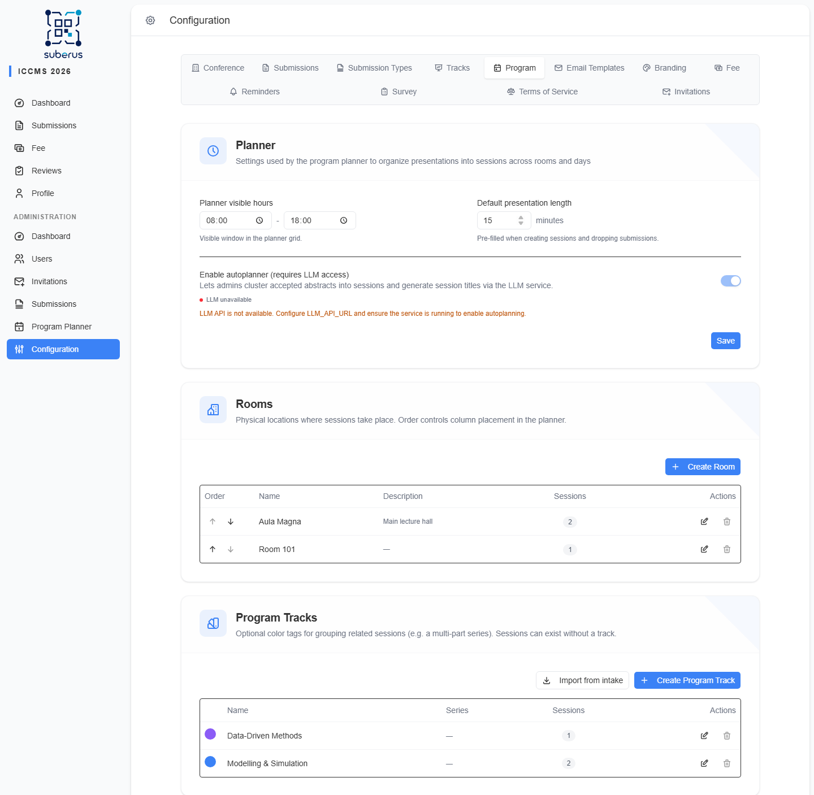
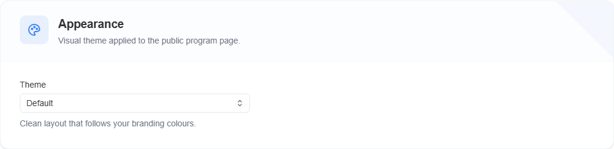

import { Aside, Steps, CardGrid, LinkCard } from '@astrojs/starlight/components';

Before you can schedule anything, the planner needs a few things in place: the
**conference dates and timezone**, the planner's **visible hours** and **default
presentation length**, your **rooms**, and (optionally) **program tracks**.

The walkthrough below sets these up for the running example — **ICCMS 2026**,
14–16 September, two rooms (*Aula Magna* and *Room 101*).

<Aside type="note" title="Where to find it">
**Settings › Program** holds the *Planner*, *Appearance*, *Presentation badges*,
*Footer content*, *Rooms*, and *Program Tracks* sections (the *Planner* section
has its own **Save**; appearance, rooms, and tracks save as you change them). The
**conference dates and timezone** live on
**[Settings › Conference](/settings/conference/)**.
</Aside>

## Prerequisites: dates & timezone

The planner reads two things from the **[Conference](/settings/conference/)**
tab:

- **Conference Start / End** define which **days** the calendar shows — days
  outside the range are hidden, and a session dragged outside it is flagged as
  *outside conference dates*.
- **Conference Timezone** is the zone **all** session times are shown in (times are
  stored in UTC).

Set both before scheduling, or the grid has nothing to lay out.

## How to prepare the planner

<Steps>

1. **Set the dates & timezone.** On **[Conference](/settings/conference/)**, set
   **Conference Start** to `14 September 2026` and **Conference End** to
   `16 September 2026`, and pick your **Conference Timezone**. These define which
   days the grid shows.

2. **Set the planner window.** On **Program › Planner**, set **Planner visible
   hours** to `08:00`–`18:00` and a **Default presentation length** (e.g. `20`
   minutes), then click **Save**.

3. **Create the rooms.** On **Program › Rooms**, click **Create Room** and add
   *Aula Magna* (Description: *Main lecture hall*); click **Create Room** again for
   *Room 101*. Their order here is their column order on the grid.

4. *(Optional)* **Add program tracks.** On **Program › Program Tracks**, click
   **Create Program Track** to add colour tags such as *Modelling & Simulation* and
   *Data-Driven Methods* — or **Import from intake** to pull them from your
   submission tracks.

</Steps>

You're ready to schedule — head to **[Manual scheduling](/planner/manual-scheduling/)**.

## Planner

| Field | What it does | What to enter / Notes |
|---|---|---|
| **Planner visible hours** | The start–end window shown on the calendar grid. | Two times, e.g. `08:00`–`18:00`. |
| **Default presentation length** | Pre-filled duration when creating sessions or dropping a submission onto the grid. | Minutes, 5–480 (step 5). |
| **Author conflict buffer** | Minimum gap between two talks that share an author before the planner flags a **Co-author double-booked** issue. | Minutes, 0–240 (step 5). `0` flags only talks that actually overlap; `15` also flags talks scheduled less than 15 minutes apart. |
| **Favourite reminder lead time** | How long before a favourited talk starts attendees get the push reminder — see [Favourite reminders](/planner/publishing/#favourite-reminders-push-notifications). | Minutes, 1–120. |
| **Enable autoplanner** | Lets the planner cluster accepted abstracts into sessions and auto-generate session titles. | Requires the LLM service — see the caution below. |

<Aside type="caution" title="Enabling the autoplanner needs the LLM service">
The **Enable autoplanner** toggle stays **disabled with a red status dot** until the
LLM service is reachable. The LLM and clustering services are **deployment-level**
configuration (`LLM_API_URL`, `LLM_API_KEY`, `LLM_MODEL`, `LLM_EMBEDDING_MODEL`, and
`PLANNER_API_URL` environment variables) — they **cannot** be set from the admin UI.
If the toggle is stuck off, ask your **system administrator** to configure and start
those services. See **[Autoplanner](/planner/autoplanner/)**.
</Aside>

## Appearance

The **Appearance** section sets the visual **theme** of the public
**[program page](/planner/publishing/)** — the layout, fonts, and colours visitors
see once the schedule is published. The change applies on the next page load.

| Field | What it does | What to enter / Notes |
|---|---|---|
| **Theme** | Visual style of the public program page. | **Default** follows your **[branding](/settings/branding/)** primary colour and adapts to light/dark; **Editorial** is a print-inspired newspaper look with its own fixed palette (ignores branding); **Crimson** is a crisp white layout with a fixed crimson/graphite palette and monospaced session times (ignores branding); **Academic** is a formal **room-by-time timetable grid** (rooms as columns, time as rows; uses the full screen width on desktop so conferences with many rooms fit, and collapses to a list on phones) with its own fixed scholarly ink/navy palette (ignores branding). |
| **Publish participant contact details** | Adds an optional **consent checkbox** to the registration form and makes author names on the public program **clickable for participants** (anyone else sees plain text). Clicking an author (in a presentation row or in the talk preview) shows an **author view** with their name, **affiliation**, **email**, and **ORCID** link. | Toggle, **off** by default. A **participant** is a user whose **[fee](/settings/fee/)** is marked as paid — only they see contact details, and only for authors who **consented**. Authors without a user account never have their contact details published. See **[Publishing › The public program](/planner/publishing/)**. |

<Aside type="tip" title="Adding more themes">
Themes are defined in code. A developer can add new ones without touching this
screen — they appear in the **Theme** dropdown automatically.
</Aside>

## Presentation badges

Badges highlight selected talks on the public **[program page](/planner/publishing/)**
— *Keynote*, *Best paper*, *Online*, *Award*. You **define** the badges here and
**assign** one to a talk in the [session editor](/planner/manual-scheduling/).

🖼️ [Screenshot placeholder — Settings › Program › Presentation badges]

<Steps>

1. Click **Add badge**. A new row appears with a label field, a colour swatch, a
   style dropdown, and a live preview of the corner it will occupy.

2. Type the **Label** (e.g. `Keynote`), pick a **Colour**, and choose a **Style**.

3. Click **Save badges**. Removing a row and saving deletes the badge — talks that
   used it lose it.

</Steps>

| Field | What it does | What to enter / Notes |
|---|---|---|
| **Label** | The text shown on the badge. | Up to 24 characters; keep ribbons short, a long label is clipped by the corner. Rendered in capitals. |
| **Colour** | Background colour of the badge or ribbon. | Any colour; the text switches between black and white automatically for contrast. |
| **Style** | How the badge appears on the program. | **Badge** — a pill next to the talk title. **Ribbon** — a diagonal ribbon across the top-right corner of the row. |

<Aside type="note" title="One badge per talk">
A presentation carries **at most one** badge. Re-applying an autoplan proposal
keeps the badges already given to the talks it re-seats. Badges follow the active
**Appearance** theme's fonts and corner style automatically. In the talk preview
dialog a ribbon is shown as a normal badge.
</Aside>

## Footer content

Custom HTML shown at the bottom of the public
**[program page](/planner/publishing/)** — typically a row of partner,
sponsor, or funding-body logos with a caption.

🖼️ [Screenshot placeholder — Settings › Program › Footer content]

<Steps>

1. Paste your HTML into the **HTML** field (raw HTML with Tailwind CSS
   classes for layout — e.g. `
…`).
   The field is syntax-highlighted as you type.

2. Click **Save footer content**. The **Preview** tab shows the saved,
   sanitized version — save first to see changes reflected there.

</Steps>

Allowed elements: `div`, `p`, `span`, `a`, `img`, `br`, `strong`, `em`, `b`,
`i`, `ul`, `ol`, `li`, with `class`, `style`, `href`, `target`, `rel`, `src`,
`alt`, `title`, `width`, `height`, `loading`, and `decoding` attributes.
`<script>`, inline event handlers (`onclick`, …), and other tags/attributes
outside this list are stripped on save. Images must be hosted externally
(paste a full `https://…` URL) — there's no image upload for this field.

<Aside type="caution" title="Only common Tailwind classes are guaranteed to work">
The site's CSS is generated at build time from classes that already appear in
the app's own source code. A common utility (`flex`, `gap-6`, `text-xs`,
`text-gray-400`, …) almost certainly works; an unusual or very specific
utility that isn't used anywhere else in the app may render with no effect,
since its CSS was never generated. Prefer inline `style` attributes for
anything exotic.
</Aside>

Applies to **every** program theme (Default, Editorial, Crimson, Academic).

## Rooms

Physical or virtual locations where sessions take place.

| Field | What it does | What to enter / Notes |
|---|---|---|
| **Name** | Room label shown on the planner and the public program. | Required, up to 200 characters (e.g. *Aula Magna*, *Room 101*). |
| **Description** | Extra detail (building, floor, notes). | Optional, up to 1000 characters. |
| **Link** | A URL for the room. | Optional — must be a valid URL (e.g. a map link or a video-call join link). |

<Aside type="tip" title="Room order = column order">
Rooms appear as **columns** on the calendar in their saved **order** (left to
right). Reorder rooms here to control the grid layout.
</Aside>

## Program Tracks

Optional colour tags for grouping related sessions (e.g. a multi-part series).
Sessions can exist without a program track.

<Aside type="caution" title="Two different 'tracks'">
**Program Tracks** (here) colour-group *sessions* on the schedule. The subject
**[Tracks](/settings/tracks/)** on the *Tracks* tab group *submissions* and are
what authors pick when submitting. They are separate features.
</Aside>

| Element | What it does | What to enter / Notes |
|---|---|---|
| **Name** | The track label. | Required, up to 200 characters. Add a number suffix (e.g. `ML 2`) to link sessions into a **series**. |
| **Color** | The colour shown on sessions using this track. | Optional — pick a preset, choose a custom colour, or paste a `#RRGGBB` hex. |
| **Import from intake** | Bulk-creates program tracks from your submission (intake) tracks. | Skips duplicates by name; reports how many were created/skipped. |

## Related

<CardGrid>
	<LinkCard title="Overview" href="/planner/overview/" description="How the planner fits together." />
	<LinkCard title="Conference" href="/settings/conference/" description="Dates & timezone the planner depends on." />
	<LinkCard title="Tracks" href="/settings/tracks/" description="The separate, subject-based submission tracks." />
	<LinkCard title="Autoplanner" href="/planner/autoplanner/" description="Enable and run the LLM-assisted planner." />
</CardGrid>
