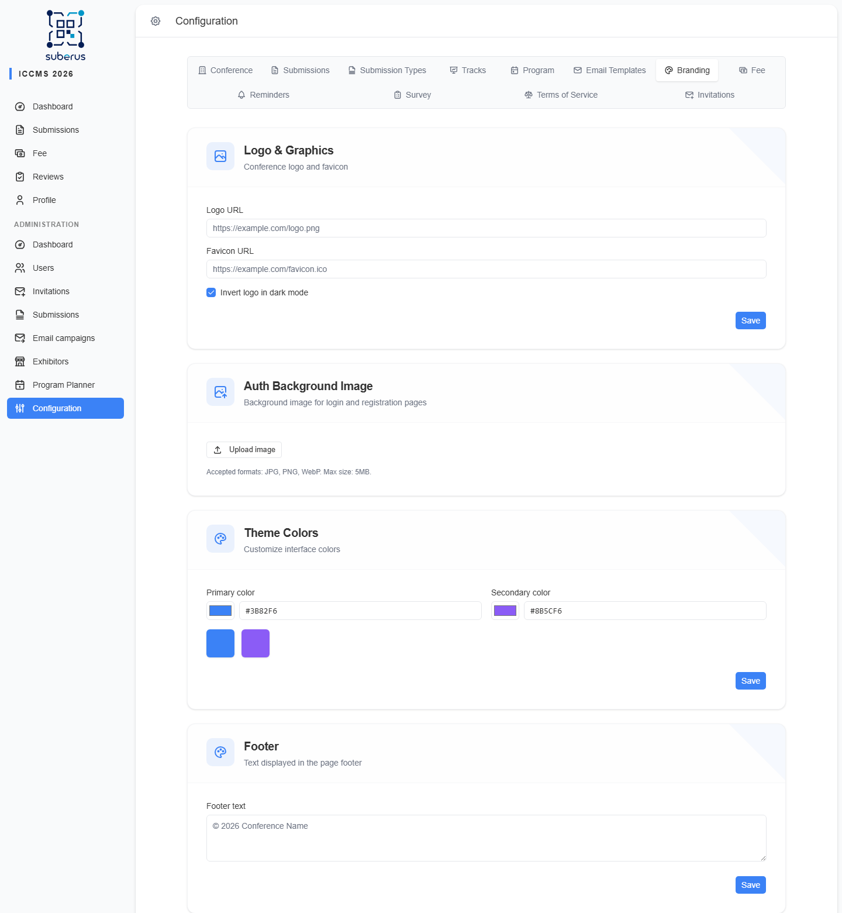

import { Aside, Steps, CardGrid, LinkCard } from '@astrojs/starlight/components';

The **Branding** tab controls the visual identity authors and reviewers see: your
**logo and favicon**, the **background image** on the login and registration
pages, the interface **colours**, and the page **footer**.

<Aside type="note" title="Where to find it">
**Settings › Branding.** Four sections — *Logo & Graphics*, *Auth Background
Image*, *Theme Colors*, *Footer* — each with its own **Save** button.
</Aside>

## How to add your logo and colours

<Steps>

1. Host your logo somewhere reachable (your website or a CDN) and paste the link
   into **Logo URL**. A preview appears below the field.

2. If your logo is dark, tick **Invert logo in dark mode** so it stays visible.

3. In *Theme Colors*, set the **Primary** and **Secondary** colours (use the
   colour picker or paste a hex code).

4. **Save** each section after editing it.

</Steps>

## Logo & Graphics

| Field | What it does | What to enter / Notes |
|---|---|---|
| **Logo URL** | The logo shown in the app header. | A public image URL. A live preview appears when the link is valid. |
| **Favicon URL** | The small icon in the browser tab. | A public URL to an `.ico`/`.png` favicon. |
| **Invert logo in dark mode** | Flips the logo's colours in dark mode so a dark logo stays visible. | Tick only if your logo disappears on a dark background. |

## Auth Background Image

The image behind the login and registration pages.

| Control | What it does | What to enter / Notes |
|---|---|---|
| **Upload / Replace image** | Uploads the background image (stored by the app). | **JPG, PNG, or WebP**, max **5 MB**. |
| **Remove** | Deletes the current background. | Pages fall back to the plain background. |
| **Overlay darkness** | Slider (0–100%) that darkens the image so text stays readable. | Appears only once an image is set. Higher = darker overlay. |

## Theme Colors

| Field | What it does | What to enter / Notes |
|---|---|---|
| **Primary color** | Main accent colour (buttons, links, highlights). | Pick a colour or paste a hex like `#3b82f6`. |
| **Secondary color** | Supporting accent colour. | Pick a colour or paste a hex like `#8b5cf6`. |

A small swatch preview shows both colours side by side.

## Footer

| Field | What it does | What to enter / Notes |
|---|---|---|
| **Footer text** | Text shown at the bottom of every page. | e.g. `© 2026 Conference Name`. |

## Related

<CardGrid>
	<LinkCard title="Conference" href="/settings/conference/" description="Name and contact shown alongside branding." />
	<LinkCard title="Email Templates" href="/settings/email-templates/" description="The email footer is set there, separately from this page footer." />
</CardGrid>
