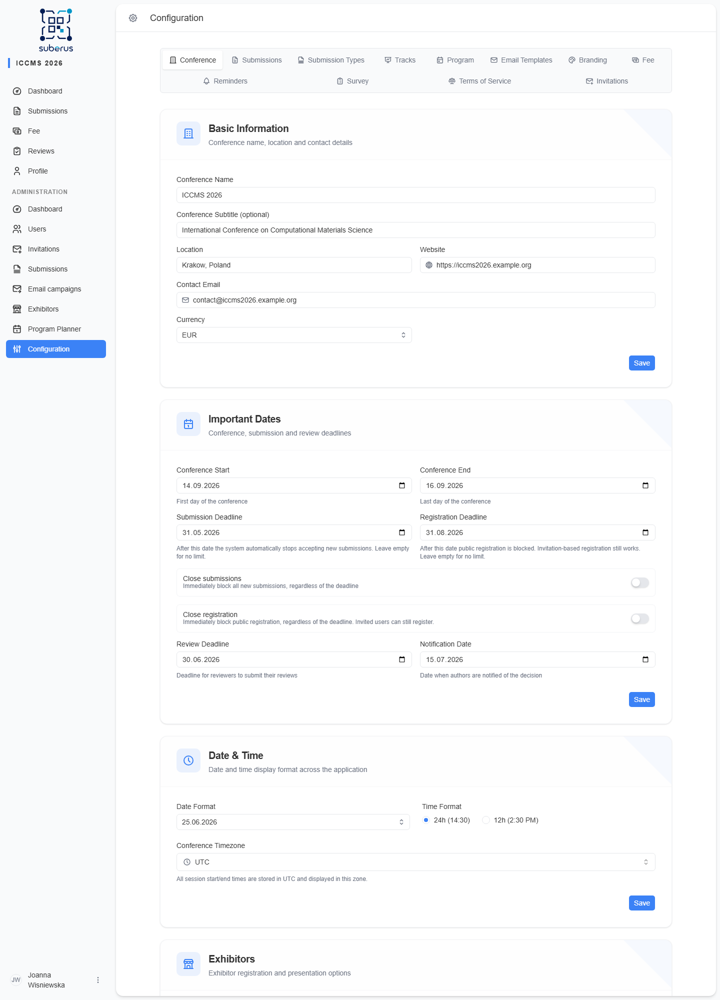
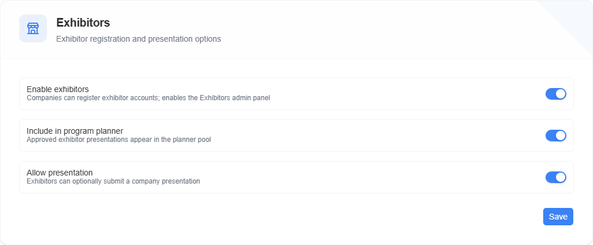

import { Aside, Steps, CardGrid, LinkCard } from '@astrojs/starlight/components';

The **Conference** tab holds your event's identity (name, location, contact), the
**key dates** that drive automatic behaviour (when submissions and registration
open or close), and the **date/time display format** used everywhere in the app
and in emails.

<Aside type="note" title="Where to find it">
**Settings › Conference.** Settings are grouped into four sections —
*Basic Information*, *Important Dates*, *Date & Time*, and *Exhibitors* — each
with its own **Save** button.
</Aside>

## How to set up the basics

<Steps>

1. Fill in **Conference Name** and **Contact Email** first — both appear in emails
   to authors and reviewers.

2. Add **Location**, **Website**, and an optional **Subtitle**.

3. Choose the **Currency** — it is used for all fees.

4. Click **Save** in the *Basic Information* section.

5. Move to *Important Dates*, set your deadlines, and **Save** again.

</Steps>

## Basic Information

| Field | What it does | What to enter / Notes |
|---|---|---|
| **Conference Name** | The event's primary name, shown across the app and in emails. | e.g. *ICSE 2026*. Required. |
| **Conference Subtitle** | Optional longer name shown under the title. | e.g. the full conference name. Leave blank if not needed. |
| **Location** | Where the event takes place. | e.g. *Krakow, Poland*. |
| **Website** | Public conference site. | Full URL starting with `https://`. |
| **Contact Email** | The address authors/reviewers see and reply to. | A monitored mailbox — this is your public contact point. |
| **Currency** | Currency for all fees. | **EUR**, **USD**, or **PLN**. Shown on the *Fee* tab. |

## Important Dates

<Aside type="caution" title="Dates drive automatic behaviour">
The submission and registration dates aren't just labels — the system enforces
them. Set them deliberately.
</Aside>

| Field | What it does | What to enter / Notes |
|---|---|---|
| **Conference Start** | First day of the event. | Date picker. |
| **Conference End** | Last day of the event. | Date picker. |
| **Submission Deadline** | Authors can submit **through the end of this day**; the system **stops accepting new submissions** once it ends. | Leave empty for no limit. End of day is measured in the **Conference Timezone** (UTC if unset). |
| **Registration Deadline** | **Public registration stays open through the end of this day**, then is blocked. Invitation-based registration still works. | Leave empty for no limit. End of day is measured in the **Conference Timezone** (UTC if unset). |
| **Close submissions** | Switch that **immediately** blocks all new submissions, regardless of the deadline. | Use to close the call early or in an emergency. |
| **Close registration** | Switch that **immediately** blocks public registration. Invited users can still register. | Independent of the deadline. |
| **Review Deadline** | The date by which reviewers should submit reviews. | Informational/notification date for reviewers. |
| **Notification Date** | The date authors are told decisions will be sent. | Communicated to authors. |

<Aside type="tip" title="Per-user override">
Need to let one author submit after the call closes? Enable **Allow late submission**
on that user in **[Users](/managing/users/)**. It bypasses both the submission
deadline and the **Close submissions** switch — for that user only.
</Aside>

## Date & Time

| Field | What it does | What to enter / Notes |
|---|---|---|
| **Date Format** | How dates are displayed throughout the app. | Pick from the list (e.g. day/month/year vs month/day/year). |
| **Time Format** | Clock style for all times. | **24h** (14:30) or **12h** (2:30 PM). |
| **Conference Timezone** | The zone all session start/end times are shown in, and the zone in which submission/registration **deadline days** end. | Times are stored in UTC and displayed here. Detected from your browser when the conference is first set up; change it any time. |

## Exhibitors

Controls company exhibitor registration. Exhibitor applications are decided on
the **[Exhibitors](/managing/exhibitors/)** screen — these switches only define
what exhibitors can do.

| Field | What it does | What to enter / Notes |
|---|---|---|
| **Enable exhibitors** | The master switch for the whole exhibitor feature: companies can register exhibitor accounts, and the **Exhibitors** screen appears in the admin sidebar. | When off, the exhibitor option disappears from the registration form, the admin menu entry is hidden, and the two switches below are hidden too. |
| **Include in program planner** | Approved exhibitor presentations appear in the planner pool. | Only visible when exhibitors are enabled. Only relevant when presentations are allowed. |
| **Allow presentation** | Exhibitors can optionally submit a company presentation with their application. | Only visible when exhibitors are enabled. Presentations are never peer-reviewed; they are accepted or rejected with the application. |
| **Save** | Persists the Exhibitors section. | This section has its own Save button, like the others on this tab. |

## Related

<CardGrid>
	<LinkCard title="Exhibitors" href="/managing/exhibitors/" description="Review and decide exhibitor applications." />
	<LinkCard title="Fee" href="/settings/fee/" description="Uses the currency set here." />
	<LinkCard title="Submission Types" href="/settings/submission-types/" description="Per-type review deadlines." />
	<LinkCard title="Program Planner: setup" href="/planner/setup/" description="Dates & timezone are planner prerequisites." />
	<LinkCard title="Quick start" href="/settings/quick-start/" description="Where this fits in the overall setup." />
</CardGrid>
