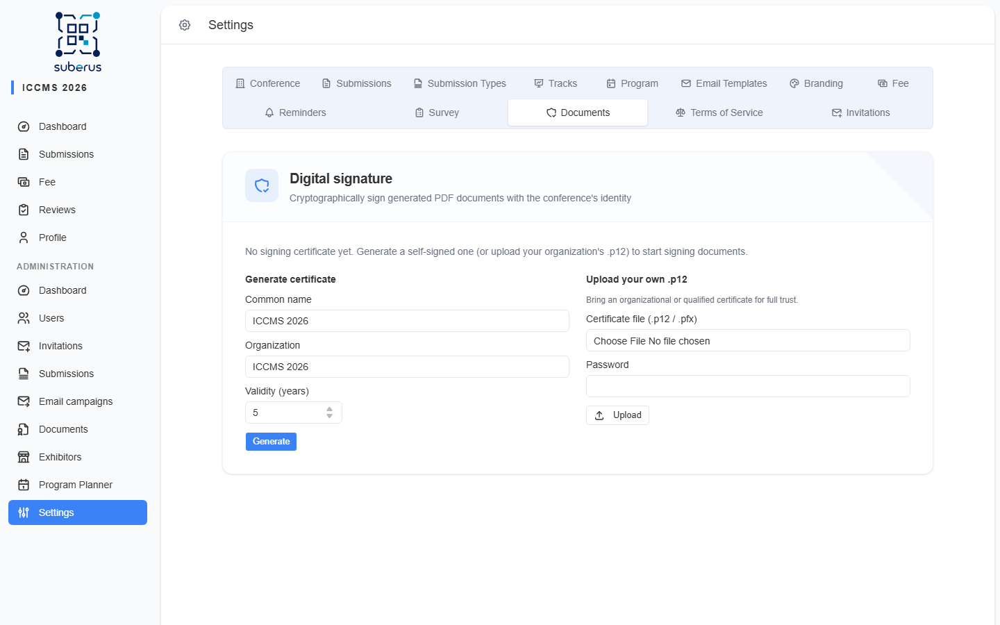

import { Aside, CardGrid, LinkCard, Steps } from '@astrojs/starlight/components';

The **Documents** tab turns on **digital signatures** for the PDFs the system
generates for participants (certificates, acceptance letters, invitation
letters…). A signed document is **tamper-evident** and carries the conference's
identity: any change to the file after signing breaks the signature.

<Aside type="note" title="Where to find it">
**Settings › Documents.** Generating the documents themselves (templates,
single and bulk generation) is done in
**[Managing the conference › Documents](/managing/documents/)**.
</Aside>

## How to turn on signing

<Steps>

1. Open **Settings › Documents**.
2. **Generate a certificate** — fill in the common name (defaults to your
   conference name), organization, and validity period, then click **Generate**.
   The certificate is created on the server; the private key never leaves it.
   *(Alternatively, upload your organization's own `.p12`/`.pfx` — see below.)*
3. Turn on **Sign new documents**. From now on, every newly generated document is
   signed. *(Existing documents are not retroactively signed.)*
4. Optionally configure the **seal appearance** and a **trusted timestamp**.

</Steps>

<Aside type="caution" title="Self-signed certificates and trust">
A self-signed certificate proves the document was issued here and was not
altered, but it is **not** on any reader's trusted list. In Adobe Acrobat the
signature shows as **“valid — signer's identity is unknown”** until the recipient
imports your **public certificate** once (use **Download public certificate**).
The integrity check (tamper detection) always works automatically. Upload your
own certificate from a trusted authority for out-of-the-box “trusted”.
</Aside>

## How recipients verify a document

- **In any PDF reader** (Adobe, Foxit, …) — the signature is checked
  automatically and appears in the reader's signature panel.
- **On the verification page** — anyone can open **`/verify-document`**, upload
  the PDF, and instantly see one of: **“Authentic”** (signed with *this
  conference's current certificate* and unaltered), **“Not issued by this
  conference”** (a valid signature, but from a different certificate — e.g. a
  forgery or a document signed before a certificate change), or a tamper warning.
  No reader configuration needed. When the seal's **QR code** is enabled it links
  straight to this page. The link is also shown to admins on the
  **[Documents](/managing/documents/)** screen when signing is on.

## Settings reference

| Field | What it does | What to enter / Notes |
|---|---|---|
| **Generate certificate** | Creates a self-signed signing certificate on the server. | Common name (e.g. conference name), organization, validity in years (1–10). |
| **Upload your own .p12** | Use an organizational or qualified certificate for full trust. | A `.p12`/`.pfx` file and its password. |
| **Download public certificate** | Downloads the `.cer` (public key only) recipients import to trust your signatures. | — |
| **Sign new documents** | Master switch — when on, every newly generated document is signed. | Requires a certificate to be present. |
| **Reason / issuer text** | Text shown in the visible seal. | Defaults to “Issued by *conference*”. |
| **Stamp position** | Which page corner the visible seal is drawn in. | Bottom-right / bottom-left / top-right / top-left. |
| **Embed a QR code** | Adds a QR in the seal linking to the verification page. | On by default. |
| **Certifying signature (DocMDP)** | Locks the PDF against further edits after signing. | Off by default (a normal approval signature). |
| **Trusted timestamp (RFC 3161)** | Adds a timestamp from a public authority, proving *when* it was signed and keeping it verifiable after the certificate expires. | Off by default. Free TSAs: `https://freetsa.org/tsr`, `http://timestamp.digicert.com`. |

<Aside type="tip">
Watch the **expiry warning** on the certificate card — when a certificate is
close to expiring, regenerate it so document generation doesn't start failing.
</Aside>

<Aside type="caution" title="Replacing a certificate re-signs documents">
Because verification is bound to your **current** certificate, replacing it
(regenerate or upload a new `.p12`) makes every document signed with the old one
read as **“Not issued by this conference”** — including copies recipients have
already downloaded, which can't be recalled. You'll be asked to confirm; on
confirm, documents still stored here are **re-signed with the new certificate**
and the recipients re-notified. Re-share those re-issued copies.
</Aside>

## Related

<CardGrid>
	<LinkCard title="Documents (managing)" href="/managing/documents/" description="Templates, single and bulk document generation." />
	<LinkCard title="Branding" href="/settings/branding/" description="Logo, colors and login-page branding." />
</CardGrid>
