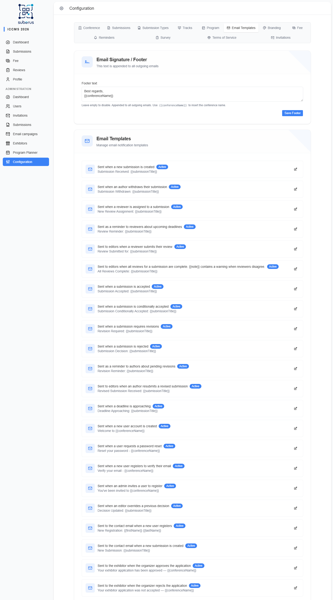

import { Aside, Steps, CardGrid, LinkCard } from '@astrojs/starlight/components';

Suberus sends automatic emails throughout the conference lifecycle — submission
received, reviewer assigned, decisions, reminders, account emails, and more. The
**Email Templates** tab lets you edit each one's wording, turn individual emails on
or off, set a shared footer, and **send yourself a test** before anything reaches
real users.

<Aside type="note" title="Where to find it">
**Settings › Email Templates.** A *footer* section at the top, then a card per
email event. Click a card to open its editor.
</Aside>

## How to edit and test a template

<Steps>

1. Click the card for the email you want to change.

2. Edit the **Subject** and **Body**. Insert dynamic values using the
   **placeholder badges** (click one to copy it, e.g. `submissionTitle`).

3. Optionally add **CC** / **BCC** addresses.

4. Click **Send Test** to mail the current version to yourself and check it.

5. Make sure **Active** is on, then **Save**.

</Steps>

<Aside type="caution" title="Disabled = not sent">
If a template's **Active** switch is off, that email is **not sent at all** when its
event happens. Turn it off only if you deliberately don't want that notification.
</Aside>

## Email Signature / Footer

| Field | What it does | What to enter / Notes |
|---|---|---|
| **Footer text** | Appended to the bottom of **every** outgoing email. | Leave empty to disable. Use `{{conferenceName}}` to insert the conference name. |
| **Save Footer** | Saves the footer. | Separate from individual templates. |

## Template editor

Each email opens in an editor with these fields:

| Field | What it does | What to enter / Notes |
|---|---|---|
| **Active** | Whether this email is sent when its event occurs. | On/Off. |
| **Subject** | The email subject line. | Supports `{{placeholders}}`. |
| **Body** | The email content. | Supports `{{placeholders}}`. |
| **CC** | Extra visible recipients. | Comma-separated addresses (optional). |
| **BCC** | Extra hidden recipients. | Comma-separated addresses (optional). |
| **Available placeholders** | The dynamic values valid for this email. | Click a badge to copy it; hover for its meaning. |
| **Send Test** | Emails the current draft to you. | Check your inbox (or Mailpit in development). |

## The emails Suberus can send

| Email | Sent to | When |
|---|---|---|
| **Submission Received** | Author | After a successful submission |
| **Submission Withdrawn** | Handling editor | When an author withdraws a handled submission |
| **Reviewer Assigned** | Reviewer | When assigned a review |
| **Reviewer Reminder** | Reviewer | Before the review deadline |
| **Review Submitted** | Assigning editor | When a reviewer submits |
| **All Reviews Complete** | Assigning editor | When the last review arrives |
| **Decision – Accepted** | Author | On acceptance |
| **Decision – Conditionally Accepted** | Author | On conditional acceptance |
| **Decision – Revision Required** | Author | When revisions are requested |
| **Decision – Rejected** | Author | On rejection |
| **Decision Overridden** | Author | When an editor changes a prior decision |
| **Revision Reminder** | Author | Before a revision deadline |
| **Revision Received** | Handling editor | When an author resubmits |
| **Deadline Approaching** | Reviewer / Author | Generic deadline warning |
| **Account Created** | User | When an account is created |
| **Password Reset** | User | On a reset request |
| **Email Verification** | User | To verify an email address |
| **Invitation** | Invited user | When invited to join |
| **New Registration (Admin)** | Admins | When someone registers |
| **New Submission (Admin)** | Admins | When a new submission arrives |
| **Exhibitor Approved** | Exhibitor | When their application is approved (see **[Exhibitors](/managing/exhibitors/)**) |
| **Exhibitor Rejected** | Exhibitor | When their application is rejected |

## Related

<CardGrid>
	<LinkCard title="Reminders" href="/settings/reminders/" description="Controls when reminder emails are sent." />
	<LinkCard title="Branding" href="/settings/branding/" description="The page footer (separate from this email footer)." />
</CardGrid>
