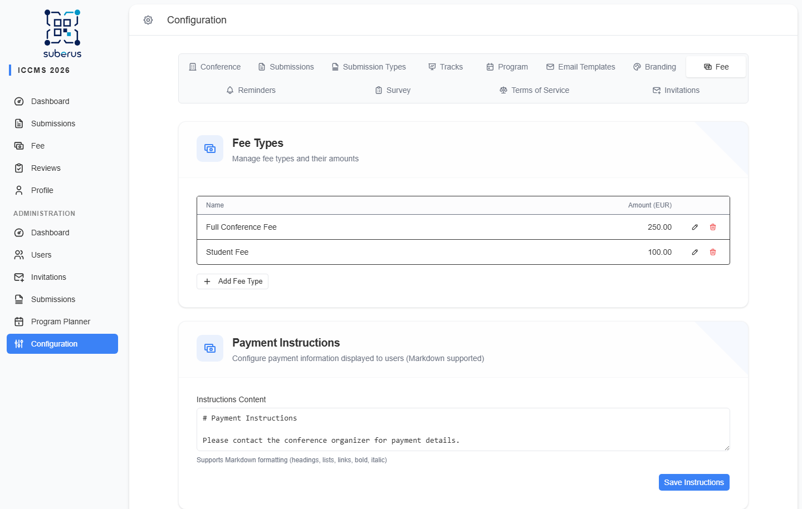

import { Aside, Steps, CardGrid, LinkCard } from '@astrojs/starlight/components';

Define your event's fee types here — *Regular*, *Student*, *Invited Speaker*, or
whatever you charge — and write the payment instructions authors read when it's
time to pay.

<Aside type="note" title="Where to find it">
**Settings › Fee.** Three sections: *Fee* (on/off toggle), *Fee Types*, and
*Payment Instructions*. The currency is taken from the
**[Conference](/settings/conference/)** tab.
</Aside>

## Turning the fee feature on or off

The **Fee enabled** switch at the top of the tab controls whether participants
see the **Fee** entry in their left-hand menu. It is **on by default**. Turn it
off (for a free event, or before fees are finalised) and the Fee page disappears
from every user's navigation immediately — no reload needed. It sits at the top of
the tab, above the screenshot's *Fee Types* and *Payment Instructions* sections.

| Element | What it does | What to enter / Notes |
|---|---|---|
| **Fee enabled** | Shows/hides the participant-facing **Fee** menu item. | On by default. Toggling it saves immediately. |

<Aside type="tip">
If your event is free, you can skip this tab — but at least one fee type must
exist, so leave the default in place.
</Aside>

## How to add a fee type

<Steps>

1. In *Fee Types*, click **Add Fee Type**.

2. Enter a **Name** and an **Amount** (in your conference currency). Leave
   **Amount** blank for a free fee type — it saves as `0.00`.

3. Click **Add**. The fee type is saved immediately and appears in the list.

4. Use the **pencil** icon to edit a row, or the **trash** icon to delete one.

</Steps>

## Fee Types reference

| Element | What it does | What to enter / Notes |
|---|---|---|
| **Name** | Label of the fee (shown to authors). | e.g. *Regular*, *Student*. Required. |
| **Amount** | The price, in the conference currency. | A number ≥ 0, two decimals (e.g. `150.00`). Blank counts as `0.00` — a free fee type. |
| **Edit (pencil)** | Edit a row inline. | Change name/amount, then **Save**. |
| **Delete (trash)** | Remove a fee type. | **At least one fee type is always required** — you can't delete the last one. |

<Aside type="caution">
Each add/edit/delete on a fee type **saves immediately** — there is no separate
Save button for the list. The currency symbol shown comes from the Conference tab,
not from here.
</Aside>

## Payment Instructions

A free-text block shown to authors who need to pay. **Markdown is supported**, so
you can use headings, lists, links, **bold**, and *italic*.

| Field | What it does | What to enter / Notes |
|---|---|---|
| **Instructions Content** | The full payment instructions authors see. | Bank details, deadlines, what to put in the transfer title, etc. Write in Markdown — the editor highlights it as you type. |
| **Save Instructions** | Saves the instructions text. | Separate from the fee-types list. |

## Related

<CardGrid>
	<LinkCard title="Conference" href="/settings/conference/" description="Sets the currency used here." />
	<LinkCard title="Users" href="/managing/users/" description="Marking a user's fee as paid or unpaid." />
</CardGrid>
