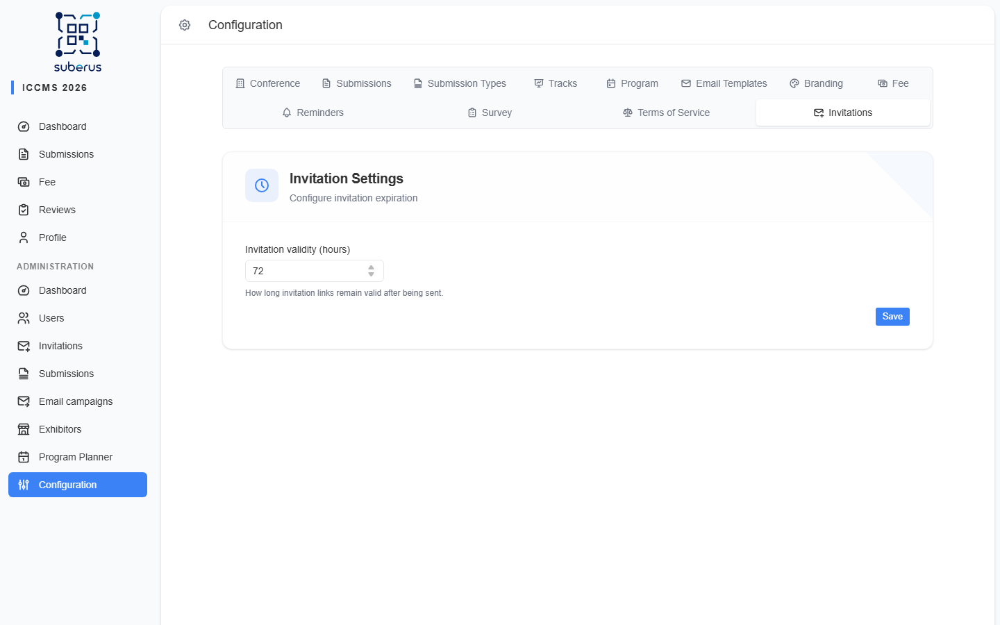

import { Aside, CardGrid, LinkCard } from '@astrojs/starlight/components';

The **Invitations** tab has a single setting: how long an invitation link stays
valid after you send it. Invitations let people (reviewers, co-organisers, invited
authors) create an account **even when public registration is closed**.

<Aside type="note" title="Where to find it">
**Settings › Invitations.** Sending and tracking individual invitations is
done in **[Managing the conference › Invitations](/managing/invitations/)** — this
tab only sets the validity window.
</Aside>

## Settings reference

| Field | What it does | What to enter / Notes |
|---|---|---|
| **Invitation validity (hours)** | How long an invitation link works before it expires. | A number ≥ 1 (hours). After this, the recipient must be re-invited. |

<Aside type="tip">
Set this long enough that recipients realistically act in time — a few days
(e.g. `72`) is more forgiving than a few hours, especially across weekends.
</Aside>

## Related

<CardGrid>
	<LinkCard title="Invitations (managing)" href="/managing/invitations/" description="Send, resend, and cancel individual invitations." />
	<LinkCard title="Conference" href="/settings/conference/" description="Close registration / Registration Deadline — invited users can still register when public registration is closed." />
</CardGrid>
