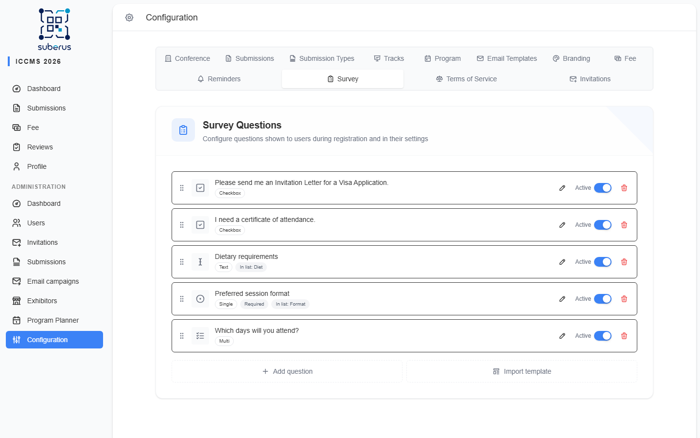
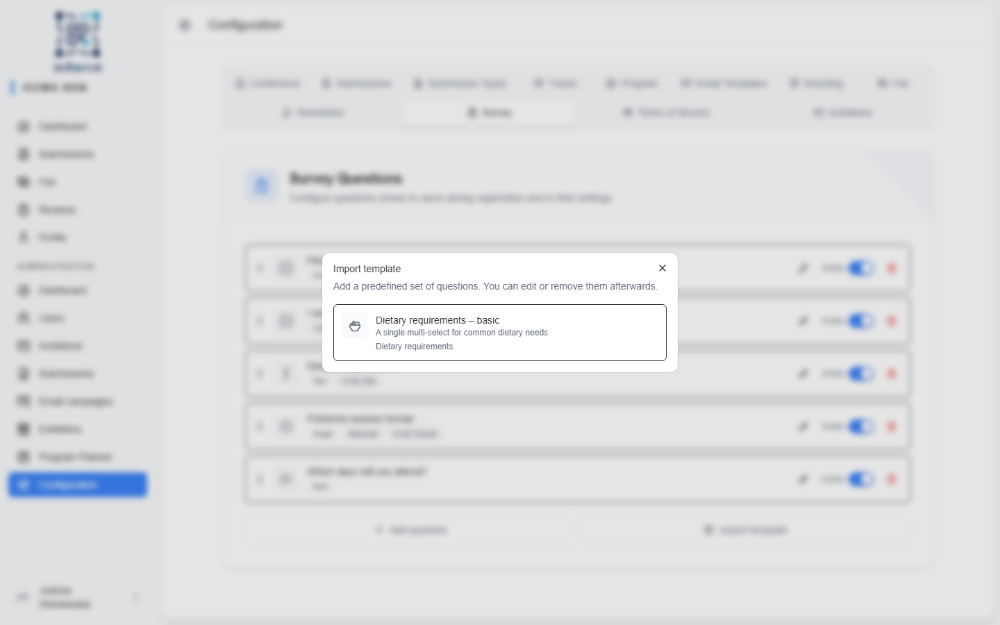

import { Aside, Steps, CardGrid, LinkCard } from '@astrojs/starlight/components';

The **Survey** tab lets you build your own questions that users answer during
registration and can revisit in their settings — for example dietary requirements,
t-shirt size, or consent checkboxes. You control the order, the question type, and
whether each answer appears as a column in the users list.

<Aside type="note" title="Where to find it">
**Settings › Survey.** Existing questions are listed, each with a drag handle
to reorder it; below them, **Add question** opens a dialog for a new one and
**Import template** adds a predefined set in one click.
</Aside>

## How to add a question

<Steps>

1. Click **Add question** to open the editor dialog, and type the question **Label**.

2. Choose a **Type** from the visual picker (see the table below). For
   *Single Select* / *Multi Select*, add the **options** (drag the handle to
   reorder them) and switch on **Allow 'Other'** if answers won't always fit the
   preset options.

3. Pick the **Audience** (only shown when the exhibitors feature is enabled), set
   whether it's **Required**, and whether to **show it in the users list** (and, if
   so, the short column name). The **Preview** panel shows exactly how users will
   see the question as you edit.

4. Click **Add** to save. Back in the list, drag the **handle** to reorder, use
   the **Active** switch to show/hide it, the **pencil** to edit, and the
   **trash** to delete.

</Steps>

## Importing a template

Templates are predefined question sets you can drop in instead of building from
scratch, then edit or remove like any other question.

<Steps>

1. Click **Import template** to open the picker.

2. Click a template card to add its questions. They're appended to the end of the
   list and behave exactly like questions you added manually.

3. Reorder, edit, or delete the imported questions as needed.

</Steps>

| Template | Adds |
|---|---|
| **Dietary requirements – basic** | A *Multi Select* "Dietary requirements" (Vegetarian, Vegan, Gluten-free, Lactose-free, Halal, Kosher, Nut allergy) with **Allow 'Other'** on. |

## Question fields

| Field | What it does | What to enter / Notes |
|---|---|---|
| **Label** | The question text users see. | Required. |
| **Type** | The kind of answer. | **Checkbox** (yes/no), **Text** (free text), **Single Select** (one of many), **Multi Select** (several of many). |
| **Audience** | Who the question is shown to. | **Everyone**, **Participants** (authors and other non-exhibitor users), or **Exhibitors** only. Appears only when the exhibitors feature is enabled; existing questions default to **Everyone**. |
| **Options** | The choices for select questions. | Required for *Single/Multi Select*; add/remove rows. Ignored for Checkbox/Text. |
| **Allow 'Other'** | Adds an *Other* choice with a free-text box for answers the options don't cover (e.g. allergies). | *Single/Multi Select* only. Other answers appear as `Other: …` in the users list and export. |
| **Required** | Whether users must answer. | On/Off. *Other* selected with an empty text box counts as unanswered. |
| **Show in users list** | Surfaces the answer as a column in *Managing › Users*. | On/Off. |
| **Field name** | The short column header used when shown in the list. | Appears only when *Show in users list* is on. Keep it short. |
| **Active** | Whether the question is currently shown to users. | Toggle per question in the list. Turn off to retire without deleting. |

<Aside type="tip">
Order matters — users see questions in the order shown here. Put the most important
(or required) questions first by dragging them up.
</Aside>

## Related

<CardGrid>
	<LinkCard title="Terms of Service" href="/settings/terms-of-service/" description="Also shown during registration." />
	<LinkCard title="Users" href="/managing/users/" description="Where answers marked 'Show in users list' appear." />
</CardGrid>
