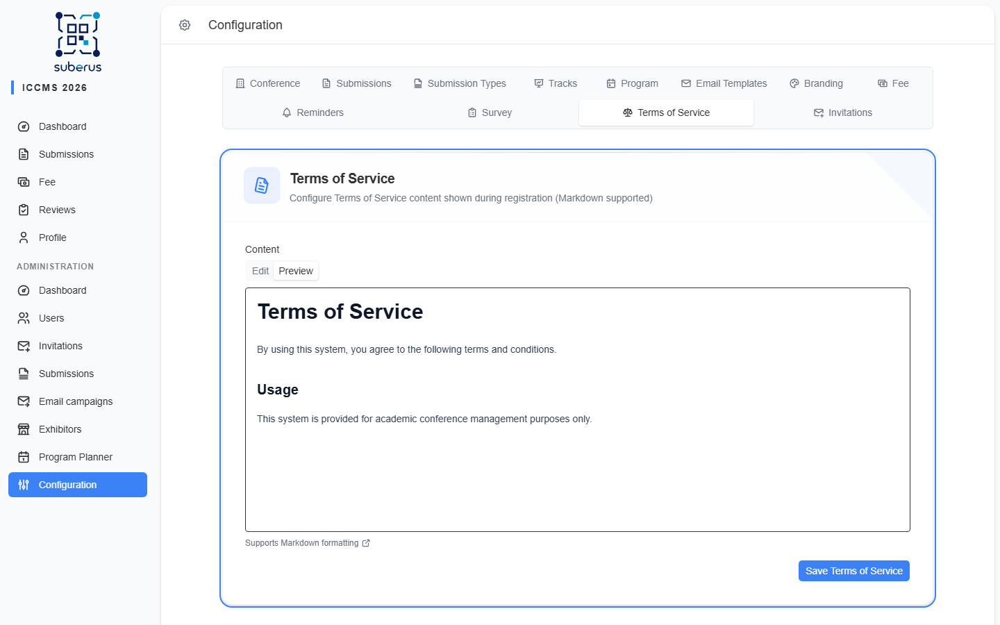

import { Aside, CardGrid, LinkCard } from '@astrojs/starlight/components';

The **Terms of Service** tab holds the terms shown to users during registration.
Whatever you write here is presented to new users before they create an account.

<Aside type="note" title="Where to find it">
**Settings › Terms of Service.** A Markdown editor with **Edit** and **Preview** tabs.
</Aside>

## Settings reference

| Field | What it does | What to enter / Notes |
|---|---|---|
| **Content** | The Terms of Service text shown during registration. | **Markdown** supported (headings, lists, links, **bold**, *italic*). Leave empty to show no terms. |
| **Edit / Preview** | Toggle between the raw Markdown editor and a formatted preview. | The **Preview** renders exactly what users see during registration. |
| **Save Terms of Service** | Saves the content. | — |

<Aside type="tip">
Keep a dated heading at the top (e.g. *Last updated: …*) so users and you can tell
which version is in force.
</Aside>

## Contact-details consent

Independently of the terms, registration can show a second, **optional** consent:

> *I consent to my name, affiliation and e-mail address being included in the
> participant list made available to the other participants of the event, for
> networking purposes.*

It appears only when **Publish participant contact details** is enabled in
**[Settings › Program › Appearance](/planner/setup/)**. It is never required to
finish registration, and users can grant or withdraw it later in **Profile ›
Contact & Invoice Information**. Contact details of users who did not consent are
never shown on the public program.

🖼️ [Screenshot placeholder: contact-details consent checkbox on the registration form]

## Related

<CardGrid>
	<LinkCard title="Branding" href="/settings/branding/" description="The look of the registration page where these terms appear." />
	<LinkCard title="Survey" href="/settings/survey/" description="Custom questions also shown during registration." />
</CardGrid>
