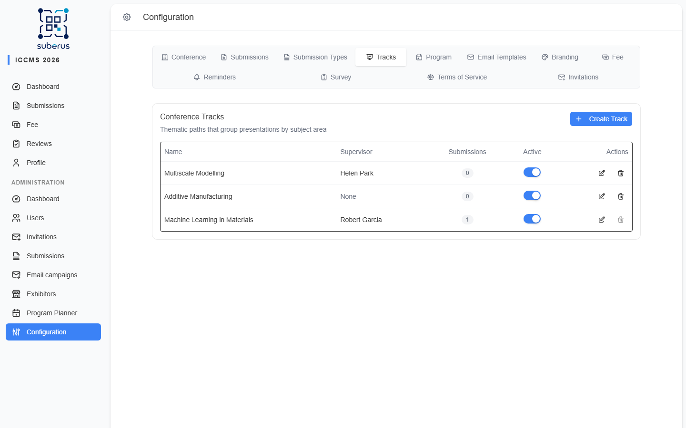

import { Aside, Steps, CardGrid, LinkCard } from '@astrojs/starlight/components';

**Tracks** are thematic paths that group submissions by subject area (for example
*Machine Learning*, *Materials*, *Bioinformatics*). Authors can pick a preferred
track when submitting (if you enable track selection on a submission type), and you
can assign a **supervisor** to oversee each track.

<Aside type="caution" title="Two different 'tracks'">
Don't confuse these with **Program Tracks** in the
**[Program Planner](/planner/setup/)** section. **Tracks** (this page) group
*submissions* by subject. **Program Tracks** are colour tags used in the program
planner to group *sessions*. They are separate features.
</Aside>

<Aside type="note" title="Where to find it">
**Settings › Tracks.** Existing tracks are listed; **Create Track** opens a
dialog.
</Aside>

## How to create a track

<Steps>

1. Click **Create Track**.

2. Enter a **Name**.

3. Optionally choose a **Supervisor** from the list of reviewers.

4. Click **Create**. To deactivate a track later, edit it and turn **Active** off.

</Steps>

## Track fields

| Field | What it does | What to enter / Notes |
|---|---|---|
| **Name** | The track's title, shown to authors and in listings. | Required, up to 200 characters. |
| **Supervisor** | A reviewer who oversees the track. | Optional — pick from reviewers, or *None*. |
| **Active** | Whether the track is available. | Shown only when editing. Turn off to retire a track without deleting it. |

<Aside type="tip">
To let authors choose a track while submitting, enable **track selection** on the
relevant submission type (Oral Presentation) — see
**[Submission Types](/settings/submission-types/)**.
</Aside>

## Related

<CardGrid>
	<LinkCard title="Submission Types" href="/settings/submission-types/" description="Enable author track selection." />
	<LinkCard title="Program Planner: setup" href="/planner/setup/" description="The separate Program Tracks used in the planner." />
</CardGrid>
